# VibeNovel v2 — Architecture Document

## System Overview

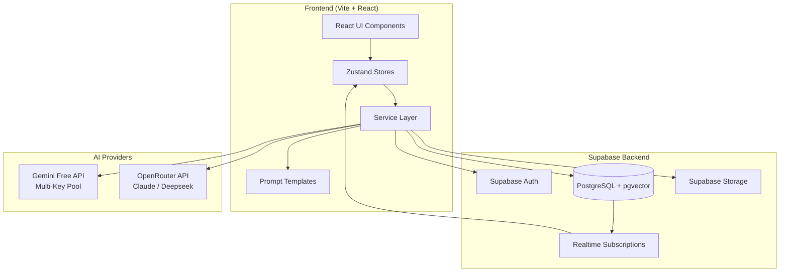

> **Arsitektur ini 100% client-side.** Tidak ada custom backend server. Semua logic berjalan di browser, semua data di Supabase, semua AI call langsung dari browser ke provider. Ini memungkinkan static deploy (Vercel/Netlify) dan Capacitor wrap tanpa perubahan.

---

## Frontend Architecture

### Tech Stack

| Layer | Teknologi | Versi | Alasan |
|---|---|---|---|
| Build | Vite | 6.x | Fast HMR, static export native |
| UI | React | 19.x | Ecosystem terluas |
| Language | TypeScript | 5.x | Type safety |
| Routing | React Router | 7.x | SPA routing |
| State | Zustand | 5.x | Minimal boilerplate, devtools bagus |
| Styling | Tailwind CSS | 4.x | Utility-first, responsive cepat |
| Animation | Framer Motion | 12.x | Declarative animations |
| Charts | Recharts | 2.x | Emotional Arc Heatmap |
| Graph | D3.js | 7.x | Constellation Map |

### Component Hierarchy

```
App.tsx
├── pages/
│   ├── Lobby.tsx (Dashboard)
│   │   ├── StatsBar
│   │   ├── ProjectCard (× N)
│   │   │   └── DualProgressBar
│   │   ├── ProjectCreationModal
│   │   │   ├── BlueprintSelector
│   │   │   └── ImportWizard (4 steps)
│   │   └── SearchAndFilter
│   │
│   └── Workspace.tsx (Mode-Based)
│       ├── TopBar (project title + progress)
│       ├── ModeSwitcher (4 tabs)
│       ├── ContextPanel (left 30%)
│       │   ├── [Brainstorm] StoryCompassPreview + GapDetector
│       │   ├── [Outline]   StoryCompassPanel (tabs: Tokoh/Item/Dunia)
│       │   ├── [Write]     ChapterOutlineView + StateSnapshot
│       │   └── [Review]    PlotRadarPanel + ThreadTracker
│       │
│       └── MainCanvas (right 70%)
│           ├── [Brainstorm] CoAuthorChat
│           │   ├── AiMessageBubble
│           │   ├── ApprovalCard (Setuju/Edit/Tolak)
│           │   └── ChatInput
│           ├── [Outline]   SeasonArchitectPanel
│           │   ├── SeasonAccordion
│           │   ├── SubArcGroup
│           │   └── ChapterOutlineCard
│           ├── [Write]     ProseCanvasPanel
│           │   ├── BeatEditor
│           │   ├── BeatIndicator
│           │   └── ProseToolbar
│           └── [Review]    ProseReader + EmotionalArcHeatmap
│
├── modals/
│   ├── SettingsModal (AI Engine)
│   ├── DirectorsCutModal
│   ├── LoreDiffModal
│   ├── BatchSuccessModal
│   ├── RecapModal
│   └── TargetChangeModal
│
└── ui/ (shared primitives)
    ├── Button, Toast, Spinner
    ├── BottomSheet (mobile modals)
    ├── FAB (Floating Action Button)
    └── DualProgressBar
```

### Routing

```typescript
// src/App.tsx
<Routes>
  <Route path="/" element={<Lobby />} />
  <Route path="/project/:projectId" element={<Workspace />} />
  <Route path="/login" element={<Login />} />
</Routes>
```

Hanya 3 route. Workspace mengelola semua mode secara internal via state, bukan via URL.

---

## Theme & Styling System

Sistem tema VibeNovel dirancang untuk mendukung **Dual-Theme (Light/Dark)** dengan estetika premium yang disesuaikan untuk target audiens (emak-emak penulis KBM + penulis pro).

Kami menggunakan kombinasi Tailwind CSS 4.x dan CSS Variables untuk memastikan transisi tema berjalan instan, mulus, dan bebas kedipan (no flash of dark mode).

### 1. Desain Karakter Tema

| Aspek | Malam Kreatif (Dark Mode) | Jurnal Cantik (Light Mode) |
|---|---|---|
| **Vibe** | Meja menulis malam hari yang hangat & magis | Buku jurnal fisik kertas cream yang mewah |
| **Background** | Burgundy/plum gelap hangat (#1A1118) | Ivory/cream lembut hangat (#FDF8F5) |
| **Card & Surfaces** | Plum gelap hangat (#251D23) | Putih kertas murni (#FFFFFF) |
| **Text Utama** | Cream lembut hangat (#FDF6F0) | Cokelat tua hangat (#3D2C36) (ramah mata) |
| **Text Sekunder** | Lilac/mauve pudar (#B8A0B0) | Taupe lembut (#8E7A87) |
| **Borders** | Outline grape-tinted halus (#3A2F38) | Pink/cream lembut (#F0DFE7) |
| **Shadows & Glow** | Rose gold glow pudar pada hover | Rose gold shadow halus khas planner kertas |

### 2. Implementasi CSS Variables (src/index.css)

```css
@theme {
  --color-bg-primary: var(--bg-primary);
  --color-surface-primary: var(--surface-primary);
  --color-surface-hover: var(--surface-hover);
  --color-text-main: var(--text-main);
  --color-text-muted: var(--text-muted);
  --color-border-subtle: var(--border-subtle);
  --color-card-shadow: var(--card-shadow);
}

:root {
  /* Jurnal Cantik (Light Mode) */
  --bg-primary: #FDF8F5;
  --surface-primary: #FFFFFF;
  --surface-hover: #FFF3EC;
  --text-main: #3D2C36;
  --text-muted: #8E7A87;
  --border-subtle: #F0DFE7;
  --card-shadow: 0 4px 20px -2px rgba(78, 54, 41, 0.05), 0 2px 8px -1px rgba(78, 54, 41, 0.03);
}

.dark {
  /* Malam Kreatif (Dark Mode) */
  --bg-primary: #1A1118;
  --surface-primary: #251D23;
  --surface-hover: #2F262D;
  --text-main: #FDF6F0;
  --text-muted: #B8A0B0;
  --border-subtle: #3A2F38;
  --card-shadow: 0 8px 30px rgba(0, 0, 0, 0.3), 0 4px 12px rgba(232, 160, 191, 0.03);
}
```

### 3. State & Sinkronisasi DOM

Tema dikelola secara global menggunakan Zustand di `useUiStore` dan disinkronisasikan ke `document.documentElement` (elemen `<html>`):

```typescript
// src/store/useUiStore.ts
export const useUiStore = create<UiStore>()(
  persist(
    (set, get) => ({
      theme: 'dark', // default theme
      
      toggleTheme: () => {
        const nextTheme = get().theme === 'dark' ? 'light' : 'dark';
        set({ theme: nextTheme });
        
        // Update class di HTML element
        if (nextTheme === 'dark') {
          document.documentElement.classList.add('dark');
        } else {
          document.documentElement.classList.remove('dark');
        }
      },
      // ... state lainnya
    }),
    {
      name: 'vibenovel-ui-state',
      partialize: (state) => ({ theme: state.theme }), // hanya persist theme
    }
  )
);
```

### 4. Pencegahan Layout Shift (Anti-Flicker)

Untuk mencegah kedipan layar putih saat refresh di Dark Mode (karena LocalStorage baru terbaca setelah React render), script mini berikut diinjeksi langsung di `index.html` sebelum tag `<body>`:

```html
<!-- index.html -->
<head>
  <script>
    (function() {
      try {
        const stored = localStorage.getItem('vibenovel-ui-state');
        if (stored) {
          const parsed = JSON.parse(stored);
          if (parsed.state && parsed.state.theme === 'dark') {
            document.documentElement.classList.add('dark');
            return;
          }
        }
        // Default fallbacks atau system preference check
        document.documentElement.classList.add('dark');
      } catch (e) {}
    })();
  </script>
</head>
```

---

## AI Architecture

### Provider Hierarchy

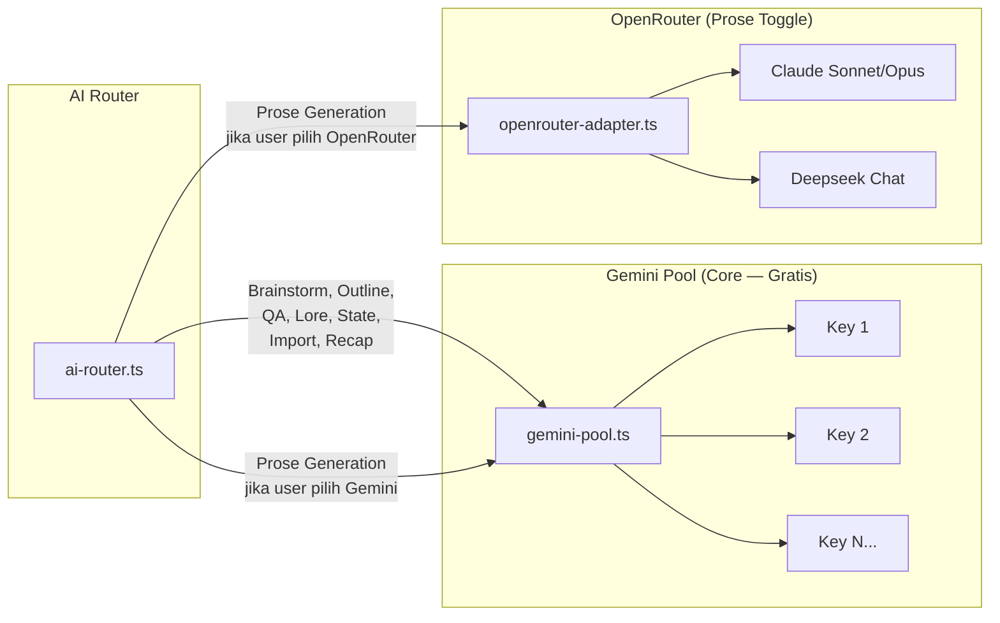

### Adapter Interface

Semua provider implement interface yang sama:

```typescript
// src/services/ai/types.ts
interface AIAdapter {
  generateText(prompt: string, options: GenerateOptions): Promise<string>;
  generateStream(prompt: string, options: GenerateOptions): AsyncIterable<string>;
}

interface GenerateOptions {
  maxTokens?: number;
  temperature?: number;
  systemPrompt?: string;
  responseFormat?: 'text' | 'json';
}
```

### Gemini Multi-Key Pool

```typescript
// src/services/ai/gemini-pool.ts
class GeminiPool implements AIAdapter {
  private keys: string[];
  private currentIndex: number = 0;
  private cooldowns: Map<string, number> = new Map();
  
  getNextKey(): string {
    // Round-robin, skip cooldown keys
    for (let i = 0; i < this.keys.length; i++) {
      const idx = (this.currentIndex + i) % this.keys.length;
      const key = this.keys[idx];
      const cooldownUntil = this.cooldowns.get(key) || 0;
      
      if (Date.now() > cooldownUntil) {
        this.currentIndex = (idx + 1) % this.keys.length;
        return key;
      }
    }
    throw new Error('Semua API key sedang cooldown. Coba lagi nanti.');
  }
  
  reportRateLimit(key: string): void {
    this.cooldowns.set(key, Date.now() + 60_000); // 60 detik cooldown
  }
}
```

### AI Router

```typescript
// src/services/ai/ai-router.ts
class AIRouter {
  private geminiPool: GeminiPool;
  private openRouterAdapter: OpenRouterAdapter;
  
  // Untuk semua operasi NON-prose → selalu Gemini
  async runCore(task: CoreTask, prompt: string): Promise<string> {
    return this.geminiPool.generateText(prompt, task.options);
  }
  
  // Untuk prose → sesuai pilihan user di Settings
  async runProse(prompt: string, project: Project): Promise<string> {
    if (project.proseProvider === 'openrouter') {
      return this.openRouterAdapter.generateStream(prompt, {
        model: project.proseModel
      });
    }
    return this.geminiPool.generateStream(prompt, {});
  }
}

type CoreTask = 
  | 'brainstorm' 
  | 'outline' 
  | 'state_snapshot'
  | 'plot_radar' 
  | 'lore_extract'
  | 'filler_detect'
  | 'thread_detect'
  | 'recap'
  | 'import_analyze';
```

---

## 4-Layer Memory System

```mermaid
graph TD
    subgraph "Layer 1: Static Lorebook (Always Injected)"
        NC[Narrative Constitution]
        CHAR[Character Profiles + Voice DNA]
        ITEMS[Items + Activation Keys]
        WORLD[World Rules]
        END[Target Ending]
        ML[Mystery Layers - active questions]
    end

    subgraph "Layer 2: Dynamic State (Updated per Chapter)"
        CS[Character States - location, emotion, inventory]
        TL[Timeline Tracker - in-story time]
        PT[Plot Threads - active, planted, resolved]
        IO[Item Ownership - who has what]
    end

    subgraph "Layer 3: RAG Long-Term (Supabase pgvector)"
        SUM[Chapter Summaries + Embeddings]
        LORE[Lore Entries]
        IMP[Imported Manuscript Chunks]
    end

    subgraph "Layer 4: Sliding Window (Immediate Context)"
        PREV[Last 500 words of prev chapter]
        CUR[Current chapter outline + beat direction]
        NEXT[Next 2 chapter outlines - read-only fence]
    end

    NC --> PROMPT[Assembled Prompt]
    CHAR --> PROMPT
    CS --> PROMPT
    SUM --> PROMPT
    PREV --> PROMPT
    CUR --> PROMPT
    PROMPT --> AI[AI Provider]
```

### Context Assembly Flow

```
Saat generate Beat 3 dari Bab 51:

1. SELALU inject:
   - Narrative Constitution (priority 10)
   - KBM Melodrama Protocol (priority 9)
   - Target Ending (priority 8)
   - Active Mystery Layers (priority 7)

2. KEYWORD-TRIGGERED inject:
   Beat outline: "Kania bertemu Pria Tua di pasar malam"
   → Extract: ["Kania", "Pria Tua", "pasar malam"]
   → Match Lorebook:
     ✅ Kania → profile + Voice DNA
     ✅ Pria Tua → profile (activation key match)
     ✅ Pasar Malam → world rule (activation key match)
     ✅ Jam Saku → item (activation key "Pria Tua" match)
     ❌ Ardan → not mentioned, SKIP
     ❌ Kafe Anggrek → not triggered, SKIP
   → ~60-80% token savings vs dumping everything

3. STATE inject:
   - Character states for Kania and Pria Tua only
   - Item states for Jam Saku only

4. RAG query (if chapter > 30):
   Semantic search: "Kania Pria Tua pasar malam jam saku"
   → Top 3 relevant chapter summaries

5. SLIDING WINDOW:
   - Last 500 words of Bab 50
   - Bab 51 outline (full)
   - Beat 1 + Beat 2 text (already generated)
   - Bab 52-53 outlines (read-only fence)
```

### Token Budget

```
Target: ~8000 tokens input per beat generation

Layer 1 (Static Lorebook, pruned):    ~1500 tokens
Layer 2 (Dynamic State, relevant): ~500 tokens
Layer 3 (RAG, top 3 summaries):    ~600 tokens
Layer 4 (Sliding Window):          ~2000 tokens
System Prompt + Instructions:      ~1500 tokens
Beat Outline + Direction:          ~400 tokens
─────────────────────────────────
Total:                             ~6500 tokens
Buffer:                            ~1500 tokens
```

---

## Data Flow Diagrams

### Flow 1: Brainstorm → Story Compass

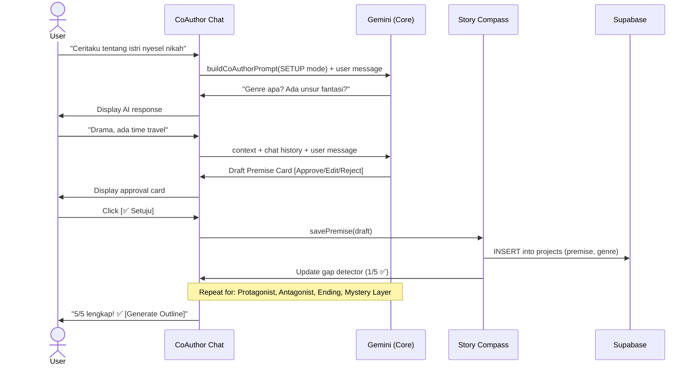

### Flow 2: Outline Generation

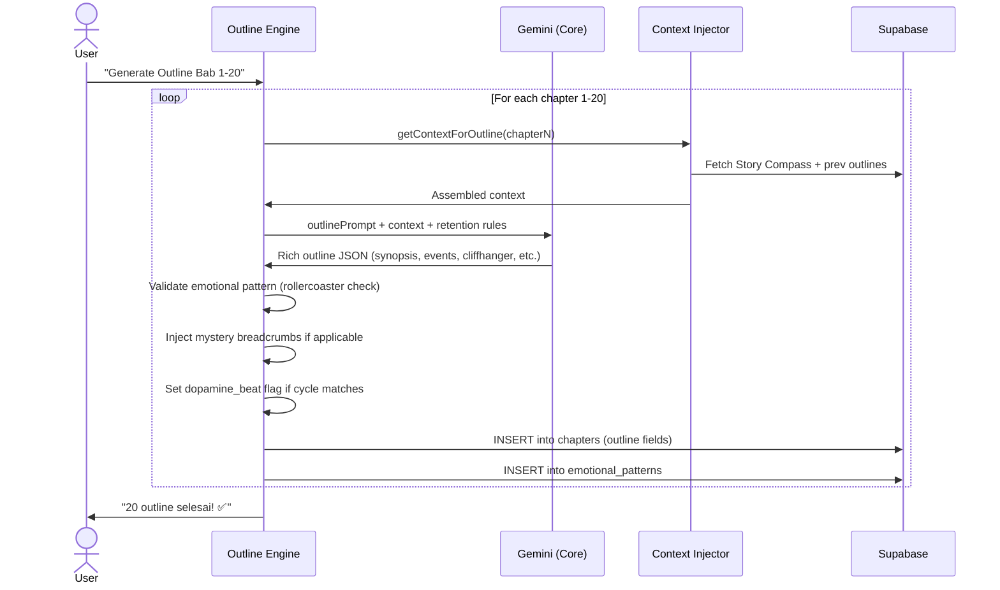

### Flow 3: Beat-by-Beat Prose Generation

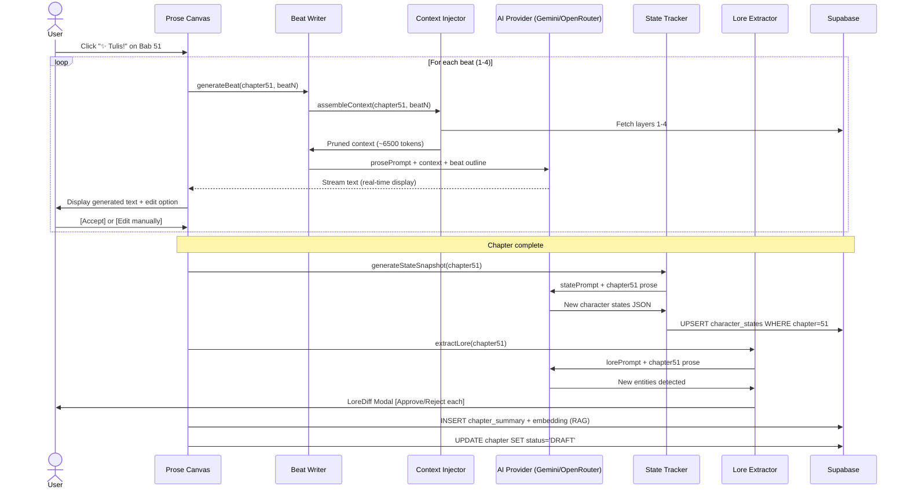

### Flow 4: Import Manuscript

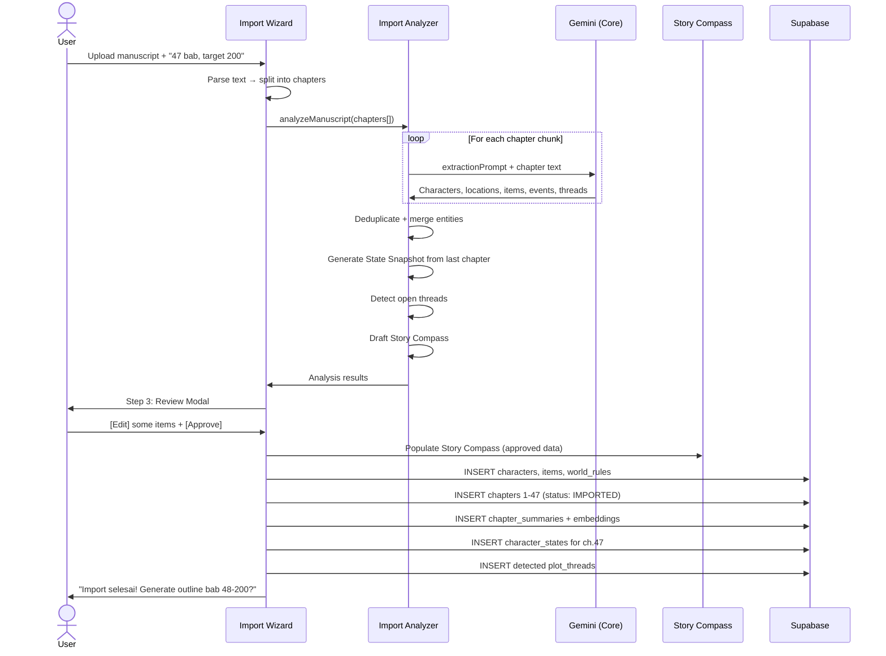

### Flow 5: Target Chapter Change

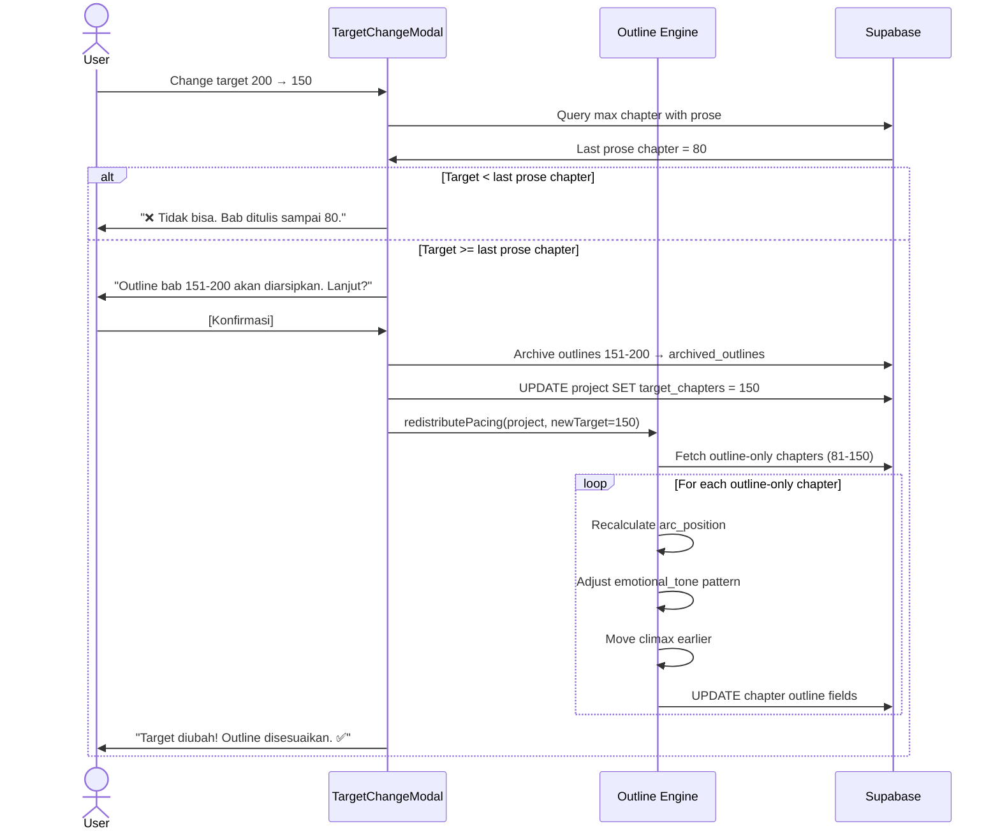

---

## Supabase Architecture

### Auth

```typescript
// src/lib/supabase.ts
import { createClient } from '@supabase/supabase-js';

export const supabase = createClient(
  import.meta.env.VITE_SUPABASE_URL,
  import.meta.env.VITE_SUPABASE_ANON_KEY
);

// Auth methods used:
// - supabase.auth.signInWithPassword()
// - supabase.auth.signInWithOAuth({ provider: 'google' })
// - supabase.auth.signUp()
// - supabase.auth.getUser()
```

### Database Entity Relationship

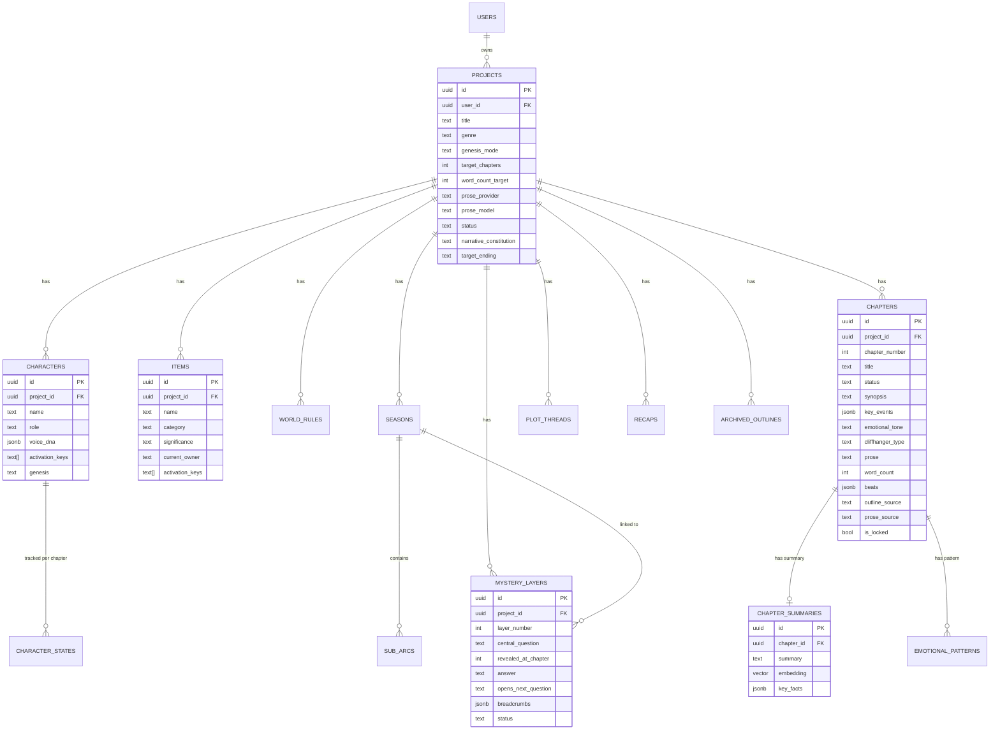

### Row Level Security (RLS)

```sql
-- Setiap table punya RLS policy yang sama:
-- User hanya bisa akses data miliknya sendiri

ALTER TABLE projects ENABLE ROW LEVEL SECURITY;

CREATE POLICY "Users can only access their own projects"
ON projects FOR ALL
USING (auth.uid() = user_id);

-- Untuk child tables (characters, chapters, dll):
CREATE POLICY "Users access via project ownership"
ON characters FOR ALL
USING (
  project_id IN (
    SELECT id FROM projects WHERE user_id = auth.uid()
  )
);

-- Pattern yang sama untuk semua child tables
```

### Storage

```
Supabase Storage Buckets:
├── manuscripts/           # Uploaded manuscript files (.txt, .docx)
│   └── {user_id}/{project_id}/manuscript.txt
├── exports/               # Generated exports
│   └── {user_id}/{project_id}/export.docx
└── mimicry-samples/       # Writing style samples
    └── {user_id}/{project_id}/sample.txt
```

---

## State Management (Zustand)

### Store Architecture

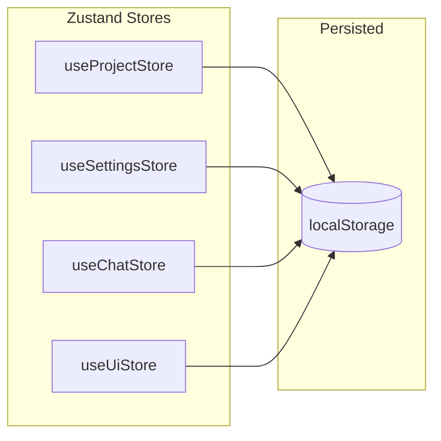

### Store Responsibilities

```typescript
// src/store/useProjectStore.ts
// Global orchestrator that merges 4 distinct parts modules transparently:
// export type ProjectStore = ProjectsPart & ChaptersPart & LorebookPart & OutlinesPart

// 1. Modul Proyek (src/store/parts/projects.ts)
// Manages: activeProject, loading states
// Actions: loadProjects, loadProjectData, addProject, updateProject, deleteProject

// 2. Modul Bab (src/store/parts/chapters.ts)
// Manages: chapters list, activeChapter, loading overlays
// Actions: loadChapters, addChapter, updateChapter, deleteChapter

// 3. Modul Pustaka Lore / 4-Layer Memory (src/store/parts/lorebook.ts)
// Manages: characters, items, worldRules, mysteryLayers, plotThreads, characterStates (Layer 2)
// Actions: addCharacter, updateCharacter, deleteCharacter, addItem, world rules CRUD, threads CRUD

// 4. Modul Outline / Batch Generator (src/store/parts/outlines.ts)
// Manages: outlineGenerating, outlineProgress, batch pacing validator warnings
// Actions: generateOutlineBatch, regenerateOutline, lockOutline, abortOutlineGeneration
```

// src/store/useSettingsStore.ts
// Manages: API keys, provider selection, user preferences
// Persisted to localStorage (NEVER sent to server)
interface SettingsStore {
  geminiKeys: string[];
  openRouterKey: string | null;
  openRouterModel: string;
  defaultProseProvider: 'gemini' | 'openrouter';
  wordCountDefault: number;
  
  addGeminiKey(key: string): void;
  removeGeminiKey(index: number): void;
  setOpenRouterKey(key: string): void;
}

// src/store/useChatStore.ts
// Manages: Co-Author chat history per project
interface ChatStore {
  messages: Map<string, ChatMessage[]>;  // projectId → messages
  coAuthorMode: 'SETUP' | 'CONSULTATION' | 'REVISION';
  
  addMessage(projectId: string, msg: ChatMessage): void;
  clearHistory(projectId: string): void;
}

// src/store/useUiStore.ts
// Manages: UI state (active mode, panel visibility, modals, theme)
interface UiStore {
  activeMode: 'brainstorm' | 'outline' | 'write' | 'review';
  contextPanelOpen: boolean;
  activeModal: string | null;
  activeChapter: number;
  theme: 'light' | 'dark';
  
  setMode(mode: string): void;
  toggleContextPanel(): void;
  openModal(name: string): void;
  toggleTheme(): void;
}
```

---

## Service Layer

### Service Dependency Graph

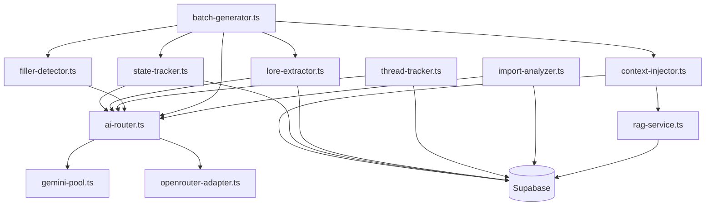

### Service Descriptions

| Service | Tanggung Jawab | AI Engine |
|---|---|---|
| **ai-router.ts** | Route request ke Gemini atau OpenRouter | — |
| **gemini-pool.ts** | Multi-key rotation, cooldown, rate limit handling | Gemini |
| **openrouter-adapter.ts** | Adapter untuk Claude/Deepseek via OpenRouter | OpenRouter |
| **context-injector.ts** | Assemble 4-layer context, keyword matching, token budgeting | — (deterministic) |
| **state-tracker.ts** | Generate + update character/item state setelah setiap chapter | Gemini |
| **lore-extractor.ts** | Auto-detect karakter/lokasi/item baru dari prose | Gemini |
| **thread-tracker.ts** | Auto-detect plot threads, health check, dangling alerts | Gemini |
| **filler-detector.ts** | Pre-generation outline check + post-generation prose check | Gemini |
| **batch-generator.ts** | Orchestrate sequential multi-chapter generation | User choice |
| **import-analyzer.ts** | Extract entities dari imported manuscript | Gemini |
| **rag-service.ts** | Semantic search chapter summaries via pgvector | — |

---

## Prompt Pipeline

### How Prompts Are Assembled

```
┌─────────────────────────────────────────────────────┐
│                   PROMPT TEMPLATE                    │
│               (English, in /prompts/)                │
│                                                      │
│  "You are a professional Indonesian novel writer..." │
│  "Generate beat {beatNumber} of chapter {chapter}."  │
│  "The output MUST be in Bahasa Indonesia."           │
│  "{contextPlaceholder}"                              │
│  "{beatDirectionPlaceholder}"                        │
└───────────────────┬─────────────────────────────────┘
                    │
                    ▼
┌─────────────────────────────────────────────────────┐
│              CONTEXT INJECTOR                        │
│                                                      │
│  Replace {contextPlaceholder} with:                  │
│  - Layer 1: Story Lorebook (pruned by keywords)      │
│  - Layer 2: Character states (relevant only)         │
│  - Layer 3: RAG results (top 3 summaries)           │
│  - Layer 4: Sliding window (prev + current + next)  │
│                                                      │
│  Replace {beatDirectionPlaceholder} with:            │
│  - Beat outline text                                 │
│  - Previous beats text (this chapter)                │
│  - Cliffhanger instruction (if last beat)           │
│  - Mystery breadcrumb (if applicable)               │
│  - Micro-hook instruction                           │
└───────────────────┬─────────────────────────────────┘
                    │
                    ▼
┌─────────────────────────────────────────────────────┐
│              ASSEMBLED PROMPT                        │
│              (~6500 tokens)                          │
│                                                      │
│  → Sent to AI Provider                              │
│  → Response streamed to UI                          │
│  → Output: Bahasa Indonesia prose                   │
└─────────────────────────────────────────────────────┘
```

### Prompt File Structure

```typescript
// src/prompts/prose-writer.ts
export function buildProsePrompt(params: {
  beat: BeatOutline;
  chapter: ChapterOutline;
  context: AssembledContext;
  prevBeats: string[];
  isLastBeat: boolean;
  cliffhangerType?: string;
  mysteryBreadcrumb?: string;
  wordTarget: number;
}): string {
  return `
    You are a professional Indonesian web novel writer specializing in
    ${params.chapter.genre} genre for KBM platforms.
    
    RULES:
    - Output MUST be in Bahasa Indonesia
    - Target: ${params.wordTarget / 4} words for this beat
    - Use short paragraphs (2-3 sentences max)
    - Dialog-heavy, mobile-reader friendly
    - Include micro-hooks: subtext in dialog, "wrong" details
    ${params.isLastBeat ? `
    - This is the LAST beat. End with a ${params.cliffhangerType} cliffhanger.
    - The reader must feel COMPELLED to buy the next chapter.
    ` : ''}
    ${params.mysteryBreadcrumb ? `
    - Subtly plant this breadcrumb: "${params.mysteryBreadcrumb}"
    - Do NOT make it obvious. Weave it naturally into the scene.
    ` : ''}
    
    CONTEXT:
    ${params.context.assembled}
    
    PREVIOUS BEATS IN THIS CHAPTER:
    ${params.prevBeats.join('\n\n')}
    
    CURRENT BEAT DIRECTION:
    ${params.beat.direction}
    
    Write the next beat now.
  `;
}
```

---

## Security Architecture

### API Keys — Client-Side Only

```
┌─────────────────────────────────────────────┐
│ BYOK (Bring Your Own Key) Security Model    │
│                                             │
│ • Keys stored in localStorage (encrypted)   │
│ • Keys NEVER sent to Supabase               │
│ • Keys NEVER logged or tracked              │
│ • API calls made directly from browser      │
│   to Gemini/OpenRouter (no proxy)           │
│                                             │
│ Future (credit system):                     │
│ • Keys stored server-side (Supabase Vault)  │
│ • API calls proxied through Edge Functions  │
│ • Usage metering per user                   │
└─────────────────────────────────────────────┘
```

### Data Privacy

```
User Data Flow:
  Browser → Supabase (encrypted in transit, RLS enforced)
  
AI Data Flow:
  Browser → Gemini API (Google's privacy policy)
  Browser → OpenRouter (OpenRouter's privacy policy)
  
  ⚠️ Novel content IS sent to AI providers for generation.
  This is inherent to the product. Users must consent.
```

---

## Performance Architecture

### Lazy Loading Strategy

```typescript
// Heavy components loaded on demand
const ConstellationMap = lazy(() => import('./visualization/ConstellationMap'));
const EmotionalArcHeatmap = lazy(() => import('./visualization/EmotionalArcHeatmap'));
const ImportWizard = lazy(() => import('./onboarding/ImportWizard'));
const DirectorsCutModal = lazy(() => import('./modals/DirectorsCutModal'));
```

### Virtual Scrolling

```
Outline view with 200+ chapters → react-window / @tanstack/virtual
Chapter list in Season Architect → virtualized (render only visible)
Chat history → virtualized (keep last 50 in DOM)
```

### Offline-First Draft

```
Prose writing flow:
  1. User types / AI generates → saved to localStorage immediately
  2. Background sync to Supabase every 5 seconds (debounced)
  3. If offline → queue in localStorage → sync when online
  4. Conflict resolution: last-write-wins (single user per project)
```

### Bundle Size Budget

```
Target: < 500KB initial load (gzipped)

Core:     React + Router + Zustand       ~80KB
Styling:  Tailwind (purged)              ~20KB
Supabase: Client SDK                     ~40KB
AI:       Adapter code                   ~10KB
UI:       Components                     ~50KB
────────────────────────────────────────
Initial:                                 ~200KB ✅

Lazy:     D3.js                          ~100KB (loaded on Review tab)
Lazy:     Recharts                       ~80KB (loaded on Review tab)
Lazy:     Framer Motion                  ~50KB
```

---

## Mobile & PWA Architecture

### Responsive Breakpoints

```css
/* Tailwind v4 breakpoints */
sm:  640px   /* Large phones landscape */
md:  768px   /* Tablets */
lg:  1024px  /* Small laptops — 2-column starts here */
xl:  1440px  /* Desktops — optional 3-column */
```

### Layout Adaptation

```
≥1024px:  2-column (Context 30% + Canvas 70%)
768-1023: 2-column (Context 25% + Canvas 75%) or collapsible
<768px:   1-column + bottom tab bar (5 tabs = 5 modes)
≥1440px:  Optional 3-column (Context split into 2)
```

### PWA → Capacitor Migration Path

```
Phase 3 (PWA):
  vite-plugin-pwa → manifest.json + service worker
  → Install to home screen
  → Offline draft via localStorage
  → Push notifications (optional)

Phase 10 (Capacitor):
  npm install @capacitor/core @capacitor/cli @capacitor/android
  npx cap init "VibeNovel" "com.vibenovel.app" --web-dir=dist
  npx cap add android
  
  Capacitor wraps the SAME Vite build output.
  No code changes needed (no SSR, no server routes).
  
  Android-specific additions:
  - @capacitor/splash-screen
  - @capacitor/status-bar
  - @capacitor/app (back button handler)
  - @capacitor/filesystem (local file access for import)
```

---

## Error Handling Strategy

```typescript
// Global error boundary
class ErrorBoundary extends React.Component {
  // Catches render errors → shows friendly fallback UI
}

// AI error handling
try {
  const result = await aiRouter.runProse(prompt, project);
} catch (error) {
  if (error instanceof RateLimitError) {
    // Gemini: rotate to next key
    // OpenRouter: show "rate limited, coba lagi nanti"
  } else if (error instanceof NetworkError) {
    // Save draft locally, retry when online
  } else if (error instanceof ContentFilterError) {
    // Show: "AI menolak konten ini. Coba ubah prompt."
  } else {
    // Generic: "Terjadi kesalahan. Coba lagi?"
  }
}

// Batch generation safety
if (consecutiveErrors >= 2) {
  pauseBatch();
  showWarning("Batch dihentikan karena 2x error berturut-turut.");
}
```
