# VibeNovel v2 — Architecture Document

## System Overview

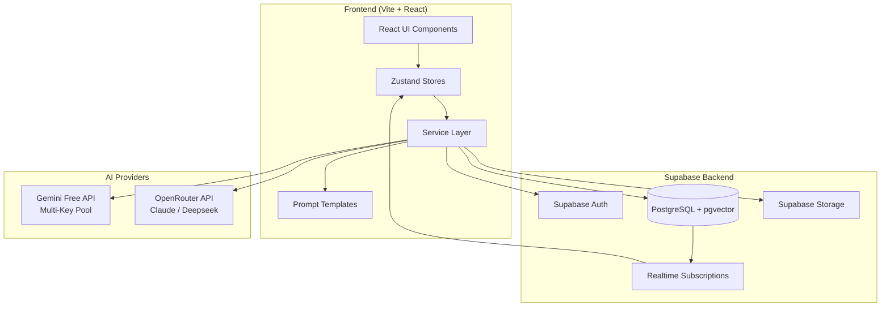

> **Arsitektur ini 100% client-side.** Tidak ada custom backend server. Semua logic berjalan di browser, semua data di Supabase, semua AI call langsung dari browser ke provider. Ini memungkinkan static deploy (Vercel/Netlify) dan Capacitor wrap tanpa perubahan.

---

## Frontend Architecture

### Tech Stack

| Layer | Teknologi | Versi | Alasan |
|---|---|---|---|
| Build | Vite | 6.x | Fast HMR, static export native |
| UI | React | 19.x | Ecosystem terluas, concurrency support |
| Language | TypeScript | 5.x | Type safety |
| Routing | React Router | 7.x | SPA routing |
| State | Zustand | 5.x | Minimal boilerplate, devtools bagus, persisted middleware |
| Styling | Tailwind CSS | 4.x | Utility-first, responsive cepat, CSS variables variables |
| Animation | Framer Motion | 12.x | Declarative animations |
| Charts | Recharts | 2.x | Emotional Arc Heatmap & Word Count Analytics (Lazy-loaded) |
| Graph | D3.js (Scoped) | 7.x | d3-force, d3-selection, d3-scale for Constellation Map (Lazy-loaded) |
| PWA | Vite PWA Plugin | 1.x / latest | Service Workers for offline availability and update notifications |
| Doc Reader | Mammoth & PDF.js | latest | Lazy-loaded document parsing for manuscript imports (.docx, .pdf, .txt) |

### Component Hierarchy

```
App.tsx (Global mounts: PwaUpdatePrompt, PremiumConfirmModal, PremiumToastContainer, CommandPalette, GlobalKeybinds)
├── pages/
│   ├── Lobby.tsx (Dashboard)
│   │   ├── StatsBar
│   │   ├── ProjectCard (× N)
│   │   │   └── DualProgressBar
│   │   ├── ProjectCreationModal
│   │   │   ├── BlueprintSelector (FRESH_BLUEPRINT picker)
│   │   │   └── ImportWizard (4-step manuscript processor)
│   │   └── SearchAndFilter
│   │
│   └── Workspace.tsx (Mode-Based SPA Canvas)
│       ├── Header (Conditional: Slim Header [Focus Mode] or Full Header)
│       │   ├── HoverModeRevealer (reveals ModeSwitcher on top edge mouse hover)
│       │   ├── ModeSwitcher (5 tabs / modes)
│       │   └── Command Palette quick-action trigger (Ctrl/Cmd+K)
│       ├── ContextPanel (left 30%, hidden in Focus Mode unless toggled)
│       │   ├── [Brainstorm] StoryCompassPreview + GapDetector
│       │   ├── [Outline]   StoryCompassPanel (Tokoh/Item/Dunia) + MimicryEngineCard (Project Voice DNA)
│       │   ├── [Write]     ChapterOutlineView + StateTimeline (10-field Layer 2 character states)
│       │   └── [Review]    PlotRadarPanel + ThreadTrackerPanel (lifespan tracking) + EmotionalArcPreview (tone indexes)
│       │
│       └── MainCanvas (right 70%)
│           ├── [Brainstorm] CoAuthorChat
│           │   ├── AiMessageBubble
│           │   ├── ApprovalCard (Optimistic duplicate name warning & manual edit trigger)
│           │   └── ChatInput
│           ├── [Outline]   SeasonArchitectPanel
│           │   ├── SeasonAccordion
│           │   ├── SubArcGroup
│           │   └── ChapterOutlineCard (Story Compass safeguards warning banner & bypass blocks)
│           ├── [Write]     ProseWriterPanel
│           │   ├── BeatEditor (Interactive beat canvas with notion-style SelectionToolbar)
│           │   ├── BeatIndicator
│           │   ├── FreeWriteEditor (Plain canvas mode for unguided writing)
│           │   └── ProseToolbar (Auto-save status, ProseModelChoice dropdown, Free Write toggle)
│           ├── [Review]    ReviewPanel (3-column layout: ProseReader, QALogs, Context)
│           │   └── QaSeverityFilter (Tab chip severity filter with Framer Motion layoutId transition)
│           └── [Visualize] VisualizationPanel (2x2 lazy container)
│               ├── EmotionalArcHeatmap (Multi-lens tiles: Tone/Cliffhanger/Filler/WordCount/Status)
│               ├── ConstellationMap (D3 force simulation or mobile list fallback with chapter range filters)
│               ├── TimelineView (10 dynamic arc bands with sticky lifespan bars)
│               └── WordCountAnalytics (Recharts ComposedChart with quick-navigate callbacks)
│
├── modals/
│   ├── SettingsModal (Keys, Writing [Mimicry], Tutorial [Reindexer trigger] tabs)
│   ├── DirectorsCutModal (3-variant stream generator and abort manager)
│   ├── LoreDiffModal (Interactive diff viewer for AI extracted entities)
│   ├── BatchSuccessModal (Autopilot stats)
│   ├── RecapModal ("Sebelumnya..." generator range picker)
│   ├── TargetChaptersAdjustmentModal (Target expand/shrink with thread/mystery clamping)
│   ├── EditDraftModal (Multi-mode form modal for Co-Author drafts)
│   └── ReindexModal (Sequential background AI reindexing panel)
│
└── ui/ (shared primitives)
    ├── Button, Toast, Spinner
    ├── BottomSheet (mobile modals)
    ├── FAB (Floating Action Button)
    └── DualProgressBar
```

### Routing

```typescript
// src/App.tsx
<Routes>
  <Route path="/" element={<Lobby />} />
  <Route path="/project/:projectId" element={<Workspace />} />
  <Route path="/login" element={<Login />} />
</Routes>
```

Hanya 3 route. Workspace mengelola semua mode secara internal via state, bukan via URL.

---

## Theme & Styling System

### Maintainability Notes

- `activeProseModel` is the single persisted prose-provider choice used by UI and AI routing. Legacy split fields like `defaultProseProvider` and `openRouterModel` are intentionally no longer part of the architectural contract.
- Onboarding helpers are split into `onboarding-flags.ts` and `onboarding-steps.ts` so the tour component stays export-clean and React Refresh friendly.
- `projects.ts` and `chapters.ts` guard Supabase calls when configuration is unavailable, which keeps local demo/offline flows from crashing on empty credentials.
- `chapter_versions` and `recaps` are part of the persisted memory surface and should stay in sync with the store/API typings whenever schema changes are introduced.

Sistem tema VibeNovel dirancang untuk mendukung **Dual-Theme (Light/Dark)** dengan estetika premium yang disesuaikan untuk target audiens (emak-emak penulis KBM + penulis pro).

Kami menggunakan kombinasi Tailwind CSS 4.x dan CSS Variables untuk memastikan transisi tema berjalan instan, mulus, dan bebas kedipan (no flash of dark mode).

### 1. Desain Karakter Tema

| Aspek | Malam Kreatif (Dark Mode) | Jurnal Cantik (Light Mode) |
|---|---|---|
| **Vibe** | Meja menulis malam hari yang hangat & magis | Buku jurnal fisik kertas cream yang mewah |
| **Background** | Burgundy/plum gelap hangat (#1A1118) | Ivory/cream lembut hangat (#FDF8F5) |
| **Card & Surfaces** | Plum gelap hangat (#251D23) | Putih kertas murni (#FFFFFF) |
| **Text Utama** | Cream lembut hangat (#FDF6F0) | Cokelat tua hangat (#3D2C36) (ramah mata) |
| **Text Sekunder** | Lilac/mauve pudar (#B8A0B0) | Taupe lembut (#8E7A87) |
| **Borders** | Outline grape-tinted halus (#3A2F38) | Pink/cream lembut (#F0DFE7) |
| **Shadows & Glow** | Rose gold glow pudar pada hover | Rose gold shadow halus khas planner kertas |

### 2. Implementasi CSS Variables (src/index.css)

```css
@theme {
  --color-bg-primary: var(--bg-primary);
  --color-surface-primary: var(--surface-primary);
  --color-surface-hover: var(--surface-hover);
  --color-text-main: var(--text-main);
  --color-text-muted: var(--text-muted);
  --color-border-subtle: var(--border-subtle);
  --color-card-shadow: var(--card-shadow);
}

:root {
  /* Jurnal Cantik (Light Mode) */
  --bg-primary: #FDF8F5;
  --surface-primary: #FFFFFF;
  --surface-hover: #FFF3EC;
  --text-main: #3D2C36;
  --text-muted: #8E7A87;
  --border-subtle: #F0DFE7;
  --card-shadow: 0 4px 20px -2px rgba(78, 54, 41, 0.05), 0 2px 8px -1px rgba(78, 54, 41, 0.03);
}

.dark {
  /* Malam Kreatif (Dark Mode) */
  --bg-primary: #1A1118;
  --surface-primary: #251D23;
  --surface-hover: #2F262D;
  --text-main: #FDF6F0;
  --text-muted: #B8A0B0;
  --border-subtle: #3A2F38;
  --card-shadow: 0 8px 30px rgba(0, 0, 0, 0.3), 0 4px 12px rgba(232, 160, 191, 0.03);
}
```

### 3. State & Sinkronisasi DOM

Tema dikelola secara global menggunakan Zustand di `useUiStore` dan disinkronisasikan ke `document.documentElement` (elemen `<html>`):

```typescript
// src/store/useUiStore.ts
export const useUiStore = create<UiStore>()(
  persist(
    (set, get) => ({
      theme: 'dark', // default theme
      
      toggleTheme: () => {
        const nextTheme = get().theme === 'dark' ? 'light' : 'dark';
        set({ theme: nextTheme });
        
        // Update class di HTML element
        if (nextTheme === 'dark') {
          document.documentElement.classList.add('dark');
        } else {
          document.documentElement.classList.remove('dark');
        }
      },
      // ... state lainnya
    }),
    {
      name: 'vibenovel-ui-state',
      partialize: (state) => ({ theme: state.theme }), // hanya persist theme
    }
  )
);
```

### 4. Pencegahan Layout Shift (Anti-Flicker)

Untuk mencegah kedipan layar putih saat refresh di Dark Mode (karena LocalStorage baru terbaca setelah React render), script mini berikut diinjeksi langsung di `index.html` sebelum tag `<body>`:

```html
<!-- index.html -->
<head>
  <script>
    (function() {
      try {
        const stored = localStorage.getItem('vibenovel-ui-state');
        if (stored) {
          const parsed = JSON.parse(stored);
          if (parsed.state && parsed.state.theme === 'dark') {
            document.documentElement.classList.add('dark');
            return;
          }
        }
        // Default fallbacks atau system preference check
        document.documentElement.classList.add('dark');
      } catch (e) {}
    })();
  </script>
</head>
```

### 5. Themed Custom Dialog & Notification Engine

Seluruh interaksi dialog konfirmasi dan toast pemberitahuan di dalam aplikasi telah beralih dari bawaan native browser (`window.alert`, `window.confirm`, `window.prompt`) ke sistem kustom dinamis yang terintegrasi secara visual dengan variabel tema aktif (`Malam Kreatif` dan `Jurnal Cantik`):
- **`PremiumConfirmModal`**: Render glassmorphism (`backdrop-blur-sm bg-black/60`) dengan animasi spring halus dari Framer Motion. Modal ini mendukung skema pewarnaan berbasis tingkat keparahan (severity-tinting):
  - *Danger-red*: Warna aksen merah menyala untuk operasi hapus data (proyek, adegan, thread).
  - *Warning-amber*: Warna oranye peringatan untuk penulisan ulang outline (overwrite) atau auto-pilot batch.
  - *Info-pink/purple*: Warna ungu/merah jambu untuk pemberitahuan info umum.
- **`PremiumToastContainer`**: Barisan notifikasi melayang di pojok kanan bawah layar dengan penghapusan otomatis berbasis durasi (auto-expiry) dan efek transisi slide-in/slide-out yang responsif.
- **`EditDraftModal`**: Form editing interaktif khusus untuk draft revisi yang diusulkan oleh Co-Author AI, mendukung layout adaptif untuk masing-masing tipe data (`character`, `item`, `world_rule`, `ending`, `mystery`, dan `character_state`).

---

## AI Architecture

### Provider Hierarchy

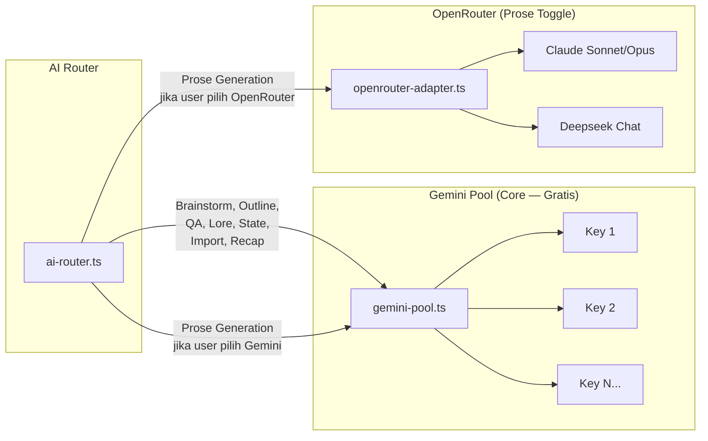

### Adapter Interface

Semua provider implement interface yang sama:

```typescript
// src/services/ai/types.ts
interface AIAdapter {
  generateText(prompt: string, options: GenerateOptions): Promise<string>;
  generateStream(prompt: string, options: GenerateOptions): AsyncIterable<string>;
}

interface GenerateOptions {
  maxTokens?: number;
  temperature?: number;
  systemPrompt?: string;
  responseFormat?: 'text' | 'json';
}
```

### Gemini Multi-Key Pool

```typescript
// src/services/ai/gemini-pool.ts
class GeminiPool implements AIAdapter {
  private keys: string[];
  private currentIndex: number = 0;
  private cooldowns: Map<string, number> = new Map();
  
  getNextKey(): string {
    // Round-robin, skip cooldown keys
    for (let i = 0; i < this.keys.length; i++) {
      const idx = (this.currentIndex + i) % this.keys.length;
      const key = this.keys[idx];
      const cooldownUntil = this.cooldowns.get(key) || 0;
      
      if (Date.now() > cooldownUntil) {
        this.currentIndex = (idx + 1) % this.keys.length;
        return key;
      }
    }
    throw new Error('Semua API key sedang cooldown. Coba lagi nanti.');
  }
  
  reportRateLimit(key: string): void {
    this.cooldowns.set(key, Date.now() + 60_000); // 60 detik cooldown
  }
}
```

### AI Router

```typescript
// src/services/ai/ai-router.ts
class AIRouter {
  private geminiPool: GeminiPool;
  private openRouterAdapter: OpenRouterAdapter;
  
  // Untuk semua operasi NON-prose → selalu Gemini
  async runCore(task: CoreTask, prompt: string): Promise<string> {
    return this.geminiPool.generateText(prompt, task.options);
  }
  
  // Untuk prose → sesuai pilihan user di Settings
  async runProse(prompt: string, project: Project): Promise<string> {
    if (project.proseProvider === 'openrouter') {
      return this.openRouterAdapter.generateStream(prompt, {
        model: project.proseModel
      });
    }
    return this.geminiPool.generateStream(prompt, {});
  }
}

type CoreTask = 
  | 'brainstorm' 
  | 'outline' 
  | 'state_snapshot'
  | 'plot_radar' 
  | 'lore_extract'
  | 'filler_detect'
  | 'thread_detect'
  | 'recap'
  | 'import_analyze'
  | 'project_voice_dna';
```

> [!NOTE]
> **Gemini Multi-Key Pool Hardening**:
> 1. **Key Logging Protection (BYOK Guard)**: Guna memenuhi aturan keamanan `#3` (AGENTS.md), `gemini-pool.ts` telah diubah untuk menghindari logging substring potongan karakter riil dari API Key (seperti `key.substring(0,8)`) ke console error/warn. Pool menggunakan helper `keyLabel(pool, key)` yang memetakan kunci ke label indeks anonim (`key #0`, `key #1`, dst).
> 2. **AbortSignal Integration**: Pool mendukung pembatalan asinkron via `AbortSignal` di method generation. Jika abort dipicu, pool langsung menghentikan request HTTP dan melempar error `AbortError`, bukan meluncurkan retry rate limit gratisan.
> 3. **pgvector Embedding Support**: Pool menyediakan method `embedContent(text, signal)` berbasis model `text-embedding-004` yang merender vektor 768-dimensi float array untuk keperluan pencarian semantik (RAG) di Supabase.

---

## 4-Layer Memory System

```mermaid
graph TD
    subgraph "Layer 1: Static Lorebook (Always Injected)"
        NC[Narrative Constitution]
        CHAR[Character Profiles + Voice DNA]
        ITEMS[Items + Activation Keys]
        WORLD[World Rules]
        END[Target Ending]
        ML[Mystery Layers - active questions]
    end

    subgraph "Layer 2: Dynamic State (Updated per Chapter)"
        CS[Character States - location, emotion, inventory]
        TL[Timeline Tracker - in-story time]
        PT[Plot Threads - active, planted, resolved]
        IO[Item Ownership - who has what]
    end

    subgraph "Layer 3: RAG Long-Term (Supabase pgvector)"
        SUM[Chapter Summaries + Embeddings]
        LORE[Lore Entries]
        IMP[Imported Manuscript Chunks]
    end

    subgraph "Layer 4: Sliding Window (Immediate Context)"
        PREV[Last 500 words of prev chapter]
        CUR[Current chapter outline + beat direction]
        NEXT[Next 2 chapter outlines - read-only fence]
    end

    NC --> PROMPT[Assembled Prompt]
    CHAR --> PROMPT
    CS --> PROMPT
    SUM --> PROMPT
    PREV --> PROMPT
    CUR --> PROMPT
    PROMPT --> AI[AI Provider]
```

### Context Assembly Flow

Pemuatan konteks dijalankan secara terarah (deterministic keyword pruning) untuk menghemat token dan menghindari kebingungan model (AI amnesia). Saat menulis adegan (beat) tertentu, alur berikut dieksekusi:

1. **Layer 1: Static Lorebook (Pangkas Kata Kunci)**:
   - **Selalu dimasukkan**: *Narrative Constitution* (Konstitusi Narasi), *KBM Melodrama Protocol* (Protokol Melodrama), *Target Ending*, dan *Lapisan Misteri* yang aktif.
   - **Dimasukkan secara kondisional**: Hanya tokoh, item, dan aturan dunia yang namanya/kunci aktivasinya cocok secara literal dengan teks arahan adegan berjalan (pruned by literal keyword matching). Ini menghemat hingga 80% token dibanding memasukkan seluruh Lorebook.

2. **Layer 2: Dynamic State (10-Field Character States)**:
   - Mengambil status tokoh/item yang relevan berdasarkan Bab sebelum berjalan. Status tokoh melacak 10 field komprehensif guna mencegah plot hole:
     - *Wajib (3)*: `knowledge_state` (apa yang dia tahu di titik ini), `active_goal` (target aktif saat ini), `secrets` (rahasia yang dia sembunyikan).
     - *Fisik & Sosial (7)*: `location` (📍 lokasi presisi), `emotional_state` (🎭 emosi aktif), `physical_condition` (💊 kondisi badan/luka), `inventory` (barang bawaan), `relationships` (relasi), `appearance_notes` (perubahan fisik/penyamaran), `alliances` (sekutu aktif).
   - Status ini diekstrak otomatis oleh asisten latar belakang saat transisi bab selesai ke status `DRAFT`, dan dapat dibangun ulang secara manual via *Reindex Memory*.

3. **Layer 3: RAG Long-Term Memory (Pencarian Semantik pgvector & Fallback)**:
   - Vektor pencarian semantik (768 dimensi hasil bentukan `text-embedding-004`) dicocokkan dengan summary bab-bab lampau di database melalui query `match_chapter_summaries` (menggunakan cosine distance `<=>`).
   - **Keyword Fallback**: Jika database offline atau API mengalami limitasi, sistem menjalankan pencarian kata kunci berbasis memori (in-memory token-overlap) menggunakan stopword filter Bahasa Indonesia (Jakarta connectors) dan penghitungan pembobotan normalisasi panjang teks untuk menyaring 3 bab paling relevan.
   - **Prose Injection**: Prose Writer menerima memori Layer 3 secara opsional lewat `buildProseInputWithRag()`. Helper ini membungkus jalur sinkron `buildProseInput()`, mengambil summary bab relevan secara best-effort, mengecualikan bab berjalan, lalu fallback ke prompt dasar saat RAG tidak tersedia atau Supabase sedang offline.

4. **Layer 4: Sliding Window (Immediate Context)**:
   - Mengambil 500 kata terakhir dari prosa bab sebelumnya (jika ada) untuk menjamin kesinambungan gaya bahasa, nada bicara, serta alur kalimat langsung.
   - Menyertakan outline berjalan dan adegan-adegan yang telah ditulis sebelumnya pada bab aktif.
   - Pagar pembatas (*read-only fence*) berupa outline 2 bab ke depan agar AI mengerti arah tujuan cerita tanpa melompati pembabakan.

### Version History Beat Snapshots

`chapter_versions` menyimpan `prose` penuh dan `beats` JSONB. Restore riwayat memakai snapshot beat tersimpan agar mode Beat-by-Beat dapat memulihkan bab sebagai satu unit, bukan menumpahkan versi lama ke beat aktif. Payload `beats` dinormalisasi saat dibaca dari Supabase sebelum dipaparkan sebagai `ChapterVersion.beats`.

### Token Budget

```
Target: ~8000 tokens input per beat generation

Layer 1 (Static Lorebook, pruned):   ~1500 tokens
Layer 2 (Dynamic State, 10-Field):   ~500 tokens
Layer 3 (RAG, top 3 summaries):      ~600 tokens
Layer 4 (Sliding Window & Fences):   ~2000 tokens
System Prompt + Rules & Style:       ~1500 tokens
Beat Outline + Direction:             ~400 tokens
──────────────────────────────────────────────────
Total Target:                        ~6500 tokens
Buffer Sisa:                         ~1500 tokens
```

---

## Data Flow Diagrams

### Flow 1: Brainstorm → Story Compass

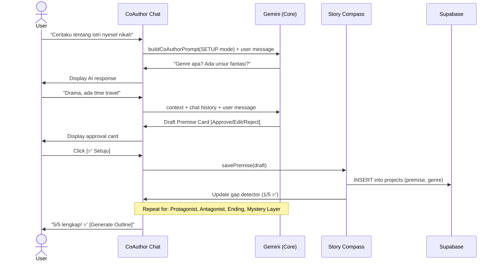

### Flow 2: Outline Generation (Story Compass Safeguarded)

### Story Contract & Canon Guardrails

Story Contract adalah sumber kebenaran mesin untuk canon cerita. Field ini
disimpan sebagai `projects.story_contract` (`jsonb`) dan dipakai oleh Co-Author,
Outline Engine, Prose Writer, dan validator sebelum output AI disimpan.

`narrative_constitution` tetap dipakai sebagai ringkasan naratif manusiawi,
sedangkan `story_contract` menyimpan struktur yang bisa divalidasi:

- `core_promise` dan `reader_promise`
- `opening_contract`
- `narrative_mechanics`
- `causality_rules`
- `canon_entities`
- `relationship_addressing`
- `arc_order`
- `forbidden_contradictions`
- `required_reveals`
- `tone_contract`

Flow wajib:

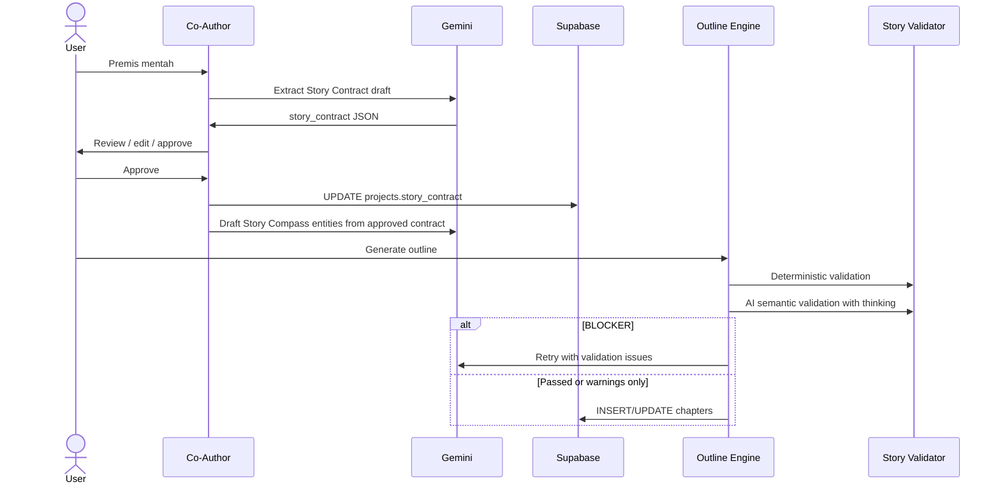

Relationship addressing menggantikan daftar nama yang dilarang. Validator harus
bisa resolve panggilan seperti `Mas`, `Sayang`, `Bu`, atau `Pak` berdasarkan
pasangan `speaker -> addressee` dan konteks relasi, lalu membedakannya dari
nama karakter baru yang perlu approval.

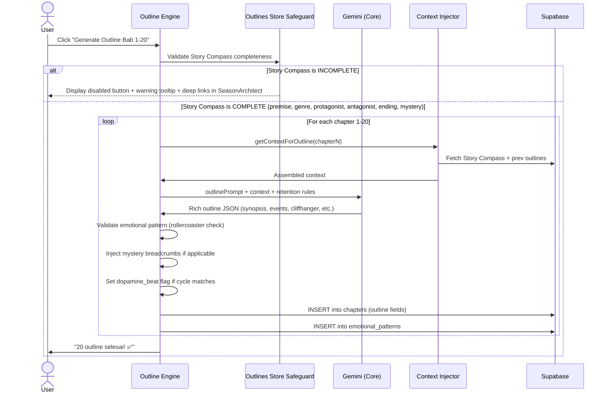

### Deep Outline Mode (Sprint 9.8)

Non-streaming reasoning untuk Outline Engine. Sama prinsipnya dengan Deep Think tapi pada surface yang berbeda — outline pakai JSON-mode call, bukan SSE stream.

**API method**: `geminiPool.generateContentV2()` non-streaming yang return `Promise<{ text: string; thoughtSummary?: string }>`. Compatible dengan `responseMimeType: 'application/json'` + `thinkingConfig` simultaneously.

**Behavior**:
- `thoughtSummary` di-discard — outline = analytical task, user tidak perlu lihat reasoning
- Retry mechanism preserved sebagai defense-in-depth (Deep Outline mengurangi retry rate, bukan menggantikan)
- `aiRouter.generateChapterOutline(input, options?)` accepts `{ thinkingBudget?, signal? }`

**Default behavior matrix**:

| Mode | Master ON (default) | Master OFF |
|------|---------------------|------------|
| Single regenerate | 🧠 Thinking aktif (1024) | ❌ Direct |
| Batch (sub-toggle OFF, default) | ❌ Direct (avoid 200×3s penalty) | ❌ Direct |
| Batch (sub-toggle ON) | 🧠 Thinking per bab | ❌ Direct |

**Quality benefits**:
- JSON parse retry rate turun dari ~15% ke ~3% (estimated)
- Mystery breadcrumb placement lebih cerdas (model evaluate target_chapter optimal)
- Cliffhanger variety lebih bervariasi (kurangi 3 bab REVELATION berturut)
- Emotional arc consistency (model konsultasi history sebelum pilih tone)
- False resolution placement optimal (identifikasi sub-arc yang tepat)
- Hook chain weaving (series_hook + season_hooks lebih natural)

**UI**: Collapsible "⚙️ Pengaturan Outline" panel di SeasonArchitectPanel dengan master toggle (purple), 4-preset budget selector, sub-toggle untuk batch (amber), warning text untuk batch impact.

### Flow 3: Beat-by-Beat Prose Generation & Background AI Pipeline

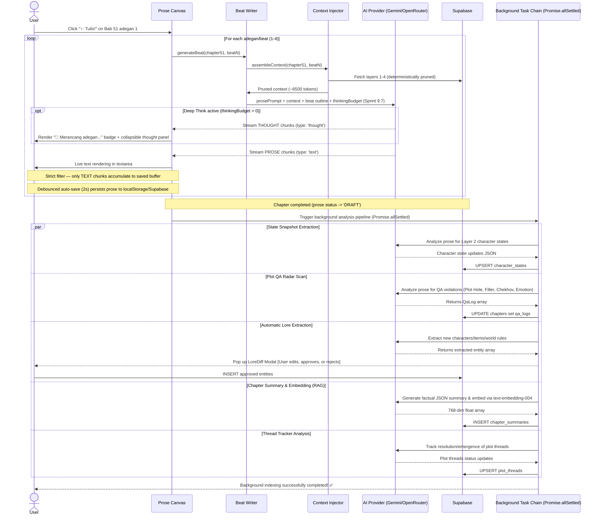

### Deep Think Mode (Sprint 9.7)

Two-phase streaming engine yang memberi model "ruang berpikir" sebelum men-generate prosa final:

**Provider matrix**:

| Provider | Mechanism | Activation |
|----------|-----------|------------|
| Gemini 2.5 Flash | `generationConfig.thinkingConfig: { thinkingBudget, includeThoughts: true }` | `generateContentStreamV2` di gemini-pool |
| Claude Sonnet 4.6 (OpenRouter) | `body.reasoning: { max_tokens: thinkingBudget }` | `generateContentStreamV2` di openrouter-adapter |
| DeepSeek V4 Flash (free) / V4 Pro | Same OpenRouter `reasoning.max_tokens` | OpenRouter unified endpoint |

**Streaming response shape**:
```typescript
interface ThinkingChunk {
  type: 'thought' | 'text'
  content: string
}
```

**SSE parsing rules**:
- **Gemini**: iterate `candidates[0].content.parts[]`, tag chunk by `part.thought === true`
- **OpenRouter primary**: `delta.reasoning_details[]` array dengan filter `type === 'reasoning.text' | 'reasoning.summary'`
- **OpenRouter fallback 1**: `delta.reasoning_content` (legacy alias string)
- **OpenRouter fallback 2**: `delta.reasoning` (legacy raw string)
- **Final prose**: `delta.content` di OpenRouter atau `part.text` (with `thought !== true`) di Gemini

**Token budget table**:

| Budget | Use Case | Latency Impact |
|--------|----------|----------------|
| 512 | Light planning | +1 detik |
| **1024 (default)** | Sweet spot — subtext + cliffhanger | +1-2 detik |
| 2048 | Deep planning untuk Director's Cut quality | +2-4 detik |
| 4096 | Maximum reasoning depth | +4-8 detik |

**Default behavior matrix**:

| Surface | Master ON (default) | Master OFF |
|---------|---------------------|------------|
| Prose Writer (interactive single beat) | 🧠 Thinking aktif (1024) | ❌ Direct prose |
| Prose Writer (Auto-Pilot, sub OFF default) | ❌ Direct prose (avoid 200×2s penalty) | ❌ Direct prose |
| Prose Writer (Auto-Pilot, sub ON) | 🧠 Thinking per beat | ❌ Direct prose |

**Privacy & persistence**:
- Thought tokens HANYA state lokal hook (`useBeatWriter`)
- TIDAK pernah masuk Zustand persist, localStorage, atau Supabase
- TIDAK masuk ke `chapter.beats[].prose` (strict filter di stream loop)
- Hilang saat refresh browser — by design

**Backward compatibility**:
- Existing `generateContentStream()` (V1) tidak diubah
- Director's Cut, recap, inline edit, dll tetap pakai V1 stream lama
- Hanya `generateProseBeatStream` yang upgrade ke V2 (`AsyncGenerator<ThinkingChunk>`)

### Flow 4: Import Manuscript

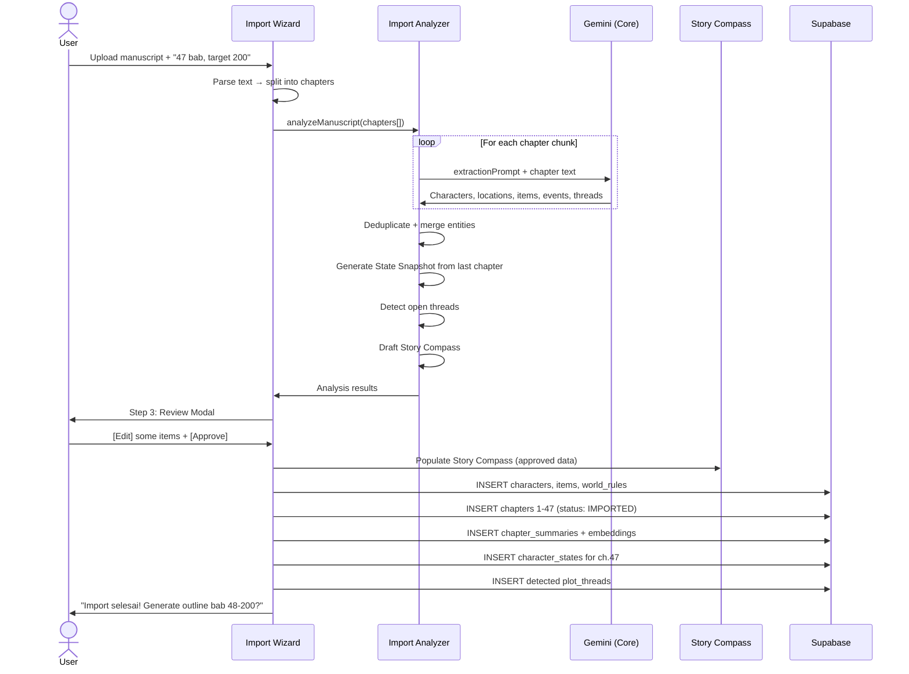

### Flow 5: Target Chapter Change (Expand / Shrink Safeguarded)

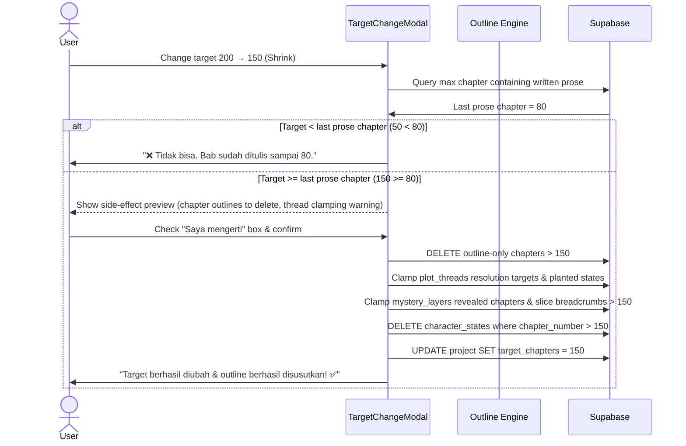

### Flow 6: Free Write Reindexing & Offline Reconnect Syncing

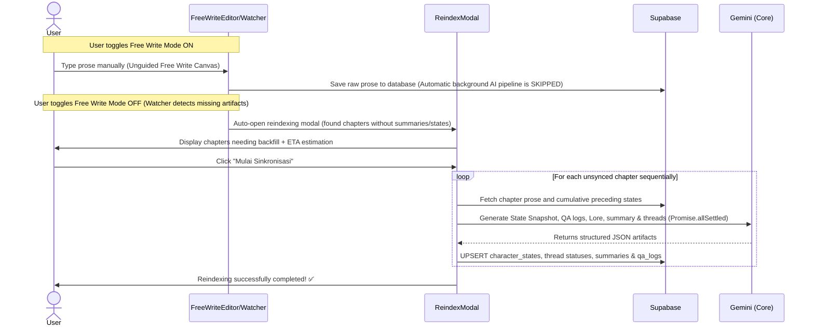

---

## Supabase Architecture

### Auth

```typescript
// src/lib/supabase.ts
import { createClient } from '@supabase/supabase-js';

export const supabase = createClient(
  import.meta.env.VITE_SUPABASE_URL,
  import.meta.env.VITE_SUPABASE_ANON_KEY
);

// Auth methods used:
// - supabase.auth.signInWithPassword()
// - supabase.auth.signInWithOAuth({ provider: 'google' })
// - supabase.auth.signUp()
// - supabase.auth.getUser()
```

### Database Entity Relationship

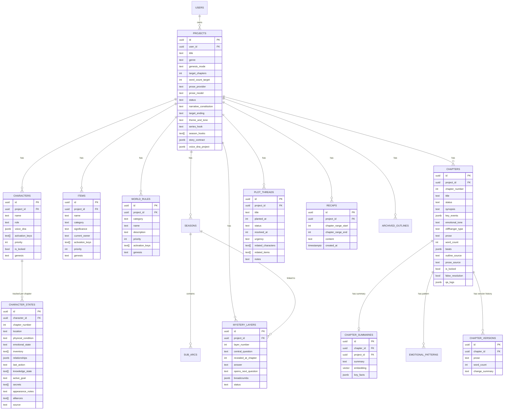

### Row Level Security (RLS)

```sql
-- Setiap table punya RLS policy yang sama:
-- User hanya bisa akses data miliknya sendiri

ALTER TABLE projects ENABLE ROW LEVEL SECURITY;

CREATE POLICY "Users can only access their own projects"
ON projects FOR ALL
USING (auth.uid() = user_id);

-- Untuk child tables (characters, chapters, dll):
CREATE POLICY "Users access via project ownership"
ON characters FOR ALL
USING (
  project_id IN (
    SELECT id FROM projects WHERE user_id = auth.uid()
  )
);

-- Pattern yang sama untuk semua child tables
```

### Storage

```
Supabase Storage Buckets:
├── manuscripts/           # Uploaded manuscript files (.txt, .docx)
│   └── {user_id}/{project_id}/manuscript.txt
├── exports/               # Generated exports
│   └── {user_id}/{project_id}/export.docx
└── mimicry-samples/       # Writing style samples
    └── {user_id}/{project_id}/sample.txt
```

---

## State Management (Zustand)

### Store Architecture

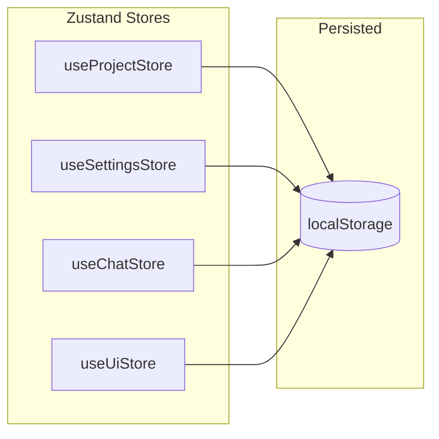

### Store Responsibilities

```typescript
// src/store/useProjectStore.ts
// Global orchestrator that merges 4 distinct parts modules transparently:
// export type ProjectStore = ProjectsPart & ChaptersPart & LorebookPart & OutlinesPart

// 1. Modul Proyek (src/store/parts/projects.ts)
// Manages: activeProject, loading states
// Actions: loadProjects, loadProjectData, addProject, updateProject, deleteProject

// 2. Modul Bab (src/store/parts/chapters.ts)
// Manages: chapters list, activeChapter, loading overlays
// Actions: loadChapters, addChapter, updateChapter, deleteChapter

// 3. Modul Pustaka Lore / 4-Layer Memory (src/store/parts/lorebook.ts)
// Manages: characters, items, worldRules, mysteryLayers, plotThreads, characterStates (Layer 2)
// Actions: addCharacter, updateCharacter, deleteCharacter, addItem, world rules CRUD, threads CRUD

// 4. Modul Outline / Batch Generator (src/store/parts/outlines.ts)
// Manages: outlineGenerating, outlineProgress, batch pacing validator warnings
// Actions: generateOutlineBatch, regenerateOutline, lockOutline, abortOutlineGeneration
```

// src/store/useSettingsStore.ts
// Manages: API keys, provider selection, user preferences, and writing modes
// Persisted to localStorage (NEVER sent to server)
interface SettingsStore {
  geminiKeys: string[];
  openRouterKey: string | null;
  activeProseModel: 'gemini' | 'claude' | 'deepseek' | 'deepseek-pro'; // Single source of truth for prose routing
  freeWriteMode: boolean;    // Toggle unguided free write mode
  wordCountDefault: number;
  
  addGeminiKey(key: string): void;
  removeGeminiKey(index: number): void;
  setOpenRouterKey(key: string): void;
  setActiveProseModel(model: SettingsStore['activeProseModel']): void;
  toggleFreeWriteMode(): void;
}

// src/store/useChatStore.ts
// Manages: Co-Author chat history per project and draft data validation
interface ChatStore {
  messages: Map<string, ChatMessage[]>;  // projectId → messages
  coAuthorMode: 'SETUP' | 'CONSULTATION' | 'REVISION';
  
  addMessage(projectId: string, msg: ChatMessage): void;
  clearHistory(projectId: string): void;
  updateMessageDraftStatus(projectId: string, msgId: string, status: 'approved' | 'rejected', editedData?: any): void; // Handles name duplicate-by-name detection
}

// src/store/useUiStore.ts
// Manages: UI state (active mode, focus mode, global modals, toasts queue, and confirm triggers)
interface Toast {
  id: string;
  message: string;
  type: 'info' | 'success' | 'warning' | 'error';
  duration?: number;
}

interface ConfirmOptions {
  title: string;
  message: string;
  severity: 'info' | 'warning' | 'danger';
  onConfirm: () => void;
  onCancel?: () => void;
}

interface UiStore {
  activeMode: 'brainstorm' | 'outline' | 'write' | 'review' | 'visualize';
  contextPanelOpen: boolean;
  activeModal: string | null;
  activeChapter: number;
  theme: 'light' | 'dark';
  focusMode: boolean;         // Persisted focus mode (default true)
  paletteOpen: boolean;       // Transient command palette (Cmd+K) state
  toasts: Toast[];            // Global toast queue
  confirmOptions: ConfirmOptions | null; // Global confirmation state
  batchProgress: BatchProgress | null;   // Autopilot progress tracker
  
  setMode(mode: string): void;
  toggleContextPanel(): void;
  openModal(name: string): void;
  toggleTheme(): void;
  setFocusMode(focus: boolean): void;
  toggleFocusMode(): void;
  setPaletteOpen(open: boolean): void;
  addToast(message: string, type: Toast['type'], duration?: number): void;
  removeToast(id: string): void;
  showConfirm(options: ConfirmOptions): void;
  hideConfirm(): void;
}
```

---

## Service Layer

### Service Dependency Graph

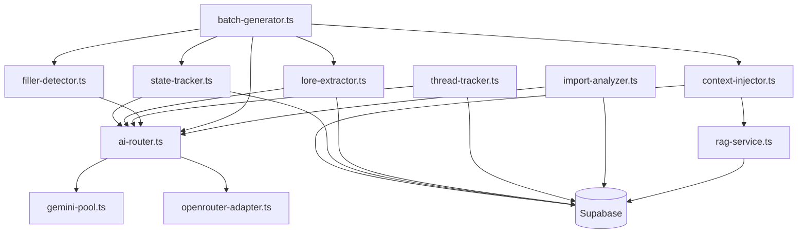

### Service Descriptions

| Service | Tanggung Jawab | AI Engine |
|---|---|---|
| **ai-router.ts** | Route request ke Gemini atau OpenRouter | — |
| **gemini-pool.ts** | Multi-key rotation, cooldown, rate limit handling, embeddings, AbortSignal handling | Gemini |
| **openrouter-adapter.ts** | Adapter untuk Claude/Deepseek via OpenRouter | OpenRouter |
| **context-injector.ts** | Assemble 4-layer context, keyword matching, token budgeting, pgvector RAG injection | — (deterministic) |
| **state-tracker.ts** | Generate + update 10-field character/item state setelah setiap chapter | Gemini |
| **lore-extractor.ts** | Auto-detect karakter/lokasi/item baru dari prose | Gemini |
| **thread-tracker.ts** | Auto-detect plot threads, health check, dangling alerts | Gemini |
| **filler-detector.ts** | Pre-generation check + post-generation prose check | Gemini |
| **batch-generator.ts** | Orchestrate sequential multi-chapter autopilot prose generation | User choice |
| **import-analyzer.ts** | Tier-1 (Quick Scan) & Tier-2 (Deep Analysis) orchestrator for imported manuscript | Gemini |
| **rag-service.ts** | Semantic search chapter summaries via pgvector RPC or local token-overlap keyword search fallback | — |
| **chapter-reindexer.ts** | Sequential reindexing utility to backfill missing AI states, summaries, and thread analysis | Gemini |
| **chapter-protection.ts** | Guardrail logic validating written prose or locked states before reduction or deletion | — (deterministic) |
| **target-chapters-adjuster.ts** | Executes project chapter target stretching (outline generation) or shrinking (outline removal, thread clamping) | — / Gemini |
| **project-cloner.ts** | Clones all key metadata, settings, and unrevealed lore assets to create clean spin-offs | — (deterministic) |
| **blueprint-applier.ts** | Subsitutes bracketed placeholders and seeds FRESH_BLUEPRINT archetypes automatically | — (deterministic) |
| **manuscript-reader.ts** | Dynamic importer for raw .txt, mammoth .docx, and pdfjs-dist .pdf text extraction | — (deterministic) |
| **manuscript-parser.ts** | Sub-arc chapter splitter, capitalized token entity seeder, and API-cost and token estimator | — (deterministic) |
| **import-cache.ts** | LocalStorage analysis cache using SHA-256 hashes of manuscript text to bypass API calls | — (deterministic) |

---

## Prompt Pipeline

### How Prompts Are Assembled

```
┌─────────────────────────────────────────────────────┐
│                   PROMPT TEMPLATE                    │
│               (English, in /prompts/)                │
│                                                      │
│  "You are a professional Indonesian novel writer..." │
│  "Generate beat {beatNumber} of chapter {chapter}."  │
│  "The output MUST be in Bahasa Indonesia."           │
│  "{contextPlaceholder}"                              │
│  "{beatDirectionPlaceholder}"                        │
└───────────────────┬─────────────────────────────────┘
                    │
                    ▼
┌─────────────────────────────────────────────────────┐
│              CONTEXT INJECTOR                        │
│                                                      │
│  Replace {contextPlaceholder} with:                  │
│  - Layer 1: Story Lorebook (pruned by keywords)      │
│  - Layer 2: Character states (relevant only)         │
│  - Layer 3: RAG results (top 3 summaries)           │
│  - Layer 4: Sliding window (prev + current + next)  │
│                                                      │
│  Replace {beatDirectionPlaceholder} with:            │
│  - Beat outline text                                 │
│  - Previous beats text (this chapter)                │
│  - Cliffhanger instruction (if last beat)           │
│  - Mystery breadcrumb (if applicable)               │
│  - Micro-hook instruction                           │
└───────────────────┬─────────────────────────────────┘
                    │
                    ▼
┌─────────────────────────────────────────────────────┐
│              ASSEMBLED PROMPT                        │
│              (~6500 tokens)                          │
│                                                      │
│  → Sent to AI Provider                              │
│  → Response streamed to UI                          │
│  → Output: Bahasa Indonesia prose                   │
└─────────────────────────────────────────────────────┘
```

### Prompt File Structure

```typescript
// src/prompts/prose-writer.ts
export function buildProsePrompt(params: {
  beat: BeatOutline;
  chapter: ChapterOutline;
  context: AssembledContext;
  prevBeats: string[];
  isLastBeat: boolean;
  cliffhangerType?: string;
  mysteryBreadcrumb?: string;
  wordTarget: number;
}): string {
  return `
    You are a professional Indonesian web novel writer specializing in
    ${params.chapter.genre} genre for KBM platforms.
    
    RULES:
    - Output MUST be in Bahasa Indonesia
    - Target: ${params.wordTarget / 4} words for this beat
    - Use short paragraphs (2-3 sentences max)
    - Dialog-heavy, mobile-reader friendly
    - Include micro-hooks: subtext in dialog, "wrong" details
    ${params.isLastBeat ? `
    - This is the LAST beat. End with a ${params.cliffhangerType} cliffhanger.
    - The reader must feel COMPELLED to buy the next chapter.
    ` : ''}
    ${params.mysteryBreadcrumb ? `
    - Subtly plant this breadcrumb: "${params.mysteryBreadcrumb}"
    - Do NOT make it obvious. Weave it naturally into the scene.
    ` : ''}
    
    CONTEXT:
    ${params.context.assembled}
    
    PREVIOUS BEATS IN THIS CHAPTER:
    ${params.prevBeats.join('\n\n')}
    
    CURRENT BEAT DIRECTION:
    ${params.beat.direction}
    
    Write the next beat now.
  `;
}
```

---

## Security Architecture

### API Keys — Client-Side Only

```
┌─────────────────────────────────────────────┐
│ BYOK (Bring Your Own Key) Security Model    │
│                                             │
│ • Keys stored in localStorage (encrypted)   │
│ • Keys NEVER sent to Supabase               │
│ • Keys NEVER logged or tracked              │
│ • API calls made directly from browser      │
│   to Gemini/OpenRouter (no proxy)           │
│                                             │
│ Future (credit system):                     │
│ • Keys stored server-side (Supabase Vault)  │
│ • API calls proxied through Edge Functions  │
│ • Usage metering per user                   │
└─────────────────────────────────────────────┘
```

### Data Privacy

```
User Data Flow:
  Browser → Supabase (encrypted in transit, RLS enforced)
  
AI Data Flow:
  Browser → Gemini API (Google's privacy policy)
  Browser → OpenRouter (OpenRouter's privacy policy)
  
  ⚠️ Novel content IS sent to AI providers for generation.
  This is inherent to the product. Users must consent.
```

---

## Performance Architecture

### Lazy Loading Strategy

Guna menjaga performa pemuatan awal yang optimal (Lighthouse score ≥ 90), komponen berat dan dependensi besar di-load secara malas (*lazy loading*) hanya ketika dibutuhkan:
1. **Visualization Panel Components**: `<VisualizationPanel />` bertindak sebagai wrapper malas. Keempat komponen visualisasi di dalamnya di-render malas menggunakan `React.lazy()` dengan `<Suspense>` boundary terpisah sehingga Recharts dan D3 hanya diunduh saat mode Visualisasi dibuka:
   - `EmotionalArcHeatmap` (~6.5 KB)
   - `TimelineView` (~7.3 KB)
   - `ConstellationMap` (~27.5 KB)
   - `WordCountAnalytics` (~377 KB - pembawa Recharts yang berat)
2. **Onboarding & Writing Modals**:
   - `ImportWizard` (~225 KB - Mammoth.js dan PDF.js hanya di-download saat mengimpor naskah)
   - `DirectorsCutModal` / `EditDraftModal` / `ReindexModal`

### Dynamic Code Splitting (Vite Advanced Chunks)

Konfigurasi `vite.config.ts` mengadopsi Rolldown `codeSplitting.groups[]` API untuk memecah bundle monolitik menjadi 4 vendor groups utama:
- `vendor-react`: Mengelompokkan `react`, `react-dom`, dan `react-router` (~189 KB).
- `vendor-supabase`: Mengelompokkan `@supabase/supabase-js` dan client adapter (~200 KB).
- `vendor-motion`: Mengelompokkan `framer-motion` (~125 KB).
- `vendor-store`: Mengelompokkan `zustand` (~2.6 KB).

Hasil pemecahan ini menurunkan ukuran entry point utama sebesar **72%** (dari **920 KB** monolitik ke **259 KB** initial load / **77 KB gzipped**), mempercepat *Time to Interactive (TTI)* secara drastis bagi pengguna baru di halaman Lobby.

### Virtual Scrolling

```
Chapter list in Season Architect → virtualized (render only visible)
Chat history → virtualized (keep last 50 in DOM)
```

### Offline-First Draft & Auto-Save

```
Prose writing flow:
  1. User types / AI generates → saved to localStorage immediately via debounced auto-save (2s)
  2. If online: Background sync to Supabase.
  3. If offline: Cached locally under `vn_draft_{chapterId}_{beatIndex}`
  4. Sync on Reconnect: useOfflineDraft watcher triggers automatic flush to Supabase when network is restored, followed by sequential background reindexing.
```

### Bundle Size Budget

```
Target: < 300KB initial load (gzipped)

Initial (Lobby):
- Main Entry (routing, context)     ~77KB (gzipped)
- vendor-react                      ~60KB (gzipped)
- vendor-supabase                   ~52KB (gzipped)
- vendor-motion                     ~41KB (gzipped)
- vendor-store                      ~1.3KB (gzipped)
────────────────────────────────────────────────────
Total Initial Load:                 ~231KB (gzipped) ✅

Lazy Loaded Chunks:
- Recharts (WordCountAnalytics)     ~109KB (gzipped, loaded only in Visualize mode)
- D3.js (ConstellationMap)          ~10KB (gzipped, loaded only in Visualize mode)
- Mammoth & PDF.js (ImportWizard)   ~900KB (gzipped, loaded only in Import mode)
```

---

## Mobile & PWA Architecture

### Responsive Breakpoints

```css
/* Tailwind v4 breakpoints */
sm:  640px   /* Large phones landscape */
md:  768px   /* Tablets */
lg:  1024px  /* Small laptops — 2-column starts here */
xl:  1440px  /* Desktops — optional 3-column */
```

### Layout Adaptation

```
≥1024px:  2-column (Context 30% + Canvas 70%)
768-1023: 2-column (Context 25% + Canvas 75%) or collapsible
<768px:   1-column + bottom tab bar (5 tabs = 5 modes)
≥1440px:  Optional 3-column (Context split into 2)
```

### PWA → Capacitor Migration Path

```
Phase 3 (PWA):
  Sistem VibeNovel v2 di-build menggunakan `vite-plugin-pwa` dengan mode `registerType: 'autoUpdate'` guna memperbarui service worker secara instan di latar belakang.
  
  **Workbox Runtime Caching Strategies**:
  - Google Fonts CSS → `StaleWhileRevalidate` (Cached for 7 days)
  - Google Fonts files (woff2) → `CacheFirst` (Cached for 1 year)
  - Supabase REST API & RPC → `NetworkFirst` (10s timeout, fallback to 1-day stale cache when offline)
  - Supabase Auth SDK → `NetworkFirst` (5s timeout, 5 min fallback cache)
  - Gemini & OpenRouter APIs → `NetworkOnly` (Sengaja tidak pernah di-cache karena data bersifat kontekstual/real-time)
  - Gambar & Aset Lokal → `CacheFirst` (Cached for 30 days)

  **Offline Draft Fallback Queue (`useOfflineDraft.ts`)**:
  - Menyediakan penanganan offline otomatis. Ketika navigator mendeteksi status `offline`, penulisan prosa di BeatEditor secara otomatis disimpan ke LocalStorage dengan namespace khusus (`vn_draft_{chapterId}_{beatIndex}`) lengkap dengan stempel waktu (timestamp).
  - Ketika browser kembali mendeteksi status `online`, watcher secara otomatis melakukan sinkronisasi ulang (syncing) mengunggah seluruh draft antrean ke database Supabase dan menjalankan reindexing asisten AI secara berurutan.
  
  **Dynamic SW Update Prompt (`PwaUpdatePrompt.tsx`)**:
  - Modal melayang beranimasi Framer Motion di pojok kanan bawah yang muncul otomatis saat Service Worker mendeteksi file revisi bundle baru di server ("Versi Baru Tersedia — Reload") atau memberikan konfirmasi siap offline ("Aplikasi Siap Dipakai Offline").

  → Installable: Berhasil lolos audit manifest chrome desktop/mobile untuk penambahan shortcut instalasi PWA ke Home Screen.
  → Push notifications (optional)

Phase 10 (Capacitor):
  npm install @capacitor/core @capacitor/cli @capacitor/android
  npx cap init "VibeNovel" "com.vibenovel.app" --web-dir=dist
  npx cap add android
  
  Capacitor wraps the SAME Vite build output.
  No code changes needed (no SSR, no server routes).
  
  Android-specific additions:
  - @capacitor/splash-screen
  - @capacitor/status-bar
  - @capacitor/app (back button handler)
  - @capacitor/filesystem (local file access for import)
```

---

## Error Handling Strategy

```typescript
// Global error boundary
class ErrorBoundary extends React.Component {
  // Catches render errors → shows friendly fallback UI
}

// AI error handling
try {
  const result = await aiRouter.runProse(prompt, project);
} catch (error) {
  if (error instanceof RateLimitError) {
    // Gemini: rotate to next key
    // OpenRouter: show "rate limited, coba lagi nanti"
  } else if (error instanceof NetworkError) {
    // Save draft locally, retry when online
  } else if (error instanceof ContentFilterError) {
    // Show: "AI menolak konten ini. Coba ubah prompt."
  } else {
    // Generic: "Terjadi kesalahan. Coba lagi?"
  }
}

// Batch generation safety
if (consecutiveErrors >= 2) {
  pauseBatch();
  showWarning("Batch dihentikan karena 2x error berturut-turut.");
}
```
