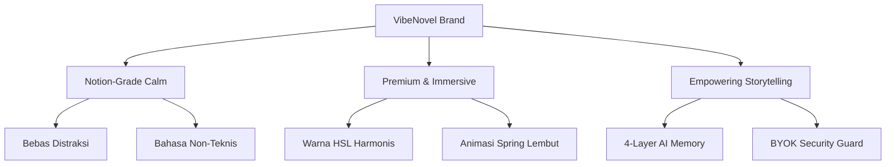
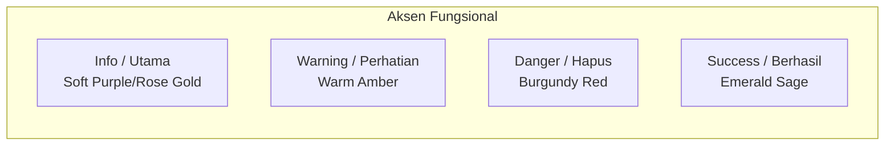

# VibeNovel Brand Guideline (v2.0)

Dokumen ini merinci identitas brand, filosofi desain, palet warna, tipografi, serta aturan nada bicara (*voice & tone*) untuk **VibeNovel**. Dokumen ini dirancang sebagai panduan bagi desainer, developer, dan AI Coding Agent dalam mempertahankan konsistensi visual dan pengalaman pengguna di seluruh ekosistem VibeNovel.

---

## 🌟 1. Visi & Filosofi Brand

VibeNovel bukan sekadar aplikasi pengolah kata (*word processor*); VibeNovel adalah **ruang kreatif kontemplatif (Notion-Grade Calm)** yang dirancang khusus untuk memeluk proses kreatif penulis novel. 

Kami menggabungkan kekuatan asisten kecerdasan buatan (*AI Co-Authoring*) tingkat lanjut dengan antarmuka yang sangat tenang, estetik, dan bebas distraksi.

### Pilar Utama Brand (Core Brand Pillars)



1. **Notion-Grade Calm (Ketenangan Tingkat Tinggi)**: Antarmuka yang bersih, lapang, dan hanya menampilkan apa yang dibutuhkan. Kami menghilangkan kepanikan visual akibat tumpukan tombol (*cluttered screens*).
2. **Premium & Immersive (Mewah & Hanyut)**: Estetika visual yang memanjakan mata dengan tema terkurasi hangat, sudut melengkung halus, efek kaca (*glassmorphism*), dan mikro-animasi transisi yang organik.
3. **Empowering Storytelling (Pemberdayaan Pencerita)**: Membantu penulis menyusun plot tanpa cela melalui visualisasi sains cerita (seperti *Emotional Arc Heatmap* dan *Constellation Relationship Map*), namun menyajikannya dengan bahasa yang sederhana.

---

## 🎭 2. Kepribadian Brand (Brand Persona)

Saat berinteraksi dengan pengguna, VibeNovel memosisikan diri sebagai **Sahabat Kreatif (Co-Author)** yang tenang, bijak, hangat, dan suportif.

| Sifat Persona | Arti bagi Penulis | Apa yang Dihindari |
|---|---|---|
| **Tenang & Teduh** | Memberikan ruang fokus tinggi tanpa rasa terburu-buru. | Warna neon berkedip, pop-up agresif, bunyi alarm mengagetkan. |
| **Warm & Welcoming** | Menggunakan sapaan ramah dalam Bahasa Indonesia yang santun. | Istilah teknis komputer kering (e.g., *database error*, *vector clock*, *pipeline aborted*). |
| **Cerdas namun Rendah Hati** | AI memberikan saran plot kreatif, bukan mendikte tulisan pengguna. | AI mengambil alih kepemilikan cerita atau bersikap menggurui. |
| **Sangat Aman (Trustworthy)** | Menghormati privasi penuh pengguna (BYOK lokal) secara transparan. | Pengiriman API key tanpa persetujuan atau pelacakan aktivitas menulis. |

---

## 🎨 3. Desain Visual & Sistem Warna (Visual Design & Color Systems)

VibeNovel menggunakan sistem **Dual-Theme** premium yang dirancang khusus untuk mewakili fase psikologis penulis: kehangatan menulis di keheningan malam (*Malam Kreatif*) dan kenyamanan menulis di jurnal fisik mewah di pagi hari (*Jurnal Cantik*).

*   **Malam Kreatif (Dark Mode)**: Suasana meja kerja menulis malam hari yang hangat, magis, dan kontemplatif.
*   **Jurnal Cantik (Light Mode)**: Estetika planner kertas ivory/cream fisik berkualitas tinggi dengan aksen rose gold.

### A. Malam Kreatif (Dark Mode) — *Default Theme*
*   **Latar Belakang Utama**: Deep Burgundy/Plum Gelap Hangat (`#1A1118`)
*   **Permukaan Kartu/Panel**: Rich Warm Plum (`#251D23`)
*   **Teks Utama**: Warm Soft Cream (`#FDF6F0`)
*   **Teks Muted/Sekunder**: Muted Lilac/Mauve (`#B8A0B0`)
*   **Garis Batas (Borders)**: Grape-Tinted Halus (`#3A2F38`)
*   **Hover Glow Accent**: Rose Gold Glow (`#E8A0BF/20`)

### B. Jurnal Cantik (Light Mode)
*   **Latar Belakang Utama**: Soft Ivory/Warm Cream (`#FDF8F5`)
*   **Permukaan Kartu/Panel**: Pure Paper White (`#FFFFFF`)
*   **Teks Utama**: Dark Cocoa/Plum Brown (`#3D2C36`) — *Lebih bersahabat di mata dibanding hitam pekat*
*   **Teks Muted/Sekunder**: Soft Warm Taupe (`#8E7A87`)
*   **Garis Batas (Borders)**: Soft Dusty Pink/Cream (`#F0DFE7`)
*   **Hover Surface**: Soft Cream Blush (`#FFF3EC`)

---

### C. Sistem Aksen & Tingkat Keparahan (Severity Tinting)
Warna aksen fungsional disesuaikan agar tetap harmonis dengan warna dasar tema tanpa merusak kedamaian visual.



*   **Info / Aksen Utama**: Soft Purple & Rose Gold (`#E8A0BF` / `#C890A7`)
*   **Peringatan (Warning)**: Warm Amber (`#E29578`) — *Bukan kuning pekat yang memicu panik*
*   **Bahaya/Hapus (Danger)**: Deep Burgundy Red (`#B23B68` / `#942B54`) — *Bukan merah neon agresif*
*   **Sukses (Success)**: Emerald Sage Green (`#4D8B6F`) — *Hijau daun lembut bertema botani*

---

## ✍️ 4. Tipografi & Hirarki Huruf (Typography)

Kami memadukan fon serif klasik berjiwa sastra untuk canvas menulis dengan fon sans-serif modern berstruktur rapi untuk antarmuka dashboard.

### 1. Fon Utama Aplikasi (UI Font)
*   **Keluarga Fon**: `Outfit` (Google Fonts) sebagai fon tajuk utama, dipadukan dengan `Inter` untuk kontrol UI sekunder.
*   **Karakter**: Outfit memiliki lengkungan yang modern, membulat manis namun tetap berwibawa, mencerminkan estetika premium.
*   **Aturan Penggunaan**:
    *   *Lobby & Project Cards*: Menggunakan `Outfit` Medium/SemiBold untuk judul proyek.
    *   *Controls & Labels*: Menggunakan `Inter` Regular/Medium dengan letter-spacing stabil.

### 2. Fon Canvas Menulis (Creative Canvas Font)
*   **Keluarga Fon**: `Lora` atau `Merriweather` (Serif).
*   **Alasan**: Fon serif merangsang imajinasi sastra, mendorong kecepatan membaca yang santai, dan memberikan impresi layaknya membaca lembar buku cetak fisik.
*   **Aturan Penggunaan**:
    *   Digunakan **hanya** di dalam `BeatEditor` (Adegan Canvas) dan `ProseReader`.
    *   Ukuran font ideal: `17px` / `1.1rem` pada desktop dengan `line-height: 1.75` untuk memberikan ruang nafas antarbaris kalimat.

---

## 🕹️ 5. Prinsip Interaksi & Animasi (UI/UX Motion Principles)

Gerakan di VibeNovel dirancang untuk terasa **organik, lentur, dan membantu kenyamanan menulis**, bukan sebagai hiasan belaka.

> [!IMPORTANT]
> **Aksesibilitas Pengurangan Gerakan**:
> Sistem secara otomatis mendeteksi prefers-reduced-motion pengguna. Jika aktif, seluruh transisi CSS, spring animation Framer Motion, dan efek scrolling ditiadakan secara absolut guna menjamin aksesibilitas kenyamanan pusing/visual.

```typescript
// Konfigurasi Spring Default (Buttery Smooth, Low Tension, No Bounce)
export const VN_SPRING_TRANSITION = {
  type: "spring",
  stiffness: 260,
  damping: 30,
  mass: 0.8
};
```

### Tiga Aturan Animasi Utama:
1. **The Hover Reveal Delay**: Elemen transien seperti `HoverModeRevealer` (Mode Switcher melayang di pojok atas) wajib menggunakan jeda masuk 200ms sebelum muncul untuk menghindari pemicu tak sengaja saat kursor melintas cepat, serta jeda keluar 1500ms agar mata pengguna tidak terganggu perpindahan mendadak.
2. **Notion-Style Modal Slide**: Semua modal pusat (`CommandPalette`, `EditDraftModal`, `ReindexModal`) memudar masuk (`opacity: 0 -> 1`) berbarengan dengan sedikit pergeseran vertikal ke atas (`y: 15px -> 0`) menggunakan spring teredam stabil agar terasa memantul ringan.
3. **Glassmorphism Backdrop Blur**: Efek kaca kabur (`backdrop-blur-sm bg-black/60`) wajib digunakan pada overlay latar belakang modal konfirmasi untuk memisahkan fokus penulis dari kanvas di belakang tanpa menutupinya secara total dengan warna solid gelap.

---

## 🗣️ 6. Nada Bicara & Kamus Istilah (Voice & Tone)

Penerjemahan istilah teknis kecerdasan buatan dan basis data ke antarmuka Bahasa Indonesia harus dialihkan ke kosakata sastrawi yang ramah penulis pemula.

> [!WARNING]
> Jangan pernah menampilkan istilah jargon komputasi kering langsung di hadapan penulis. Cari kosakata analogi yang menyentuh jiwa kreatif mereka.

### Kamus Alih Istilah VibeNovel (Jargon Translation Guide)

| Istilah Teknis / Jargon | Kosakata UI VibeNovel (Direkomendasikan) | Alasan & Dampak Psikologis |
|---|---|---|
| **Beat / Beat Direction** | **Adegan / Arahan Adegan** | "Beat" terlalu berbau teknis penulisan skenario Hollywood. "Adegan" terasa alami untuk novelis KBM. |
| **Strict Mode (Enforced Outline)** | **Mode Pemandu** | "Strict" berkesan mengekang dan menakutkan. "Pemandu" berkesan membantu membimbing arah cerita. |
| **Free Write Mode** | **Mode Bebas** | Sederhana, mengalir bebas tanpa beban aturan struktur. |
| **Command Palette (Cmd+K)** | **Aksi Cepat** | Menghilangkan kesan "terminal pengembang" menjadi pintasan cepat menu. |
| **Zustand / LocalStorage Sync** | **Sinkronisasi Memori Lokal** | Menekankan bahwa data disimpan aman di perangkat pribadi penulis sendiri. |
| **Bring Your Own Key (BYOK)** | **Gunakan Kunci Mandiri** | Ramah penulis awam, menjelaskan bahwa mereka menggunakan API Key mereka sendiri dengan aman. |
| **RAG Embedding Search** | **Pencarian Memori Cerita Terkait** | Mengalihkan istilah RAG (Retrieval-Augmented Generation) yang membingungkan menjadi fungsi memori cerita. |
| **State Snapshot / Background Extractor** | **Catatan Latar Adegan / Perkembangan Tokoh** | Menghilangkan kesan ekstraksi data, berubah menjadi buku harian perkembangan status tokoh. |
| **Plot Hole Detection (Plot Radar)** | **Pemindaian Logika Cerita** | Lebih halus dibanding "Plot Hole" yang berkesan menghakimi kesalahan penulis. |

### Contoh Penerapan Kalimat dalam UI:

*   *Sistem Error Kunci (Teknis)*: `"API Key Gemini 429 Rate Limit Exceeded. Cooldown active."`
*   *Gaya VibeNovel (Benar)*: `"⚠️ Memori AI sedang beristirahat sebentar. Kami akan mencoba lagi secara otomatis dalam 60 detik atau Anda dapat menukar kunci cadangan Anda di Pengaturan."`
*   *Tombol Konfirmasi Hapus (Teknis)*: `"Apakah Anda yakin ingin menghapus data Project ini dari database Supabase secara permanen?"`
*   *Gaya VibeNovel (Benar)*: `"🚨 Hapus Karya \"Lembayung Senja\"? Seluruh draf tulisan, catatan tokoh, dan alur adegan yang tersimpan akan hilang selamanya. Tindakan ini tidak dapat dibatalkan."`

---

## 🎨 7. Panduan Aset & Ikonografi (Iconography)

VibeNovel menggunakan **Material Symbols Outlined** (Google) dengan ketebalan garis konstan `weight: 300` untuk menjaga kelangsingan visual antarmuka.

### Peta Ikon Fitur Kunci:
-   **Dashboard / Lobby**: `home` atau `folder_open` (untuk membuka laci draf karya).
-   **Mode Brainstorm (Co-Author)**: `psychology` atau `forum` (untuk obrolan kreatif hangat).
-   **Mode Outline (Season Architect)**: `auto_stories` atau `schema` (untuk merancang pembabakan bab).
-   **Mode Write (Kanvas Adegan)**: `edit_note` or `draw` (memulai goresan pena).
-   **Mode Review (Plot Radar)**: `biotech` atau `fact_check` (untuk meneliti konsistensi logika adegan).
-   **Mode Visualisasi**: `analytics` atau `bubble_chart` (menjelajahi konstelasi cerita).
-   **Fokus Mode Toggle**: `center_focus_strong` (fokus penuh) dan `center_focus_weak` (tampilan penuh).
-   **Pemberitahuan Offline**: `cloud_off` (Penyimpanan memori lokal diaktifkan).
-   **Auto-save Aktif**: `check_circle` (Tersimpan aman).

---

> [!TIP]
> **Petunjuk bagi AI Agent / Asisten Coding**:
> Saat membuat fitur baru, merombak antarmuka, atau merumuskan pesan error baru di repositori VibeNovel v2, bacalah kembali Kamus Alih Istilah dan Prinsip Motion di atas. Pastikan kode yang Anda tulis menyatu tanpa cela dengan keteduhan jiwa kepenulisan yang diusung oleh VibeNovel.
