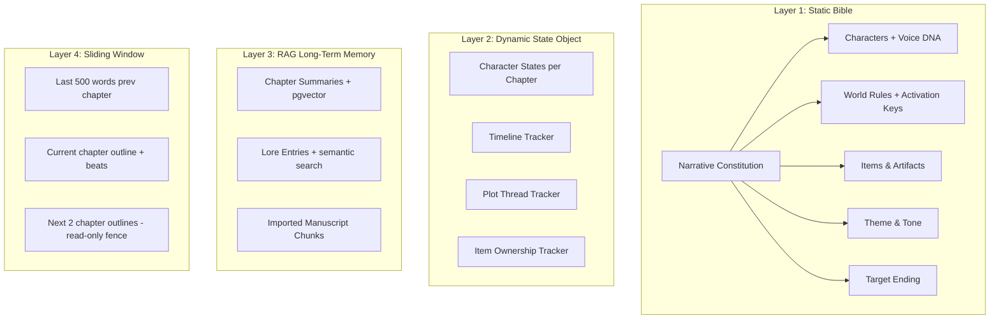

# VibeNovel v2 — Implementation Plan v3 (Final)

> **Goal:** Membangun ulang VibeNovel dari nol di folder `vibenovel-v2/` sebagai **mesin pencetak novel komersial PPC** untuk platform KBM App. Dirancang agar **siapa saja — bahkan 0 literasi, 0 kreativitas** — bisa menciptakan novel ratusan bab yang konsisten dan membuat pembaca betah membayar. Sekaligus mengakomodasi **penulis pro** yang sudah punya cerita.

> **Target User:** (1) Penulis pemula 0 literasi, (2) Penulis aktif KBM App, (3) Penulis pro dengan manuscript existing.

---

## Keputusan Final

| Topik | Keputusan |
|---|---|
| **Tech Stack** | **Vite + React 19 + TypeScript** (bukan Next.js — Capacitor-ready) |
| **Scope** | Full rebuild di `vibenovel-v2/`, v1 tetap utuh |
| **Database** | **Supabase** (PostgreSQL + pgvector + Auth + Storage + Realtime) |
| **AI Core** | **Gemini Free Multi-API** = tenaga utama SEMUA operasi AI |
| **AI Prose (Toggle)** | **OpenRouter** (model Claude / Deepseek) = opsi untuk generate prosa saja |
| **Bisnis Model** | BYOK dulu (pemakaian pribadi), sistem poin/kredit di masa depan |
| **Word Count** | User-configurable per project (default 1500, range 500-4000) |
| **Target Bab** | Wajib diisi saat buat proyek, bisa diubah kapanpun |
| **Prompt Language** | English prompts → AI output Bahasa Indonesia |
| **Layout** | **2-column mode-based** (bukan 3-column fixed) |
| **Outline Engine** | Terpisah dari Brainstorm Agent |
| **Story Compass** | Agent mengajukan → user menyetujui → baru disimpan |
| **Pro Writer** | Dual onboarding: Fresh Start vs Import Manuscript |

---

## AI Provider Architecture

### Pembagian Peran AI

```
┌─────────────────────────────────────────────────────────────┐
│                    GEMINI FREE MULTI-API                     │
│                    (Core Engine — Gratis)                    │
│                                                             │
│  Menjalankan SEMUA operasi AI kecuali prose:                │
│  • Brainstorm Agent (guided interview)                      │
│  • Outline Engine (generate rich outline)                   │
│  • State Snapshot Generator                                 │
│  • Plot Radar (QA validation)                               │
│  • Auto-Lore Extraction                                     │
│  • Filler Detector                                          │
│  • Thread Detection                                         │
│  • Recap Generator                                          │
│  • Import Analyzer (manuscript extraction)                  │
│  • Context Injection keyword extraction                     │
│                                                             │
│  Key Rotation: User input multiple Gemini free API keys     │
│  → Round-robin → Skip key yang kena rate limit              │
└─────────────────────────────────────────────────────────────┘

┌─────────────────────────────────────────────────────────────┐
│              PROSE WRITER — USER PILIH PROVIDER             │
│              (Toggle di Settings per project)               │
│                                                             │
│  ◉ Gemini (default, gratis)                                 │
│  ○ OpenRouter → Claude (bayar per token)                    │
│  ○ OpenRouter → Deepseek (bayar per token, lebih murah)     │
│                                                             │
│  Hanya untuk:                                               │
│  • Beat-by-beat prose generation                            │
│  • Director's Cut rewrite                                   │
│  • Inline surgical edit                                     │
└─────────────────────────────────────────────────────────────┘
```

> [!IMPORTANT]
> **Tidak ada Claude API langsung.** Semua akses Claude/Deepseek melalui **OpenRouter** saja. User cukup punya 1 OpenRouter API key untuk akses berbagai model.

### Settings UI

```
┌───────────────────────────────────────────────────┐
│ ⚙ AI ENGINE                                      │
│                                                   │
│ ── Gemini (Core Engine) ─────────────────────     │
│ API Keys (bisa lebih dari 1 untuk rotasi):        │
│  [AIza•••••••••••••••••1] [🗑]                    │
│  [AIza•••••••••••••••••2] [🗑]                    │
│  [+ Tambah Key]                                   │
│                                                   │
│ ── Prose Writer ─────────────────────────────     │
│ Provider untuk menulis cerita:                    │
│  ◉ Gemini (gratis, pakai key di atas)             │
│  ○ OpenRouter                                     │
│    API Key: [sk-or-•••••••••••••] [🗑]            │
│    Model:   [anthropic/claude-sonnet-4  ▼]        │
│             [deepseek/deepseek-chat     ]         │
│             [anthropic/claude-opus-4    ]         │
│                                                   │
│ ⓘ Gemini menjalankan semua fitur AI lainnya       │
│   (outline, brainstorm, QA, dll) secara gratis.   │
│   OpenRouter hanya untuk menulis prosa.           │
│                                                   │
│ 🔒 Kunci API tersimpan lokal di browser Anda.     │
└───────────────────────────────────────────────────┘
```

### Multi-Key Rotation Logic

```typescript
// src/services/ai/gemini-pool.ts
interface GeminiKeyPool {
  keys: string[];
  currentIndex: number;
  cooldowns: Map<string, number>;  // key → timestamp kapan bisa dipakai lagi

  getNextKey(): string;  // round-robin, skip yang cooldown
  reportRateLimit(key: string): void;  // tandai cooldown 60 detik
  reportError(key: string, error: string): void;
}
```

---

## Tech Stack

```
Frontend:     Vite + React 19 + TypeScript + React Router v7
Styling:      Tailwind CSS v4
Animasi:      Framer Motion
State:        Zustand v5
Database:     Supabase (PostgreSQL + pgvector + Auth + Storage + Realtime)
AI Core:      Google Gemini Free API (multi-key rotation)
AI Prose:     OpenRouter API (Claude, Deepseek — toggle)
Visualisasi:  D3.js (Constellation Map) + Recharts (Heatmap)
Mobile:       PWA → Capacitor wrapper (masa depan)
Hosting:      Vercel / Netlify (static) → Play Store via Capacitor
```

### Mengapa Vite + React, Bukan Next.js?

| Aspek | Next.js | Vite + React |
|---|---|---|
| **Capacitor** | ⚠️ Perlu `output: 'export'`, API routes mati | ✅ Static build native, langsung wrap |
| **Bundle** | Lebih besar | Lebih kecil, load cepat di HP |
| **Backend** | Built-in tapi mati di Capacitor | Supabase Edge Functions (terpisah, clean) |
| **Deploy** | Vercel-centric | Di mana saja |

---

## Dashboard (Lobby)

### Layout Desktop

```
┌─────────────────────────────────────────────────────────────────┐
│  VibeNovel                                    [🔔] [👤 Profil]  │
├─────────────────────────────────────────────────────────────────┤
│                                                                 │
│  Selamat malam, Bima 👋                                        │
│                                                                 │
│  ┌──────────┐  ┌──────────┐  ┌──────────┐  ┌──────────┐       │
│  │ 📚 12    │  │ ✍ 847    │  │ 📝 3     │  │ ⭐ 2     │       │
│  │ Proyek   │  │ Bab      │  │ Aktif    │  │ Selesai  │       │
│  └──────────┘  └──────────┘  └──────────┘  └──────────┘       │
│                                                                 │
│  🔍 [Cari proyek...]  Filter: [Semua ▼]  Sort: [Terbaru ▼]    │
│                                                                 │
│  ── Sedang Dikerjakan ─────────────────────────────────────     │
│                                                                 │
│  ┌─────────────────┐  ┌─────────────────┐  ┌───────────────┐  │
│  │ Outline ▓▓▓▓▓▓▓▓▓▓▓▓░░░ 80%         │  │               │  │
│  │ Ditulis ▓▓▓▓▓▓▓░░░░░░░░ 47%         │  │    ＋         │  │
│  │                 │  │                 │  │               │  │
│  │ Istri Sah vs    │  │ CEO Arogan      │  │  Proyek Baru  │  │
│  │ Selingkuhan     │  │                 │  │               │  │
│  │ Drama RT        │  │ Romance Office  │  │               │  │
│  │                 │  │                 │  │               │  │
│  │ 94/200 bab      │  │ 32/150 bab      │  │               │  │
│  │ ~141.000 kata   │  │ ~48.000 kata    │  │               │  │
│  │ 🟢 Writing — #95│  │ 🟡 Outline      │  │               │  │
│  │ 15 menit lalu   │  │ 2 jam lalu      │  │               │  │
│  │                 │  │                 │  │               │  │
│  │ [Lanjut →] [⋯] │  │ [Lanjut →] [⋯] │  │               │  │
│  └─────────────────┘  └─────────────────┘  └───────────────┘  │
│                                                                 │
│  ── Arsip ──────────────────────────── [Lihat Semua →] ──      │
│  ┌─────────────────┐  ┌─────────────────┐                      │
│  │ ████████████████ │  │ ████████████████ │                      │
│  │ Kembali ke Masa │  │ Kontrak Nikah   │                      │
│  │ Lalu            │  │ 180/180 ✅       │                      │
│  │ 200/200 ✅       │  │ ⭐ Selesai       │                      │
│  │ ⭐ Selesai       │  └─────────────────┘                      │
│  └─────────────────┘                                            │
└─────────────────────────────────────────────────────────────────┘
```

### Dual Progress Bar per Card

| Bar | Mengukur | Warna |
|---|---|---|
| **Outline** | `bab_punya_outline / target_bab` | Biru muda |
| **Ditulis** | `bab_punya_prose / target_bab` | Hijau |

Ketika user ubah target bab, kedua bar langsung recalculate.

### Status Badge

| Status | Warna | Kondisi |
|---|---|---|
| 🔵 Brainstorming | Biru | Sedang brainstorm, Story Compass belum lengkap |
| 🟡 Outlining | Kuning | Story Compass siap, sedang generate/edit outline |
| 🟢 Writing | Hijau | Sedang generate/menulis prosa |
| 🟠 Paused | Oranye | User sengaja pause |
| ⭐ Selesai | Emas | Semua bab selesai |

### Menu Card (⋯)
- Buka Proyek
- Ubah Target Bab
- Duplikasi (Spin-Off Clone)
- Export (.txt / .docx / .pdf)
- Arsipkan
- Hapus

### Mobile Dashboard

Card stack vertikal full-width. Satu progress bar saja (prose). FAB "+" di kanan bawah.

```
┌─────────────────────────┐
│ VibeNovel    [🔔] [👤]  │
│                         │
│ Selamat malam, Bima 👋  │
│ 3 proyek aktif          │
│                         │
│ ┌─────────────────────┐ │
│ │ ▓▓▓▓▓▓▓░░░░░░  47% │ │
│ │ Istri Sah vs        │ │
│ │ Selingkuhan          │ │
│ │ 94/200 • 🟢 Bab 95  │ │
│ │ 15 mnt  [Lanjut →]  │ │
│ └─────────────────────┘ │
│                         │
│ ┌─────────────────────┐ │
│ │ ▓▓▓░░░░░░░░░  21%  │ │
│ │ CEO Arogan           │ │
│ │ 32/150 • 🟡 Outline  │ │
│ │ 2 jam   [Lanjut →]  │ │
│ └─────────────────────┘ │
│                    [＋] │
└─────────────────────────┘
```

---

## Project Creation

### Entry Point

```
┌─────────────────────────────────────────────────────┐
│              BUAT PROYEK BARU                       │
│                                                     │
│  Judul Novel: [________________________________]    │
│  Genre:       [Drama Rumah Tangga              ▼]   │
│                                                     │
│  Target Bab:  [  200  ]                             │
│               💡 Rekomendasi genre ini: 200-300 bab │
│                                                     │
│  Kata per Bab: [ 1500 ]                             │
│               💡 KBM sweet spot: 1000-2500 kata     │
│                                                     │
│  ─────────────────────────────────────────────      │
│  Bagaimana Anda ingin memulai?                      │
│                                                     │
│  ┌───────────────────┐  ┌───────────────────┐       │
│  │  🌱 MULAI DARI    │  │  📖 LANJUT CERITA │       │
│  │     NOL           │  │     SAYA          │       │
│  │                   │  │                   │       │
│  │ [Brainstorm dulu] │  │ [Import Sekarang] │       │
│  │ [Pakai Blueprint] │  │                   │       │
│  └───────────────────┘  └───────────────────┘       │
└─────────────────────────────────────────────────────┘
```

### Target Bab: Logic Saat Diubah

**Setiap chapter punya tingkat perlindungan:**

| Status | Boleh diubah AI? |
|---|---|
| 🔒 **LOCKED** (ada prose / imported / manual lock) | ❌ Tidak boleh disentuh |
| 📋 **OUTLINE_ONLY** (ada outline, belum ada prose) | ⚠️ Bisa di-regenerate jika user setuju |
| ⬜ **EMPTY** (belum ada apa-apa) | ✅ Bebas |

**Menambah target (200 → 300):**
```
Sistem tanya:
 ◉ Tambah Season Baru (ending tetap, lanjut arc baru setelahnya)
 ○ Peregangan Alur (geser klimaks ke bab 300, regenerate outline yang belum ditulis)

Bab LOCKED → tidak berubah
Bab OUTLINE_ONLY → di-redistribute jika user pilih "Peregangan"
Bab EMPTY baru → generate fresh
```

**Mengurangi target (200 → 120):**
```
Cek: ada bab LOCKED di atas 120?
 → YA (misal locked sampai 140): ❌ BLOKIR, target minimal = 140
 → TIDAK: outline bab 121-200 diarsipkan (tidak dihapus),
          outline 81-120 di-regenerate dengan pacing dipercepat
```

---

## Workspace: Mode-Based 2-Column Layout

### Prinsip: Tampilkan hanya yang relevan dengan aktivitas saat ini.

```
┌──────────────────────────────────────────────────────────┐
│ ← Lobby    Istri Sah vs Selingkuhan    94/200 bab       │
│ [💬 Brainstorm] [📋 Outline] [✍ Write] [📊 Review]      │
├────────────────────┬─────────────────────────────────────┤
│                    │                                     │
│   Context Panel    │        Main Canvas                  │
│   (30-35%)         │        (65-70%)                     │
│                    │                                     │
│   Isi berubah      │        Isi berubah                  │
│   sesuai mode      │        sesuai mode                  │
│                    │                                     │
│   [◀ collapse]     │                                     │
└────────────────────┴─────────────────────────────────────┘
```

### Apa yang Tampil di Setiap Mode

| Mode | Context Panel (kiri 30%) | Main Canvas (kanan 70%) |
|---|---|---|
| **💬 Brainstorm** | Story Compass preview + gap indicator | Co-Author Chat |
| **📋 Outline** | Story Compass (bible/lore/items) | Season Architect (outline editor) |
| **✍ Write** | Outline bab aktif + State Snapshot | Prose Canvas (editor lebar) |
| **📊 Review** | Plot Radar + Thread Tracker | Prose reader + Emotional Arc |

### Distraction-Free Mode (Context Panel collapsed)

```
┌─────────────────────────────────────────────────────┐
│ [≡]              ✍ Bab 95 — Cincin yang Terlempar  │
│                                                     │
│   Kania memejamkan mata rapat-rapat.                │
│   Dadanya sesak, seolah udara di ruangan            │
│   tiga kali empat meter ini baru saja               │
│   dipompa keluar secara paksa.                      │
│                                                     │
│                                    [✨ Magic Write] │
└─────────────────────────────────────────────────────┘
```

### Ultra-Wide (≥1440px, optional)

Context Panel bisa split jadi 2 sub-panel:

```
┌──────────┬───────────┬────────────────────────────┐
│ Outline  │ Story     │      Prose Canvas           │
│ bab ini  │ Compass   │      (tetap dominan)        │
└──────────┴───────────┴────────────────────────────┘
```

### Mobile (<768px)

```
┌─────────────────────┐
│ ← Bab 95            │
│                     │
│   [Active Panel]    │
│   (full screen)     │
│                     │
├─┬─┬─┬─┬─┤
│💬│📋│✍│📊│⚙│
└─┴─┴─┴─┴─┘
Mode = bottom tab
```

### Design Rules Mobile

- Touch target minimum 44×44px
- Swipe left/right antar panel
- Bottom sheet modal (bukan centered popup)
- FAB "✨ Magic Write" di Canvas
- Font minimum 16px
- Semua hover-state punya touch equivalent

---

## Dual Onboarding Flow

### Path A: Fresh Start (User Pemula / 0 Literasi)

```
[Brainstorm dulu] → Brainstorm Agent
  │
  Phase 1: "Ceritamu tentang apa?"
  Phase 2: Agent draft karakter → USER SETUJU → simpan ke Story Compass
  Phase 3: Agent draft world rules → USER SETUJU → simpan
  Phase 4: Agent draft ending → USER SETUJU → simpan
  Phase 5: "Story Compass siap ✅"
  │
  └→ Handoff: Tombol [Generate Outline] → memanggil Outline Engine

[Pakai Blueprint] → Pilih genre template
  │
  └→ Story Compass auto-filled → USER REVIEW & EDIT → Konfirmasi
     └→ [Generate Outline]
```

> [!IMPORTANT]
> **Story Compass tidak pernah terisi otomatis tanpa persetujuan user.** Agent mengajukan draft → user approve/edit → baru disimpan. Ini berlaku untuk brainstorm, blueprint, DAN auto-extraction dari import.

### Path B: Pro Writer / Import Manuscript

```
[Import Sekarang]
  │
  Step 1: Import Wizard
    - Paste / upload .txt / .docx / .pdf
    - "Sudah sampai bab ke berapa?" → [ 47 ]
    - "Total target bab?" → [ 200 ] (sudah diisi dari creation form)
    - [Analisis Cerita Saya →]
  │
  Step 2: AI Analysis (Gemini, gratis)
    - Extract karakter + sifat + Voice DNA
    - Extract lokasi + item penting
    - Extract plot events per bab
    - Detect open threads
    - Generate State Snapshot dari bab terakhir
    - Draft Story Compass
  │
  Step 3: Review & Konfirmasi
    ┌──────────────────────────────────────────┐
    │ INI YANG SAYA TEMUKAN:                   │
    │                                          │
    │ ✅ 4 Karakter: Kania, Dirga, Ardan, Ibu │
    │ ✅ 3 Lokasi: Kafe, Kontrakan, Kantor     │
    │ ✅ 2 Item: Jam saku perak, Cincin        │
    │ ✅ State: Kania di depan gedung Ardan    │
    │ ⚠️ 2 Thread belum selesai                │
    │ ❓ Ending belum terdeteksi               │
    │                                          │
    │ [Edit Satu-Satu] [Setujui Semua] [Batal] │
    └──────────────────────────────────────────┘
  │
  Step 4: Isi gap manual (ending, world rules khusus, dll)
  │
  Step 5: Story Compass siap → Generate outline bab 48-200
```

### Aturan Anti-Tabrakan: Manual vs Auto

| Situasi | Aturan |
|---|---|
| User edit prose manual | State Snapshot TIDAK auto-update. User klik "Update State" jika ada perubahan posisi/kondisi karakter |
| User edit outline manual | Outline di-lock sebagai `outline_source: 'MANUAL'`. AI tidak akan overwrite kecuali user klik "Regenerate" |
| User import bab lama | Masuk sebagai `status: 'IMPORTED'`. Plot Radar tidak flag sebagai error |
| AI generate → user edit | Edit = versi final. Re-generate hanya per-beat, bukan overwrite bab |
| User mau tulis tanpa outline | Mode **Free Write** — Canvas terbuka, State Snapshot & Plot Radar jalan di background, tapi tanpa enforcement |
| User tulis outline manual → lalu klik Generate Outline di range yg sama | Sistem tanya: "Bab X sudah punya outline manual. Overwrite?" Per-bab, bukan batch |

---

## 4-Layer Memory Architecture



---

## Supabase Database Schema

```sql
-- Projects
create table projects (
  id uuid primary key default gen_random_uuid(),
  user_id uuid references auth.users,
  title text not null,
  genre text,
  genesis_mode text check (genesis_mode in ('FRESH_BRAINSTORM', 'FRESH_BLUEPRINT', 'IMPORTED')),
  target_chapters int not null default 200,
  word_count_target int default 1500,
  word_count_min int default 1000,
  word_count_max int default 2000,
  prose_provider text default 'gemini',  -- 'gemini' | 'openrouter'
  prose_model text default 'gemini-2.0-flash',
  status text default 'BRAINSTORMING',
  narrative_constitution text,  -- core rules of this story
  target_ending text,
  theme_and_tone text,
  created_at timestamptz default now(),
  updated_at timestamptz default now()
);

-- Characters
create table characters (
  id uuid primary key default gen_random_uuid(),
  project_id uuid references projects on delete cascade,
  name text not null,
  role text check (role in ('PROTAGONIST', 'ANTAGONIST', 'SUPPORTING', 'MINOR')),
  description text,
  voice_dna jsonb,
  activation_keys text[],
  priority int default 5,
  is_locked boolean default false,
  genesis text check (genesis in ('BRAINSTORMED', 'IMPORTED', 'AUTO_EXTRACTED', 'MANUAL'))
);

-- Items & Artifacts (benda penting dalam cerita)
create table items (
  id uuid primary key default gen_random_uuid(),
  project_id uuid references projects on delete cascade,
  name text not null,
  category text check (category in ('WEAPON', 'MAGICAL', 'DOCUMENT', 'JEWELRY', 'VEHICLE', 'KEY_ITEM', 'OTHER')),
  description text,
  significance text,  -- "Jam saku ini adalah alat time travel utama"
  activation_keys text[],
  current_owner text,  -- nama karakter yang memegangnya saat ini
  priority int default 5,
  genesis text check (genesis in ('BRAINSTORMED', 'IMPORTED', 'AUTO_EXTRACTED', 'MANUAL'))
);

-- World Rules (Lore entries)
create table world_rules (
  id uuid primary key default gen_random_uuid(),
  project_id uuid references projects on delete cascade,
  category text,  -- MAGIC_SYSTEM | SOCIAL_RULE | GEOGRAPHY | TECHNOLOGY | OTHER
  name text not null,
  description text,
  priority int default 5,
  activation_keys text[],
  genesis text check (genesis in ('BRAINSTORMED', 'IMPORTED', 'AUTO_EXTRACTED', 'MANUAL'))
);

-- Character States (per chapter)
create table character_states (
  id uuid primary key default gen_random_uuid(),
  character_id uuid references characters on delete cascade,
  chapter_number int not null,
  location text,
  physical_condition text,
  emotional_state text,
  inventory jsonb,  -- item IDs yang dipegang
  relationships jsonb,
  last_action text,
  source text check (source in ('AUTO_GENERATED', 'MANUAL_EDIT', 'IMPORTED'))
);

-- Seasons & Sub-Arcs
create table seasons (
  id uuid primary key default gen_random_uuid(),
  project_id uuid references projects on delete cascade,
  season_number int not null,
  title text,
  premise text,
  target_goal text,
  start_chapter int,
  end_chapter int
);

create table sub_arcs (
  id uuid primary key default gen_random_uuid(),
  season_id uuid references seasons on delete cascade,
  title text,
  start_chapter int,
  end_chapter int,
  goal text,
  mini_climax text
);

-- Chapters
create table chapters (
  id uuid primary key default gen_random_uuid(),
  project_id uuid references projects on delete cascade,
  chapter_number int not null,
  title text,
  status text check (status in ('OUTLINE_ONLY', 'GENERATING', 'DRAFT', 'FINAL', 'IMPORTED')),

  -- Outline (rich)
  synopsis text,
  key_events jsonb,
  active_characters text[],
  active_items text[],  -- item IDs yang muncul di bab ini
  location text,
  time_in_story text,
  emotional_tone text,
  cliffhanger_type text,
  cliffhanger_setup text,
  dopamine_beat boolean default false,
  paywall_advice text,
  arc_position jsonb,
  open_threads text[],
  resolved_threads text[],
  foreshadowing text[],
  chapter_end_state jsonb,
  do_not_include text[],
  must_connect_to text,
  filler_risk text,

  -- Prose
  prose text,
  word_count int,
  beats jsonb,

  -- Metadata
  outline_source text check (outline_source in ('GENERATED', 'MANUAL', 'IMPORTED')),
  prose_source text check (prose_source in ('GENERATED', 'MANUAL_WRITE', 'IMPORTED', 'MIXED')),
  is_locked boolean default false,
  created_at timestamptz default now(),
  updated_at timestamptz default now(),
  unique(project_id, chapter_number)
);

-- Plot Threads
create table plot_threads (
  id uuid primary key default gen_random_uuid(),
  project_id uuid references projects on delete cascade,
  title text not null,
  planted_at int,
  status text check (status in ('PLANTED', 'ACTIVE', 'RESOLVED', 'ABANDONED')),
  resolved_at int,
  urgency text check (urgency in ('LOW', 'MEDIUM', 'HIGH', 'CRITICAL')),
  related_characters text[],
  related_items text[],
  notes text
);

-- Chapter Summaries (RAG)
create table chapter_summaries (
  id uuid primary key default gen_random_uuid(),
  chapter_id uuid references chapters on delete cascade,
  project_id uuid references projects on delete cascade,
  chapter_number int,
  summary text,
  embedding vector(1536),
  key_facts jsonb
);

-- Recaps
create table recaps (
  id uuid primary key default gen_random_uuid(),
  project_id uuid references projects on delete cascade,
  chapter_range_start int,
  chapter_range_end int,
  content text,
  created_at timestamptz default now()
);

-- Mystery Layers (Bawang Berlapis — retensi jangka panjang)
create table mystery_layers (
  id uuid primary key default gen_random_uuid(),
  project_id uuid references projects on delete cascade,
  layer_number int not null,
  central_question text not null,       -- "Kenapa Kania menolak Dirga?"
  revealed_at_chapter int,              -- Bab berapa jawaban terungkap
  answer text,                          -- "Kania sudah melihat masa depan"
  opens_next_question text,             -- "Bagaimana dia bisa melihat masa depan?"
  breadcrumbs jsonb,                    -- [{chapter: 3, hint: "Kania menatap jam saku"}, ...]
  status text check (status in ('ACTIVE', 'REVEALED', 'PLANNED')),
  season_id uuid references seasons on delete set null
);

-- Emotional Pattern (pola emosi per bab, untuk Rollercoaster validation)
create table emotional_patterns (
  id uuid primary key default gen_random_uuid(),
  project_id uuid references projects on delete cascade,
  chapter_number int not null,
  planned_emotion text,                 -- TENSION | RELIEF | DOPAMINE | SHOCK | BREATHER
  actual_emotion text,                  -- diisi setelah prose di-generate
  false_resolution boolean default false,
  unique(project_id, chapter_number)
);

-- Archived Outlines (saat target bab dikurangi)
create table archived_outlines (
  id uuid primary key default gen_random_uuid(),
  project_id uuid references projects on delete cascade,
  chapter_number int,
  outline_data jsonb,  -- snapshot seluruh outline fields
  archived_at timestamptz default now(),
  reason text  -- 'TARGET_REDUCED' | 'REGENERATED' | 'USER_DELETED'
);
```

---

## Sistem 1: Co-Author (Brainstorm Agent)

**Scope:** Agen AI yang sadar konteks penuh — bukan chatbot biasa. Punya misi yang berubah berdasarkan state proyek.

**TIDAK** generate outline. Hanya Outline Engine yang boleh.

### Context Injection: Apa yang Co-Author Tahu Setiap Reply

```
┌─────────────────────────────────────────────────────────┐
│ CONTEXT YANG DI-INJECT KE CO-AUTHOR SETIAP PESAN:      │
│                                                         │
│ 1. Story Compass state (field mana terisi/kosong)       │
│ 2. Outline state (berapa bab sudah punya outline)       │
│ 3. Prose state (berapa bab sudah ditulis)               │
│ 4. State terakhir (lokasi/emosi karakter di bab terakhir│
│ 5. Mystery Layers (sudah dirancang atau belum)          │
│ 6. Project settings (target bab, genre, word count)     │
│ 7. Riwayat chat sebelumnya                              │
└─────────────────────────────────────────────────────────┘
```

### 3 Mode Operasi

| Mode | Kapan Aktif | Misi | Personality |
|---|---|---|---|
| 🎯 **Setup Mode** | Story Compass field wajib belum lengkap | Isi semua gap secepat mungkin | Fokus, terarah, gentle tapi persistent |
| 💬 **Consultation Mode** | Compass lengkap, sedang outlining/writing | Bantu masalah spesifik, brainstorm ide bab tertentu | Santai, responsif, context-aware |
| ✏️ **Revision Mode** | User mau ubah sesuatu di Compass | Update dengan aman tanpa merusak outline/prose existing | Hati-hati, selalu peringatkan dampak |

### Setup Mode: Required vs Optional Fields

| Field | Wajib? | Alasan |
|---|---|---|
| Premise & Genre | ✅ WAJIB | Tanpa ini, tidak bisa generate apapun |
| Protagonis (minimal 1) | ✅ WAJIB | Cerita butuh tokoh utama |
| Antagonis/Konflik | ✅ WAJIB | Cerita butuh konflik |
| Target Ending | ✅ WAJIB | Outline Engine butuh arah cerita |
| Mystery Layer (minimal 1) | ✅ WAJIB | Retensi jangka panjang (bawang berlapis) |
| Supporting Characters | ⚠️ Opsional | Bisa ditambah nanti |
| Items | ⚠️ Opsional | Bisa ditambah nanti |
| World Rules | ⚠️ Opsional (wajib jika genre fantasi) | Tergantung genre |
| Voice DNA detail | ⚠️ Opsional | Auto-populate dari prose nanti |

### Setup Mode: Redirect Rules (Anti-Melantur)

```
User ngobrol 1-2 pesan off-topic:
  → Biarkan, catat idenya. Kadang user butuh explore.

User off-topic pesan ke-3:
  → Redirect halus + tunjukkan progress:
    "Ide seru! Saya catat. 📝 Tapi yuk pastikan protagonis
     dulu — tanpa tokoh utama cerita belum bisa jalan.
     
     Story Compass: 1/5 wajib terisi ████░░░░░░ 20%"

User off-topic pesan ke-4+:
  → Agent ambil inisiatif, draft sendiri:
    "Oke saya bantu ya. Berdasarkan premis 'istri nyesel
     nikah sama suami miskin', gimana kalau tokoh utamanya:

     Nama: Kania Savitri
     Sifat: Keras kepala tapi rapuh
     
     [✅ Setuju] [✏️ Edit] [❌ Tolak]"
```

### Alur Approval (Semua Mode)

```
Agent mengajukan draft data
        │
        ▼
┌────────────────────────────────────┐
│ 💬 Agent:                          │
│ "Berdasarkan ceritamu, ini draft   │
│  karakter utama yang saya buat:"   │
│                                    │
│  Nama: Kania Savitri               │
│  Peran: Protagonis                 │
│  Sifat: Keras kepala tapi rapuh    │
│  Dialect: Betawi halus             │
│                                    │
│  [✅ Setuju] [✏️ Edit] [❌ Tolak]  │
└────────────────────────────────────┘
        │
        ├─ [Setuju] → Simpan ke Story Compass
        ├─ [Edit] → Buka editor inline → Edit → Simpan
        └─ [Tolak] → Agent ajukan draft baru
```

> [!IMPORTANT]
> Setiap data yang masuk ke Story Compass HARUS melalui approval user. Tidak ada auto-save tanpa konfirmasi.

### Gap Detection (Real-time di Chat)

```
Story Compass: 3/5 wajib terisi ██████░░░░ 60%
[✅] Premise & Genre
[✅] Protagonis (disetujui)
[✅] Antagonis (disetujui)
[⬜] Ending              ← Agent fokus di sini berikutnya
[⬜] Mystery Layer
────────────────
Opsional:
[⬜] Item Penting
[⬜] World Rules
[⬜] Supporting Characters
```

### Handoff Saat Semua Wajib Terisi

```
Agent: "Story Compass sudah lengkap! ✅

        ┌─────────────────────────────────┐
        │ [✅] Premise   [✅] Protagonis  │
        │ [✅] Antagonis [✅] Ending      │
        │ [✅] Mystery Layer (3 layers)   │
        │ ──────────── 5/5 wajib ─────── │
        └─────────────────────────────────┘

        Mau langsung generate outline?

        [🚀 Generate Outline Bab 1-20]
        [✏️ Tambah detail dulu (item, world rules, dll)]
        [📋 Review Story Compass dulu]"
```

### Consultation Mode (Setelah Compass Lengkap)

Ketika user buka chat saat sedang outlining/writing:

```
Agent tahu:
  - Compass: lengkap
  - Outline: 60/200 bab
  - Prose: 35 bab ditulis
  - Bab terakhir: "Bab 35 — Kania kabur dari rumah Ardan"
  - State: Kania sedang berlari di hujan, emosi: takut + determinasi

Agent: "Hai! Kamu sudah di bab 35 — Kania baru kabur dari Ardan.
        Ada yang bisa saya bantu?"

User: "Saya bingung bab 36 mau diisi apa"

Agent: "Di outline, bab 36: 'Kania bertemu Pria Tua di pasar malam.'
        State Kania sekarang: kabur, ketakutan.
        
        Beberapa opsi pertemuan:
        1. Pria Tua muncul di tengah pelarian (dramatic)
        2. Kania berhenti di pasar karena kehujanan (naturalistik)
        3. Mau ubah outline bab 36?"
```

### Revision Mode (Ubah Compass Tanpa Merusak)

```
User: "Saya mau ubah ending. Kania tidak kembali ke Dirga."

Agent cek dampak:
  - 115 outline (bab 36-150) mengarah ke ending lama
  - 35 bab sudah ditulis
  - Mystery Layer 3 bergantung pada ending lama

Agent: "⚠️ Perubahan ini berdampak besar:

        • 115 outline (bab 36-150) perlu di-regenerate
        • Mystery Layer 3 perlu direvisi
        • 35 bab yang sudah ditulis TIDAK diubah (aman)
        
        [Lanjut Revisi] [Batal]"
```

### System Prompt Builder (Teknis)

```typescript
function buildCoAuthorPrompt(project: Project): string {
  const compass = getCompassState(project);
  const mode = compass.requiredComplete
    ? (isRevisionIntent ? 'REVISION' : 'CONSULTATION')
    : 'SETUP';

  return `
    MODE: ${mode}
    
    COMPASS STATE: ${JSON.stringify(compass)}
    PROGRESS: Outline ${outlineCount}/${project.targetChapters}, 
              Prose ${proseCount}/${project.targetChapters}
    LAST CHAPTER: ${lastChapter?.title} — ${lastChapter?.endState}
    MYSTERY LAYERS: ${JSON.stringify(mysteryLayers)}
    
    ${mode === 'SETUP' ? `
      MISI: Lengkapi field wajib: ${compass.missingRequired.join(', ')}
      ATURAN: 
      - Fokus 1 field per giliran
      - Off-topic 3x → redirect + draft sendiri
      - Setelah 5/5 wajib terisi → tawarkan Generate Outline
      - JANGAN generate outline sendiri
    ` : ''}
    
    ${mode === 'CONSULTATION' ? `
      MISI: Bantu masalah spesifik. Kamu tahu isi outline + state.
    ` : ''}
    
    ${mode === 'REVISION' ? `
      MISI: Update Compass dengan aman.
      SELALU peringatkan dampak ke outline/prose existing.
    ` : ''}
  `;
}
```

---

## Sistem 3: Outline Engine (Terpisah)

**Scope:** Menerima Story Compass → rich outline per chapter. Bisa dipanggil kapanpun.

### 5 Entry Points (Tanpa Tabrakan)

```
1. Setelah Brainstorm → "Generate Outline Bab 1-[N]"
   Semua outline = GENERATED

2. Setelah Import → "Generate Outline Bab 48-200"
   Bab 1-47 = IMPORTED (tidak disentuh)

3. Re-generate satu bab → Klik "🔄 Regenerate" di bab tertentu
   Sistem cek: outline_source MANUAL? → Tanya "Yakin overwrite?"
   Sistem cek: ada prose? → Tolak, harus hapus prose dulu

4. User tulis outline manual → Klik "+ Tambah Outline Manual"
   Simpan sebagai outline_source: 'MANUAL'
   AI TIDAK BOLEH menyentuh bab ini saat batch generate

5. Batch re-generate range → "Regenerate Outline Bab 50-80"
   Sistem cek per bab:
   - MANUAL → Skip (tampilkan peringatan: "3 bab di-skip karena outline manual")
   - Ada prose (LOCKED) → Skip
   - GENERATED/EMPTY → Regenerate
```

### Output Outline per Chapter

```json
{
  "chapterNumber": 5,
  "title": "Cincin yang Terlempar",
  "synopsis": "Kania menolak lamaran Dirga untuk melindunginya...",
  "keyEvents": ["Kania menolak cincin", "Ardan masuk dengan dokumen utang"],
  "activeCharacters": ["Kania", "Dirga", "Ardan"],
  "activeItems": ["Cincin berlian", "Dokumen utang"],
  "location": "Kafe Anggrek, Jakarta Selatan",
  "timeInStory": "Sabtu sore, 10 tahun lalu",
  "emotionalTone": "CONFLICT",
  "cliffhangerType": "BETRAYAL",
  "cliffhangerSetup": "Ardan berbisik ultimatum",
  "dopamineBeat": false,
  "paywallAdvice": "🔴 LOCKED — sudah ketagihan sejak twist bab 4",
  "arcPosition": { "season": 1, "subArc": "Penolakan Dirga", "positionInSubArc": "CLIMAX" },
  "openThreads": ["Kania harus memilih: Ardan atau bertahan"],
  "resolvedThreads": ["Hubungan Kania-Dirga putus"],
  "foreshadowing": ["Penyitaan besok pagi — setup chapter 6"],
  "chapterEndState": {
    "Kania": { "location": "Depan pintu kafe", "emotion": "hancur tapi determinasi" },
    "Dirga": { "location": "Lantai kafe", "emotion": "kehancuran total" }
  },
  "doNotInclude": ["Pria Tua / jam saku — baru chapter 7"],
  "mustConnectTo": "Chapter 4: Kania meninggalkan warung tenda",
  "fillerRisk": "low"
}
```

---

## Beat-by-Beat Prose Writer

### Flow per Beat

```
Beat 1/4: "Opening — Kania duduk di kafe, Dirga berlutut melamar"
  → Generate ~300 kata (provider sesuai setting: Gemini/OpenRouter)
  → User review + optional edit

Beat 2/4: "Rejection — Kania menolak dengan kata-kata kejam"
  → Generate ~300 kata (terima: beat 1 text + state snapshot)

Beat 3/4: "Escalation — Ardan masuk dengan dokumen utang"
  → Generate ~300 kata (terima: beat 1+2 + state)
  → Auto-detect: Ardan belum di Bible → toast "Karakter baru: Ardan"

Beat 4/4: "Cliffhanger — Ardan berbisik ultimatum"
  → Generate ~300 kata (terima: beat 1+2+3 + state)
  → Chapter selesai → update State Snapshot → RAG summary → lore extraction
```

### 2 Mode Prose Writing

| Mode | Untuk Siapa | Behavior |
|---|---|---|
| **Interactive** | Semua user yang mau kontrol | Generate per beat, review, edit, lanjut |
| **Auto-Pilot** | User 0 literasi | Generate seluruh chapter otomatis (sequential) |

---

## Dynamic Context Injection

```
Input: Beat outline = "Kania menolak lamaran Dirga di kafe"
  ↓
Extract keywords → ["Kania", "Dirga", "kafe", "lamaran"]
  ↓
Match Story Bible:
  ✅ Kania (profile + Voice DNA)
  ✅ Dirga (profile + Voice DNA)
  ✅ Kafe Anggrek (activation key "kafe")
  ✅ Cincin berlian (activation key "lamaran")
  ❌ Ardan (not mentioned → SKIP)
  ❌ Jam saku (not triggered → SKIP)
  ↓
Priority overrides:
  ✅ Narrative Constitution (priority 10) → ALWAYS
  ✅ KBM Melodrama Protocol (priority 9) → ALWAYS
  ↓
Result: Pruned context → ~60-80% token hemat vs dump semua
```

---

## KBM PPC Retention Engine: 5 Mesin Retensi

Retensi pembaca PPC bukan cuma cliffhanger. Sistem ini menggunakan **5 mesin yang bekerja bersamaan** untuk memastikan pembaca terus membeli bab berikutnya.

### Mesin 1: 🧅 Bawang Berlapis (Layered Mystery)

**Inti retensi jangka panjang.** Setiap jawaban membuka pertanyaan yang lebih besar.

```
Layer 1 (Bab 1-15):
  Pertanyaan: "Kenapa Kania menolak Dirga yang baik hati?"
  Jawaban bab 15: "Karena dia sudah pernah melihat masa depan mereka"
       → Membuka Layer 2

Layer 2 (Bab 16-40):
  Pertanyaan: "Bagaimana Kania bisa melihat masa depan?"
  Jawaban bab 40: "Jam saku perak dari Pria Tua di pasar malam"
       → Membuka Layer 3

Layer 3 (Bab 41-80):
  Pertanyaan: "Siapa Pria Tua itu sebenarnya?"
  Jawaban bab 80: "Dia adalah Dirga dari timeline lain"
       → Membuka Layer 4

Layer 4 (Bab 81-150):
  Pertanyaan: "Kenapa Dirga masa depan menghancurkan dirinya sendiri?"
  Jawaban bab 150: "Karena di timeline aslinya, KANIA yang mati"
       → Membuka Layer Final

Layer 5 (Bab 151-200):
  Pertanyaan: "Bisakah mereka temukan timeline tanpa kematian?"
```

**Implementasi di Outline Engine:**

```typescript
interface MysteryLayer {
  layerNumber: number;
  centralQuestion: string;       // "Kenapa Kania menolak Dirga?"
  revealedAtChapter: number;     // Bab berapa jawaban terungkap
  answer: string;                // "Kania sudah melihat masa depan"
  opensNextQuestion: string;     // "Bagaimana dia bisa melihat?"
  breadcrumbs: {                 // Petunjuk kecil yang ditebar
    chapter: number;
    hint: string;                // "Kania menatap jam saku dengan tatapan aneh"
  }[];
}
```

**Enforcement rules:**
- Setiap Season WAJIB punya minimal 1 mystery layer
- Breadcrumb ditebar 5-10 bab sebelum reveal
- Reveal SELALU membuka pertanyaan baru (tidak ada dead-end)
- Brainstorm Agent membantu user merancang mystery layers saat setup
- Outline Engine inject breadcrumb ke outline bab yang relevan

---

### Mesin 2: 🎢 Emotional Rollercoaster

Tidak boleh tegang terus — pembaca butuh **lembah** agar **puncak** terasa tinggi.

```
Emosi ▲
      │    ╱╲         ╱╲╱╲              ╱╲
      │   ╱  ╲    ╱╲ ╱    ╲     ╱╲     ╱  ╲
      │  ╱    ╲  ╱  ╳      ╲   ╱  ╲   ╱    ╲
      │ ╱      ╲╱  ╱ ╲      ╲ ╱    ╲ ╱      ╲    ← KLIMAKS
NETRAL│╱────────────────      ╳      ╳        ╲
      │                       ╲    ╱          ╲
      │                        ╲  ╱            ╲
      │                         ╲╱              ╲
      └─────────────────────────────────────────────→ Bab
       1    10    20    30    40    50    60    70
```

**Pattern per 10 bab:**

| Bab | Fungsi Emosi | Efek ke Pembaca |
|---|---|---|
| 1-2 | **Tension rising** | Penasaran |
| 3 | **Mini-payoff** (dopamine hit) | "Yes! Akhirnya!" |
| 4-5 | **Breather** (humor/romance/wholesome) | Rileks, bonding ke karakter |
| 6-7 | **Escalation** (ancaman baru, stakes naik) | Cemas |
| 8 | **False resolution** ("Selesai kan? ...kan?") | Lega sesaat |
| 9 | **TWIST / BETRAYAL** | Shock, harus baca bab 10 |
| 10 | **Cliffhanger** + breadcrumb layer berikutnya | "TIDAK MUNGKIN" |

**Outline Engine validation:** Setiap outline punya field `emotional_tone`. Engine validasi bahwa pattern tidak flat — 3 bab berturut-turut `CONFLICT` tanpa breather = peringatan "emosi monoton".

---

### Mesin 3: 🪝 Hook Chain (Rantai Kail 5 Level)

Bukan cuma cliffhanger di akhir bab. **Setiap level punya hook yang membuat pembaca tidak bisa berhenti.**

| Level | Scope | Contoh | Bertahan |
|---|---|---|---|
| **Series Hook** | Seluruh novel | "Akankah Kania temukan timeline tanpa kematian?" | 200 bab |
| **Season Hook** | 1 season | "Siapa Pria Tua di pasar malam?" | 30-50 bab |
| **Sub-Arc Hook** | 1 sub-arc | "Apakah Ardan benar mencintai Kania?" | 10-15 bab |
| **Chapter Hook** | Akhir bab (cliffhanger) | "Yang berdiri di sana bukan Dirga." | 1 bab |
| **Micro-Hook** | Dalam prose | "Ardan tersenyum. Tapi matanya tidak." | 1-2 paragraf |

**Cliffhanger Protocol (6 Tipe, Wajib Setiap Akhir Bab):**

| Tipe | Contoh |
|---|---|
| **REVELATION** | "Di balik pintu itu... berdiri Dirga dengan seringai asing" |
| **DANGER** | "Kania mendengar langkah di lorong. Bukan langkah Ardan." |
| **DECISION** | "Ambil amplop itu, atau bakar semua buktinya." |
| **BETRAYAL** | "Nama di layar HP Ardan. Nama yang seharusnya tidak ada." |
| **COUNTDOWN** | "Jam saku berdenyut. Waktu tinggal 72 jam." |
| **EMOTIONAL** | "Air mata Dirga memburamkan gambar rumah impian mereka." |

**Micro-Hook di prompt prose writer:**
- Setiap dialog punya subtext (apa yang TIDAK dikatakan)
- Setiap deskripsi punya detail yang "salah" (pembaca notice = penasaran)
- Akhir setiap scene (bukan hanya akhir bab) punya pertanyaan terbuka

---

### Mesin 4: 💔 False Resolution + Reversal

Teknik paling efektif untuk PPC: **buat pembaca pikir masalah sudah selesai, lalu hancurkan lagi.**

```
Bab 30: Kania dan Dirga akhirnya berdamai 💕
Bab 31: Mereka merencanakan pernikahan ulang 💍
Bab 32: [Pembaca: "Akhirnya happy ending!"]
Bab 33: Foto Kania dan Ardan tersebar di grup keluarga Dirga 💀
         [Pembaca: "TIDAK!!!" → beli 5 bab sekaligus]
```

**Pattern:**
```
PROMISE → FULFILLMENT → DESTRUCTION → DEEPER PROMISE

Season 1: "Kania kembali ke Dirga" → Berhasil → Timeline salah → "Cari timeline yang benar"
Season 2: "Cari timeline benar" → Ketemu → Dirga jahat di sini → "Kenapa Dirga bisa jahat?"
Season 3: "Selamatkan Dirga" → Berhasil → Kania hilang ingatan → ...
```

**Outline Engine rule:** Setiap sub-arc WAJIB punya minimal 1 false resolution sebelum resolusi sesungguhnya. Field `false_resolution: true` di `emotional_patterns` table.

---

### Mesin 5: 🧲 Character Investment Trap

Pembaca tidak bayar untuk plot — mereka **bayar untuk karakter yang mereka sayangi.**

```
Fase 1 (Bab 1-10): Buat pembaca SAYANG
  → Show vulnerability: Dirga kerja double shift demi kue ultah Kania
  → Show humor: Dialog kocak yang khas
  → Show competence: Momen keren yang memorable

Fase 2 (Bab 11-20): Buat pembaca INVESTASI EMOSIONAL
  → Side character backstory yang menyentuh
  → Relasi yang terasa genuine, bukan template

Fase 3 (Bab 21+): ANCAM karakter yang sudah mereka sayangi
  → Pembaca: "Jangan bunuh Dirga!" → Beli bab berikutnya untuk pastikan dia selamat
```

**Implementasi:** Voice DNA system memastikan setiap karakter punya "charm factor" — dialog khas, verbal tic memorable, momen vulnerable yang konsisten. Pembaca jatuh cinta ke SUARA karakter.

---

### Dopamine Cycle (Pattern Repetisi)

```
Bab 1-3:  SETUP (konflik + hook)       → pembaca penasaran
Bab 4-5:  MICRO-VICTORY                → dopamine hit!
Bab 6-8:  ESCALATION (ancaman baru)    → pembaca cemas
Bab 9-10: MINI-PAYOFF + CLIFFHANGER    → dopamine + hook baru
... (repeat with evolving stakes setiap 10 bab)
```

### Paywall Strategy Advisor

```
Chapter 1-8:   🟢 FREE — Hook pembaca, bangun character investment
Chapter 9:     🔴 FIRST LOCK — setelah twist besar + cliffhanger terkuat
Chapter 10-15: 🔴 LOCKED — pembaca sudah ketagihan
Chapter 16:    🟡 UNLOCK SATU BAB — re-engage yang ragu
Chapter 17+:   🔴 LOCKED — pembaca loyal, mystery layer menjaga retensi
```

### Mapping: Mesin Retensi → Sistem yang Menjalankan

| Mesin Retensi | Dijalankan Oleh | Kapan |
|---|---|---|
| 🧅 Bawang Berlapis | Brainstorm Agent (setup layers) + Outline Engine (inject breadcrumbs) | Setup + outline |
| 🎢 Emotional Rollercoaster | Outline Engine (`emotional_tone`) + Plot Radar (validasi pattern) | Outline + QA |
| 🪝 Hook Chain (5 level) | Outline Engine (chapter hook) + Prose Writer prompt (micro-hook) | Outline + prose |
| 💔 False Resolution | Outline Engine (sub-arc `false_resolution` flag) | Outline |
| 🧲 Character Investment | Voice DNA + Brainstorm Agent (charm factor saat desain karakter) | Setup + prose |
| Cliffhanger Protocol | Prose Writer (6 tipe, wajib tiap akhir bab) | Prose |
| Dopamine Cycle | Outline Engine (`dopamine_beat` flag per 3-5 bab) | Outline |
| Paywall Advisor | Outline Engine (`paywall_advice` per bab) | Outline |

---

## 10 Fase Delivery

### Fase 1 — Foundation + Onboarding (MVP)
**Goal:** User bisa buat project, isi Story Compass, generate outline.

- [ ] Vite + React + TypeScript + Tailwind v4 + Zustand + React Router
- [ ] Supabase: auth, schema, storage
- [ ] Dashboard (Lobby): project cards, dual progress bar, stats
- [ ] Project Creation Modal (target bab + kata per bab + genesis mode)
- [ ] Brainstorm Agent (guided interview, approval-based)
- [ ] Story Compass Panel (Characters + World Rules + Items CRUD)
- [ ] Outline Engine v2 (rich outline, semua field)
- [ ] Season Architect Panel (outline viewer + manual edit + lock)
- [ ] Mode-based 2-column layout (Brainstorm + Outline mode)
- [ ] Mobile responsive

---

### Fase 2 — Prose Writer + AI Engine
**Goal:** User bisa generate prosa dari outline.

- [ ] Gemini multi-key pool (rotation + cooldown)
- [ ] OpenRouter adapter (Claude, Deepseek)
- [ ] AI Settings UI (provider selector, BYOK, key rotation)
- [ ] Beat-by-beat Prose Writer (Interactive mode)
- [ ] State Snapshot Tracker (auto-generate after chapter)
- [ ] Dynamic Context Injection (keyword-triggered)
- [ ] Prose Canvas Panel (editor + beat indicator)
- [ ] Write mode di workspace
- [ ] Word count config per project

---

### Fase 3 — Quality Guard + PWA
**Goal:** QA aktif + installable di HP.

- [ ] Plot Radar v2 (3-layer: pre/post/cross-chapter)
- [ ] Filler Detector
- [ ] Auto-Lore Extraction v2 (characters, locations, items)
- [ ] LoreDiff Modal (approve/reject)
- [ ] Review mode di workspace
- [ ] PWA setup (vite-plugin-pwa)
- [ ] Offline draft (localStorage)

---

### Fase 4 — Pro Writer Features
**Goal:** Penulis pro punya semua tools.

- [ ] Import Wizard (paste/upload manuscript)
- [ ] Import Analyzer (AI extract characters, items, threads, state)
- [ ] Free Write mode (canvas tanpa enforcement)
- [ ] Manual outline locking
- [ ] Director's Cut Mode (3 rewrite variants)
- [ ] Inline Edit (surgical edit per selection)
- [ ] Status tracking (IMPORTED/GENERATED/MANUAL/MIXED)

---

### Fase 5 — KBM Retention Engine (5 Mesin)
**Goal:** Output dioptimalkan untuk retensi pembaca PPC dengan 5 mesin retensi.

- [ ] 🧅 Mystery Layer system (Bawang Berlapis): CRUD + breadcrumb injection ke outline
- [ ] 🎢 Emotional Rollercoaster: pattern validation (3 bab monoton = warning)
- [ ] 🪝 Hook Chain: Series/Season/Sub-Arc/Chapter/Micro hook tracking
- [ ] 💔 False Resolution flag per sub-arc (wajib 1 per sub-arc)
- [ ] 🧲 Character Investment: charm factor setup di Brainstorm Agent
- [ ] Cliffhanger Protocol enforcement (6 tipe, wajib tiap akhir bab)
- [ ] Dopamine Cycle Injection (dopamine beat setiap 3-5 bab)
- [ ] Paywall Strategy Advisor per bab
- [ ] Character Voice DNA editor + auto-populate dari prose
- [ ] KBM Formatting Rules (paragraf pendek, dialog-heavy, mobile-first)
- [ ] Nested Arc Architecture (Series → Season → Sub-Arc → Chapter)

---

### Fase 6 — Auto-Pilot Batch Generation
**Goal:** 1 klik = 5-10 bab otomatis.

- [ ] Batch Generator (sequential, bukan paralel)
- [ ] Progress UI (per-chapter status)
- [ ] Pause & Resume
- [ ] Safety stop (2x hard error → berhenti)
- [ ] BatchSuccessModal (stats + warnings)

---

### Fase 7 — Thread & Continuity
**Goal:** Novel 200+ bab tidak kehilangan thread.

- [ ] Thread Tracker (auto-detect + manual add)
- [ ] Thread Health Check per 10 bab
- [ ] Dangling thread alerts
- [ ] "Sebelumnya..." Recap Generator
- [ ] RAG setup (pgvector semantic search)

---

### Fase 8 — Visualisasi
**Goal:** Bird's-eye view seluruh novel.

- [ ] Emotional Arc Heatmap
- [ ] Lore Constellation Map (D3.js)
- [ ] Timeline view
- [ ] Word count analytics

---

### Fase 9 — Genre Blueprints & Polish
**Goal:** Zero to outline dalam < 5 menit.

- [ ] 6 Genre Blueprint templates
- [ ] Spin-Off Clone
- [ ] Mimicry Engine
- [ ] Target bab adjustment logic (tambah/kurangi)
- [ ] Onboarding tutorial

---

### Fase 10 — Capacitor & Production
**Goal:** Play Store ready.

- [ ] Performance optimization
- [ ] Capacitor setup
- [ ] Android: splash screen, icon, back button
- [ ] Play Store preparation
- [ ] E2E testing (10 chapter dari nol)

---

## File Structure

```
vibenovel-v2/
├── public/
│   └── icons/                    # PWA icons
├── src/
│   ├── main.tsx                  # Entry point
│   ├── App.tsx                   # Router
│   ├── index.css                 # Global + Tailwind
│   │
│   ├── pages/
│   │   ├── Lobby.tsx             # Dashboard
│   │   └── Workspace.tsx         # Mode-based 2-column
│   │
│   ├── components/
│   │   ├── dashboard/
│   │   │   ├── ProjectCard.tsx         # Card dengan dual progress bar
│   │   │   ├── StatsBar.tsx            # Summary stats
│   │   │   └── ProjectCreationModal.tsx
│   │   ├── onboarding/
│   │   │   ├── ImportWizard.tsx
│   │   │   ├── BlueprintSelector.tsx
│   │   │   └── StoryCompassPreview.tsx
│   │   ├── workspace/
│   │   │   ├── ModeSwitcher.tsx         # Tab: Brainstorm/Outline/Write/Review
│   │   │   ├── ContextPanel.tsx         # Left panel (content varies by mode)
│   │   │   ├── MainCanvas.tsx           # Right panel (content varies by mode)
│   │   │   ├── SeasonArchitectPanel.tsx
│   │   │   ├── ProseCanvasPanel.tsx
│   │   │   └── StoryCompassPanel.tsx
│   │   ├── chat/
│   │   │   ├── CoAuthorChat.tsx
│   │   │   ├── AiMessageBubble.tsx
│   │   │   └── ApprovalCard.tsx         # Approve/Edit/Reject draft
│   │   ├── prose/
│   │   │   ├── BeatEditor.tsx
│   │   │   ├── ProseToolbar.tsx
│   │   │   ├── PlotRadarIndicator.tsx
│   │   │   └── BatchProgressPanel.tsx
│   │   ├── compass/
│   │   │   ├── CharacterCard.tsx
│   │   │   ├── VoiceDNAEditor.tsx
│   │   │   ├── WorldRuleCard.tsx
│   │   │   ├── ItemCard.tsx             # Items & Artifacts
│   │   │   ├── StateTimeline.tsx
│   │   │   └── ThreadTrackerPanel.tsx
│   │   ├── visualization/
│   │   │   ├── ConstellationMap.tsx
│   │   │   └── EmotionalArcHeatmap.tsx
│   │   ├── modals/
│   │   │   ├── DirectorsCutModal.tsx
│   │   │   ├── LoreDiffModal.tsx
│   │   │   ├── SettingsModal.tsx
│   │   │   ├── BatchSuccessModal.tsx
│   │   │   ├── RecapModal.tsx
│   │   │   └── TargetChangeModal.tsx    # Logika ubah target bab
│   │   └── ui/
│   │       ├── Toast.tsx
│   │       ├── Spinner.tsx
│   │       ├── Button.tsx
│   │       ├── BottomSheet.tsx
│   │       ├── DualProgressBar.tsx
│   │       └── FAB.tsx
│   │
│   ├── services/
│   │   ├── ai/
│   │   │   ├── gemini-pool.ts           # Multi-key rotation
│   │   │   ├── openrouter-adapter.ts    # Claude, Deepseek via OpenRouter
│   │   │   └── ai-router.ts            # Route ke provider yang aktif
│   │   ├── supabase.ts
│   │   ├── context-injector.ts
│   │   ├── state-tracker.ts
│   │   ├── lore-extractor.ts
│   │   ├── thread-tracker.ts
│   │   ├── batch-generator.ts
│   │   ├── filler-detector.ts
│   │   ├── import-analyzer.ts
│   │   └── rag-service.ts
│   │
│   ├── prompts/                         # Semua English
│   │   ├── brainstorm-agent.ts
│   │   ├── outline-engine.ts
│   │   ├── prose-writer.ts
│   │   ├── plot-radar.ts
│   │   ├── lore-extractor.ts
│   │   ├── state-snapshot.ts
│   │   ├── import-analyzer.ts
│   │   ├── rewrite.ts
│   │   └── recap-generator.ts
│   │
│   ├── store/
│   │   ├── useProjectStore.ts
│   │   ├── useSettingsStore.ts
│   │   ├── useChatStore.ts
│   │   └── useUiStore.ts
│   │
│   ├── hooks/
│   │   ├── usePlotRadar.ts
│   │   ├── useLocalProse.ts
│   │   ├── useBeatWriter.ts
│   │   └── useBatchGenerator.ts
│   │
│   ├── lib/
│   │   ├── supabase.ts
│   │   ├── kbm-pacing.ts
│   │   ├── genre-blueprints.ts
│   │   └── text-utils.ts
│   │
│   └── types/
│       ├── project.ts
│       ├── outline.ts
│       ├── state.ts
│       ├── thread.ts
│       └── ai.ts
│
├── supabase/
│   └── schema.sql
│
├── index.html
├── vite.config.ts
├── tailwind.config.ts
├── tsconfig.json
├── package.json
└── capacitor.config.ts              # Siap Fase 10
```

---

## Ringkasan Sistem

| # | Sistem | Fase | AI Engine |
|---|--------|------|-----------|
| — | Dashboard + Dual Progress Bar | 1 | — |
| — | Dual Onboarding (Fresh + Import) | 1, 4 | Gemini |
| 1 | Brainstorm Agent (approval-based) | 1 | Gemini |
| 2 | Story Compass v2 (Characters + Items + Rules) | 1 | — |
| 3 | Outline Engine v2 (5 entry points, anti-collision) | 1 | Gemini |
| 4 | Beat-by-Beat Prose Writer | 2 | **User pilih**: Gemini / OpenRouter |
| 5 | Gemini Multi-Key Pool | 2 | Gemini |
| 6 | State Snapshot Tracker | 2 | Gemini |
| 7 | Dynamic Context Injection | 2 | — (deterministic) |
| 8 | Plot Radar v2 (3-layer) | 3 | Gemini |
| 9 | Auto-Lore Extraction v2 | 3 | Gemini |
| 10 | Filler Detector | 3 | Gemini |
| 11 | Import Wizard + Analyzer | 4 | Gemini |
| 12 | Director's Cut + Inline Edit | 4 | **User pilih** |
| 13 | Mimicry Engine | 4 | Gemini |
| 14 | KBM Retention Engine | 5 | — (rules-based) |
| 15 | Voice DNA | 5 | Gemini |
| 16 | Auto-Pilot Batch Generation | 6 | **User pilih** |
| 17 | Thread Tracker + Recap | 7 | Gemini |
| 18 | Constellation Map + Heatmap | 8 | — |
| 19 | Genre Blueprints + Spin-Off | 9 | — |
| 20 | Capacitor Android | 10 | — |

---

## Verification Plan

### Per Fase
- [ ] Build tanpa error (`npm run build`)
- [ ] Flow utama berjalan end-to-end
- [ ] Mobile responsive di 375px
- [ ] Tidak ada data loss saat refresh

### End-to-End (Fase 10)
1. **Path A:** User baru → Brainstorm → Approve karakter → Outline 20 bab → Auto-Pilot 10 bab → semua bab ada cliffhanger, tidak ada amnesia
2. **Path B:** Import 47 bab → AI analyze → approve Story Compass → Outline bab 48-60 → Generate bab 48 → state konsisten dari bab 47
3. **Manual Outline:** Tulis outline manual bab 50 → batch generate bab 48-55 → bab 50 di-skip (tidak overwrite)
4. **Target Change:** Ubah 200→150 → outline 151-200 diarsipkan, pacing 81-150 dipercepat
5. **Provider Switch:** Ganti dari Gemini ke OpenRouter (Claude) mid-session → output tidak terputus
6. **Mobile:** Semua flow di atas di viewport 375px
