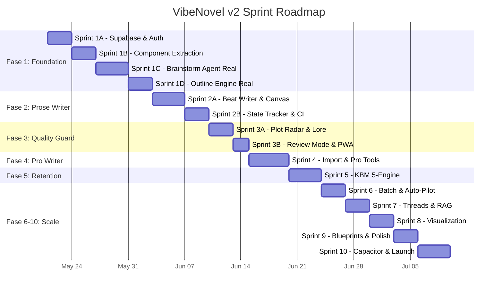
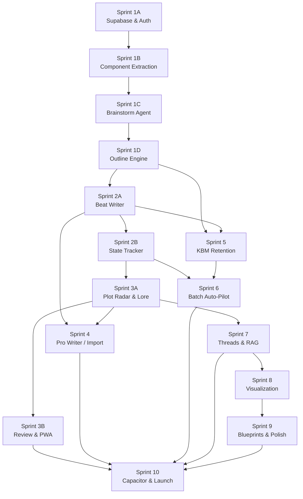

# VibeNovel v2 — Master Sprint Plan

> Dokumen ini memecah 10 Fase dari [implementation_plan_v3.md](file:///d:/Coding/vibenovel/implementation_plan_v3.md) menjadi sprint-sprint terstruktur yang bisa dieksekusi satu per satu tanpa keluar jalur. Setiap sprint memiliki deliverable yang jelas, daftar file yang harus dibuat/diubah, dependensi, dan kriteria verifikasi.

---

## 📊 Audit Kondisi Saat Ini

Sebelum mulai, berikut status kode yang **sudah terbangun** vs yang **belum**:

### ✅ Sudah Ada (Hasil Sprint 0 — Scaffolding)

| Komponen | File | Status |
|---|---|---|
| Vite + React + TS scaffold | `vite.config.ts`, `tsconfig.json`, `package.json` | ✅ Build sukses |
| Entry point | `src/main.tsx`, `src/App.tsx` | ✅ Routing dasar |
| Tema CSS (dual theme tokens) | `src/index.css` | ✅ Dark/Light variables |
| Anti-flicker script | `index.html` | ✅ |
| Supabase client config | `src/lib/supabase.ts` | ✅ Placeholder (belum ada env vars) |
| Zustand: `useUiStore` | `src/store/useUiStore.ts` | ✅ Theme, mode, panel |
| Zustand: `useSettingsStore` | `src/store/useSettingsStore.ts` | ✅ BYOK keys, provider toggle |
| Zustand: `useProjectStore` | `src/store/useProjectStore.ts` | ✅ CRUD + dummy data |
| Zustand: `useChatStore` | `src/store/useChatStore.ts` | ✅ Mock responder (state-aware) |
| AI: `gemini-pool.ts` | `src/services/ai/gemini-pool.ts` | ✅ Key rotation logic |
| AI: `openrouter-adapter.ts` | `src/services/ai/openrouter-adapter.ts` | ✅ Adapter skeleton |
| AI: `ai-router.ts` | `src/services/ai/ai-router.ts` | ✅ Routing + prompt assembly |
| AI: `context-injector.ts` | `src/services/ai/context-injector.ts` | ✅ 4-layer keyword pruning |
| AI: `types.ts` | `src/services/ai/types.ts` | ✅ Interface definitions |
| Types | `src/types/project.ts` | ✅ Semua model interfaces |
| Lobby page | `src/pages/Lobby.tsx` | ✅ Dashboard + cards + settings modal |
| Workspace page | `src/pages/Workspace.tsx` | ✅ 4-mode layout + chat + outline + write + review |
| Login page | `src/pages/Login.tsx` | ✅ Placeholder auth UI |
| AGENTS.md | `AGENTS.md` | ✅ Coding rules |

### ❌ Belum Ada (Harus Dibangun)

| Kategori | Detail |
|---|---|
| **Komponen terpisah** | Semua komponen masih inline di `Lobby.tsx` dan `Workspace.tsx` — belum diekstrak ke `src/components/` |
| **Supabase real** | Belum ada project Supabase, belum ada `schema.sql`, belum ada RLS, belum ada env vars |
| **Framer Motion** | Belum diinstal, belum ada animasi |
| **Prompt templates** | Seluruh `src/prompts/` belum ada |
| **Service layer** | `state-tracker.ts`, `lore-extractor.ts`, `thread-tracker.ts`, `filler-detector.ts`, `batch-generator.ts`, `import-analyzer.ts`, `rag-service.ts` — semua belum |
| **Hooks** | `usePlotRadar.ts`, `useLocalProse.ts`, `useBeatWriter.ts`, `useBatchGenerator.ts` — semua belum |
| **Modals** | `SettingsModal`, `DirectorsCutModal`, `LoreDiffModal`, `BatchSuccessModal`, `RecapModal`, `TargetChangeModal` — belum diekstrak |
| **Visualisasi** | `ConstellationMap`, `EmotionalArcHeatmap` — belum ada |
| **PWA** | Belum ada service worker atau manual manifest |
| **Capacitor** | Belum ada konfigurasi |
| **Blueprint templates** | Belum ada |
| **Import Wizard** | Belum ada |

---

## 🗺 Peta Sprint Keseluruhan

---

## Sprint 1A — Supabase & Auth (Fase 1)

> **Goal**: Koneksi database nyata, autentikasi, dan migrasi dari dummy data ke Supabase.

### Deliverables
- [ ] Project Supabase sudah dibuat dan aktif
- [ ] Seluruh 13 tabel dari `schema.sql` sudah di-deploy
- [ ] RLS policies aktif di semua tabel
- [ ] Auth (email + Google OAuth) berfungsi
- [ ] Login page terhubung ke Supabase Auth
- [ ] `useProjectStore` membaca/menulis ke Supabase (bukan dummy)

### File yang Dibuat/Diubah

| Action | Path | Detail |
|---|---|---|
| **[NEW]** | `supabase/schema.sql` | Seluruh 13 tabel + RLS + pgvector extension |
| **[NEW]** | `.env.local` | `VITE_SUPABASE_URL`, `VITE_SUPABASE_ANON_KEY` |
| **[MODIFY]** | `src/lib/supabase.ts` | Baca env vars, export typed client |
| **[MODIFY]** | `src/pages/Login.tsx` | Koneksi nyata ke `supabase.auth` |
| **[MODIFY]** | `src/store/useProjectStore.ts` | Ganti seluruh dummy → Supabase CRUD |
| **[MODIFY]** | `src/App.tsx` | Auth guard (redirect ke `/login` jika belum login) |
| **[NEW]** | `src/hooks/useAuth.ts` | Hook `useAuth()` untuk state autentikasi |

### Dependensi
- Akun Supabase dan project baru
- `VITE_SUPABASE_URL` dan `VITE_SUPABASE_ANON_KEY` dari dashboard

### Verifikasi
- [ ] User bisa sign up, login, dan logout
- [ ] Buat project baru → muncul di Supabase `projects` table
- [ ] Refresh halaman → project masih ada (bukan localStorage)
- [ ] User A tidak bisa melihat project User B (RLS)
- [ ] `npm run build` tetap sukses

---

## Sprint 1B — Component Extraction & UI Polish (Fase 1)

> **Goal**: Pecah monolith `Lobby.tsx` (650 baris) dan `Workspace.tsx` (1048 baris) menjadi komponen terpisah. Install Framer Motion.

### Deliverables
- [ ] Setiap komponen UI punya file sendiri
- [ ] Animasi transisi halus di semua interaksi
- [ ] Mobile responsive sudah solid di 375px

### File yang Dibuat

| Action | Path | Diekstrak Dari |
|---|---|---|
| **[NEW]** | `src/components/ui/Button.tsx` | Inline styles |
| **[NEW]** | `src/components/ui/DualProgressBar.tsx` | `Lobby.tsx` |
| **[NEW]** | `src/components/ui/Toast.tsx` | Baru |
| **[NEW]** | `src/components/ui/Spinner.tsx` | `Workspace.tsx` |
| **[NEW]** | `src/components/ui/BottomSheet.tsx` | Baru (mobile modals) |
| **[NEW]** | `src/components/ui/FAB.tsx` | Baru |
| **[NEW]** | `src/components/dashboard/ProjectCard.tsx` | `Lobby.tsx` L60-178 |
| **[NEW]** | `src/components/dashboard/StatsBar.tsx` | `Lobby.tsx` L60-80 |
| **[NEW]** | `src/components/dashboard/ProjectCreationModal.tsx` | `Lobby.tsx` L350-500 |
| **[NEW]** | `src/components/workspace/ModeSwitcher.tsx` | `Workspace.tsx` L303-322 |
| **[NEW]** | `src/components/workspace/ContextPanel.tsx` | `Workspace.tsx` L349-658 |
| **[NEW]** | `src/components/workspace/MainCanvas.tsx` | `Workspace.tsx` L662+ |
| **[NEW]** | `src/components/chat/CoAuthorChat.tsx` | `Workspace.tsx` brainstorm section |
| **[NEW]** | `src/components/chat/AiMessageBubble.tsx` | `Workspace.tsx` msg bubbles |
| **[NEW]** | `src/components/chat/ApprovalCard.tsx` | `Workspace.tsx` draft approval |
| **[NEW]** | `src/components/modals/SettingsModal.tsx` | `Lobby.tsx` L500-646 |
| **[MODIFY]** | `src/pages/Lobby.tsx` | Jadi ~100 baris (compose components) |
| **[MODIFY]** | `src/pages/Workspace.tsx` | Jadi ~150 baris (compose components) |

### Dependensi
- `npm install framer-motion` (Framer Motion 12.x)

### Verifikasi
- [ ] Semua fitur yang ada sebelumnya tetap berfungsi (regresi zero)
- [ ] Animasi fade-in/slide di modal, panel, dan transisi mode
- [ ] Mobile: bottom tab bar berfungsi di 375px
- [ ] Mobile: bottom sheet modal (bukan centered popup)
- [ ] `npm run build` tetap sukses

---

## Sprint 1C — Brainstorm Agent (Real AI) (Fase 1)

> **Goal**: Co-Author chat terhubung ke Gemini API nyata. Mock responder diganti AI sungguhan.

### Deliverables
- [ ] Chat brainstorm mengirim prompt ke Gemini via `gemini-pool.ts`
- [ ] 3 mode operasi (Setup/Consultation/Revision) aktif
- [ ] Approval flow (Setuju/Edit/Tolak) menyimpan ke Supabase
- [ ] Story Compass gap detection real-time
- [ ] Redirect rules (anti-melantur) aktif

### File yang Dibuat/Diubah

| Action | Path | Detail |
|---|---|---|
| **[NEW]** | `src/prompts/brainstorm-agent.ts` | `buildCoAuthorPrompt()` — Setup/Consultation/Revision |
| **[NEW]** | `src/components/compass/StoryCompassPreview.tsx` | Gap indicator panel |
| **[MODIFY]** | `src/store/useChatStore.ts` | Hapus mock responder → panggil `aiRouter.chatCoAuthor()` |
| **[MODIFY]** | `src/services/ai/ai-router.ts` | `chatCoAuthor()` pakai prompt builder nyata |
| **[MODIFY]** | `src/services/ai/gemini-pool.ts` | Baca keys dari `useSettingsStore`, bukan hardcode |
| **[MODIFY]** | `src/components/chat/ApprovalCard.tsx` | Setuju → INSERT ke Supabase (characters/items/world_rules/ending/mystery) |

### Dependensi
- Sprint 1A (Supabase aktif)
- Sprint 1B (komponen diekstrak)
- Minimal 1 Gemini API key

### Verifikasi
- [ ] Buka chat tanpa API key → pesan error "Masukkan Gemini API key dulu"
- [ ] Ketik pesan → respon AI muncul (bukan mock)
- [ ] AI ajukan draft karakter → klik Setuju → masuk ke tabel `characters`
- [ ] Setelah 5/5 wajib terisi → muncul tombol "Generate Outline"
- [ ] Off-topic 3x → AI redirect + draft sendiri

---

## Sprint 1D — Outline Engine (Real AI) (Fase 1)

> **Goal**: Generate rich outline per chapter menggunakan Gemini. Season Architect panel fungsional.

### Deliverables
- [ ] Tombol "Generate Outline" menghasilkan outline 20+ field per bab
- [ ] Season Architect menampilkan outline cards yang bisa di-klik dan di-edit
- [ ] Manual outline entry + lock mechanism
- [ ] 5 entry points (batch, single regenerate, manual, import, range) berfungsi

### File yang Dibuat/Diubah

| Action | Path | Detail |
|---|---|---|
| **[NEW]** | `src/prompts/outline-engine.ts` | `buildOutlinePrompt()` — rich outline dengan retention rules |
| **[NEW]** | `src/components/workspace/SeasonArchitectPanel.tsx` | Outline viewer, cards, expand/collapse |
| **[NEW]** | `src/components/workspace/ChapterOutlineCard.tsx` | Per-chapter outline card (synopsis, events, tone, cliffhanger) |
| **[MODIFY]** | `src/services/ai/ai-router.ts` | `generateChapterOutline()` pakai prompt builder nyata |
| **[MODIFY]** | `src/store/useProjectStore.ts` | `generateOutlineBatch()` action — sequential loop |
| **[NEW]** | `src/lib/kbm-pacing.ts` | Emotional rollercoaster pattern validator, dopamine cycle |

### Dependensi
- Sprint 1C (Story Compass terisi)

### Verifikasi
- [ ] Klik "Generate Outline Bab 1-20" → 20 outline muncul di Season Architect
- [ ] Setiap outline punya: synopsis, key_events, emotional_tone, cliffhanger_type, dll
- [ ] Edit manual → `outline_source` = 'MANUAL', tidak di-overwrite saat batch
- [ ] Emotional rollercoaster pattern → tidak ada 3 bab `CONFLICT` berturut-turut
- [ ] `npm run build` tetap sukses

---

## Sprint 2A — Beat-by-Beat Prose Writer (Fase 2)

> **Goal**: User bisa menghasilkan prosa dari outline beat-by-beat.

### Deliverables
- [ ] Prose Canvas panel berfungsi penuh
- [ ] Generate per-beat (Interactive mode) via Gemini atau OpenRouter
- [ ] Beat indicator progress bar
- [ ] Prose toolbar (word count, beat navigation, Magic Write FAB)
- [ ] Provider toggle (Gemini gratis vs OpenRouter berbayar)

### File yang Dibuat/Diubah

| Action | Path | Detail |
|---|---|---|
| **[NEW]** | `src/prompts/prose-writer.ts` | `buildProsePrompt()` — beat direction, lore context, voice DNA |
| **[NEW]** | `src/components/prose/BeatEditor.tsx` | Editor area per-beat + accept/edit toggle |
| **[NEW]** | `src/components/prose/BeatIndicator.tsx` | Visual beat 1/4, 2/4, 3/4, 4/4 |
| **[NEW]** | `src/components/prose/ProseToolbar.tsx` | Word count, save, undo, Magic Write |
| **[NEW]** | `src/hooks/useBeatWriter.ts` | Orchestrate beat generation loop |
| **[MODIFY]** | `src/components/workspace/MainCanvas.tsx` | Write mode → render ProseCanvas components |
| **[MODIFY]** | `src/services/ai/ai-router.ts` | `generateProseBeat()` — pakai prompt builder nyata |
| **[MODIFY]** | `src/services/ai/openrouter-adapter.ts` | Implementasi nyata (bukan skeleton) |

### Dependensi
- Sprint 1D (outline tersedia untuk ditulis)

### Verifikasi
- [ ] Pilih bab yang punya outline → klik "✨ Tulis!" → beat 1 ter-generate
- [ ] Prose muncul dalam Bahasa Indonesia, paragraf pendek, dialog-heavy
- [ ] Ganti provider ke OpenRouter + masukkan key → prose via Claude
- [ ] Word count ter-update otomatis setiap beat
- [ ] 4 beat selesai → chapter status berubah ke DRAFT

---

## Sprint 2B — State Tracker & Context Injection Upgrade (Fase 2)

> **Goal**: Setelah tiap chapter selesai, state karakter di-update otomatis. Context injection pakai 4-layer penuh.

### Deliverables
- [ ] State Snapshot auto-generate setelah chapter prose selesai
- [ ] State Snapshot tampil di Write mode Context Panel
- [ ] Context Injector membaca dari Supabase (bukan hardcode)
- [ ] Word count config per project berfungsi

### File yang Dibuat/Diubah

| Action | Path | Detail |
|---|---|---|
| **[NEW]** | `src/services/state-tracker.ts` | `generateStateSnapshot()` — AI extract states from prose |
| **[NEW]** | `src/prompts/state-snapshot.ts` | Prompt template untuk state extraction |
| **[NEW]** | `src/components/compass/StateTimeline.tsx` | Visual state per karakter per bab |
| **[MODIFY]** | `src/services/ai/context-injector.ts` | Baca dari Supabase, bukan props. Tambah Layer 2+3+4 |
| **[MODIFY]** | `src/hooks/useBeatWriter.ts` | Setelah chapter selesai → trigger state tracker |

### Dependensi
- Sprint 2A (prose sudah bisa di-generate)

### Verifikasi
- [ ] Selesai tulis bab 1 → `character_states` ter-insert di Supabase
- [ ] Pindah ke bab 2 → Context Panel menampilkan state dari bab 1
- [ ] Generate bab 2 → context injection menyertakan state bab 1
- [ ] Ubah word count target → beat generation mengikuti target baru

---

## Sprint 3A — Plot Radar & Lore Extraction (Fase 3)

> **Goal**: QA otomatis setelah prose digenerate + auto-detect entitas baru dari prose.

### Deliverables
- [ ] Plot Radar berjalan otomatis setelah chapter selesai
- [ ] Filler Detector memperingatkan bab yang terlalu "kosong"
- [ ] Auto-Lore Extraction mendeteksi karakter/lokasi/item baru
- [ ] LoreDiff Modal: user approve/reject tiap entity baru

### File yang Dibuat/Diubah

| Action | Path | Detail |
|---|---|---|
| **[NEW]** | `src/prompts/plot-radar.ts` | QA validation prompt (3-layer: pre/post/cross-chapter) |
| **[NEW]** | `src/services/filler-detector.ts` | Pre + post prose filler check |
| **[NEW]** | `src/services/lore-extractor.ts` | Extract entities → diff with existing lorebook |
| **[NEW]** | `src/prompts/lore-extractor.ts` | Prompt template lore extraction |
| **[NEW]** | `src/components/modals/LoreDiffModal.tsx` | Per-entity approve/reject UI |
| **[NEW]** | `src/hooks/usePlotRadar.ts` | Hook untuk QA check on-demand atau auto |
| **[MODIFY]** | `src/services/ai/ai-router.ts` | `runQARadar()` pakai prompt builder nyata |

### Dependensi
- Sprint 2B (state tracker aktif)

### Verifikasi
- [ ] Selesai tulis bab → Plot Radar jalan → laporan QA muncul
- [ ] Filler detected → warning muncul di Review panel
- [ ] Karakter baru muncul di prose → LoreDiff Modal muncul
- [ ] User approve → karakter masuk ke `characters` table
- [ ] User reject → karakter tidak disimpan

---

## Sprint 3B — Review Mode & PWA (Fase 3)

> **Goal**: Review mode fungsional penuh. App bisa di-install ke home screen.

### Deliverables
- [ ] Review mode menampilkan prose reader + QA results
- [ ] Emotional Arc Heatmap placeholder (data saja, visual nanti Sprint 8)
- [ ] Thread Tracker placeholder di Review panel
- [ ] PWA installable

### File yang Dibuat/Diubah

| Action | Path | Detail |
|---|---|---|
| **[NEW]** | `src/components/workspace/ReviewPanel.tsx` | Prose reader + QA log viewer |
| **[NEW]** | `src/components/compass/ThreadTrackerPanel.tsx` | Placeholder thread list |
| **[MODIFY]** | `vite.config.ts` | Tambah `vite-plugin-pwa` |
| **[NEW]** | `public/manifest.json` | PWA manifest |
| **[NEW]** | `public/icons/` | PWA icons (192x192, 512x512) |

### Dependensi
- Sprint 3A (QA data tersedia)
- `npm install vite-plugin-pwa`

### Verifikasi
- [ ] Review mode: bisa baca prose + lihat QA warnings
- [ ] Mobile: "Add to Home Screen" muncul
- [ ] Offline: draft tersimpan di localStorage → sync saat online

---

## Sprint 4 — Pro Writer Features (Fase 4)

> **Goal**: Penulis pro bisa import manuscript, tulis bebas, dan edit surgical.

### Deliverables
- [ ] Import Wizard (4 steps: upload → analyze → review → confirm)
- [ ] Import Analyzer: AI extract entities dari manuscript
- [ ] Free Write mode (canvas terbuka tanpa enforcement)
- [ ] Director's Cut (3 rewrite variants)
- [ ] Inline surgical edit per selection

### File yang Dibuat/Diubah

| Action | Path | Detail |
|---|---|---|
| **[NEW]** | `src/components/onboarding/ImportWizard.tsx` | 4-step wizard UI |
| **[NEW]** | `src/services/import-analyzer.ts` | Chunk → extract → merge → draft compass |
| **[NEW]** | `src/prompts/import-analyzer.ts` | Extraction prompt template |
| **[NEW]** | `src/components/modals/DirectorsCutModal.tsx` | 3 rewrite options |
| **[NEW]** | `src/prompts/rewrite.ts` | Director's cut prompt template |
| **[MODIFY]** | `src/components/dashboard/ProjectCreationModal.tsx` | Tambah "Import Sekarang" path |
| **[MODIFY]** | `src/components/prose/BeatEditor.tsx` | Inline edit selection |

### Dependensi
- Sprint 2A (prose writer berfungsi)
- Sprint 3A (lore extractor berfungsi)

### Verifikasi
- [ ] Paste 10 bab manuscript → AI extract 3+ karakter + 2+ items
- [ ] Review modal → edit 1 karakter → approve → masuk Compass
- [ ] Free Write: bisa tulis tanpa outline (no block)
- [ ] Director's Cut: pilih teks → "3 Versi" → pilih favorit
- [ ] Import status: bab 1-10 = IMPORTED, bab 11+ = EMPTY

---

## Sprint 5 — KBM Retention Engine (Fase 5)

> **Goal**: 5 mesin retensi aktif: Bawang Berlapis, Rollercoaster, Hook Chain, False Resolution, Character Investment.

### Deliverables
- [ ] Mystery Layer CRUD + breadcrumb injection ke outline
- [ ] Emotional rollercoaster validation (3 bab monoton = warning)
- [ ] Hook Chain tracking (series → season → sub-arc → chapter → micro)
- [ ] False Resolution flag per sub-arc
- [ ] Voice DNA editor + auto-populate dari prose
- [ ] Paywall Strategy Advisor per bab

### File yang Dibuat/Diubah

| Action | Path | Detail |
|---|---|---|
| **[NEW]** | `src/components/compass/VoiceDNAEditor.tsx` | Per-karakter voice editing |
| **[NEW]** | `src/components/compass/MysteryLayerPanel.tsx` | CRUD + breadcrumb timeline |
| **[MODIFY]** | `src/lib/kbm-pacing.ts` | Tambah hook chain tracking, false resolution logic |
| **[MODIFY]** | `src/prompts/outline-engine.ts` | Inject breadcrumb + dopamine + paywall |
| **[MODIFY]** | `src/prompts/prose-writer.ts` | Inject micro-hook + voice DNA + cliffhanger protocol |

### Dependensi
- Sprint 1D (outline engine)
- Sprint 2A (prose writer)

### Verifikasi
- [ ] Buat 3 mystery layers → breadcrumb muncul di outline bab terkait
- [ ] Outline batch: emotional_tone bervariasi (tidak 3x conflict berturut)
- [ ] Setiap bab punya cliffhanger (1 dari 6 tipe)
- [ ] Paywall advice muncul di setiap outline card
- [ ] Voice DNA: edit → prose generation using voice baru

---

## Sprint 6 — Auto-Pilot Batch Generation (Fase 6)

> **Goal**: 1 klik = auto-generate 5-10 bab secara sequential.

### File yang Dibuat/Diubah

| Action | Path | Detail |
|---|---|---|
| **[NEW]** | `src/services/batch-generator.ts` | Sequential orchestrator + pause/resume |
| **[NEW]** | `src/hooks/useBatchGenerator.ts` | Hook UI untuk batch progress |
| **[NEW]** | `src/components/prose/BatchProgressPanel.tsx` | Per-chapter progress indicator |
| **[NEW]** | `src/components/modals/BatchSuccessModal.tsx` | Stats + warnings setelah batch selesai |

### Verifikasi
- [ ] Klik "Auto-Pilot 5 Bab" → 5 bab ter-generate secara sequential
- [ ] Progress panel: Bab 1 ✅, Bab 2 🔄, Bab 3 ⬜, Bab 4 ⬜, Bab 5 ⬜
- [ ] Pause → resume → lanjut dari bab terakhir
- [ ] 2x hard error berturut → batch berhenti otomatis
- [ ] Selesai → BatchSuccessModal dengan stats (total kata, waktu, warnings)

---

## Sprint 7 — Thread Tracker & RAG (Fase 7)

> **Goal**: Novel 200+ bab tidak kehilangan thread. Semantic search fungsional.

### File yang Dibuat/Diubah

| Action | Path | Detail |
|---|---|---|
| **[NEW]** | `src/services/thread-tracker.ts` | Auto-detect + manual add threads |
| **[NEW]** | `src/prompts/recap-generator.ts` | Recap prompt template |
| **[NEW]** | `src/services/rag-service.ts` | Supabase pgvector semantic search |
| **[NEW]** | `src/components/modals/RecapModal.tsx` | "Sebelumnya..." recap viewer |
| **[MODIFY]** | `src/components/compass/ThreadTrackerPanel.tsx` | Full implementation (bukan placeholder) |

### Verifikasi
- [ ] Thread auto-detect: setelah bab selesai → threads muncul di panel
- [ ] Dangling thread alert setiap 10 bab
- [ ] Recap: klik "Recap Bab 1-30" → ringkasan ter-generate
- [ ] RAG search: query "Kania pasar malam" → top 3 chapter summaries

---

## Sprint 8 — Visualization (Fase 8)

> **Goal**: Bird's-eye view seluruh novel.

### File yang Dibuat/Diubah

| Action | Path | Detail |
|---|---|---|
| **[NEW]** | `src/components/visualization/EmotionalArcHeatmap.tsx` | Recharts heatmap |
| **[NEW]** | `src/components/visualization/ConstellationMap.tsx` | D3.js entity graph |
| **[NEW]** | `src/components/visualization/TimelineView.tsx` | In-story timeline |
| **[NEW]** | `src/components/visualization/WordCountAnalytics.tsx` | Per-chapter word stats |

### Dependensi
- `npm install recharts d3`

### Verifikasi
- [ ] Heatmap: 200 bab terlihat dengan warna emosi berbeda
- [ ] Constellation: klik karakter → lihat koneksi ke karakter/item lain
- [ ] Timeline: in-story time progression visible
- [ ] Word count chart: trend per bab

---

## Sprint 9 — Genre Blueprints & Polish (Fase 9)

> **Goal**: Zero to outline < 5 menit. Polish UX keseluruhan.

### File yang Dibuat/Diubah

| Action | Path | Detail |
|---|---|---|
| **[NEW]** | `src/lib/genre-blueprints.ts` | 6 template (Drama RT, Romance, Fantasi, Thriller, dll) |
| **[NEW]** | `src/components/onboarding/BlueprintSelector.tsx` | Genre template picker |
| **[NEW]** | `src/components/modals/TargetChangeModal.tsx` | Logika tambah/kurangi target bab |
| **[NEW]** | `src/lib/text-utils.ts` | Export .txt / .docx helpers |

### Verifikasi
- [ ] Pilih Blueprint "Drama RT" → Story Compass pre-filled → review → konfirmasi
- [ ] Generate Outline langsung → < 5 menit total
- [ ] Ubah target 200→150 → outline 151-200 diarsipkan
- [ ] Ubah target 200→300 → sistem tanya: Season Baru atau Peregangan
- [ ] Export .txt berfungsi

---

## Sprint 10 — Capacitor & Production (Fase 10)

> **Goal**: Play Store ready.

### File yang Dibuat/Diubah

| Action | Path | Detail |
|---|---|---|
| **[NEW]** | `capacitor.config.ts` | Capacitor configuration |
| **[NEW]** | `android/` | Generated Android project |
| **[MODIFY]** | `vite.config.ts` | Production optimizations, code splitting |
| **[MODIFY]** | `src/App.tsx` | Android back button handler |

### Dependensi
- `npm install @capacitor/core @capacitor/cli @capacitor/android`
- `npm install @capacitor/splash-screen @capacitor/status-bar @capacitor/app`

### Verifikasi (End-to-End — semua 6 path dari implementation plan)
- [ ] **Path A**: Baru → Brainstorm → Approve → Outline 20 → Auto-Pilot 10 → cliffhanger ada, amnesia tidak
- [ ] **Path B**: Import 47 bab → analyze → approve → Outline 48-60 → Generate 48 → state konsisten
- [ ] **Path C**: Manual outline bab 50 → batch 48-55 → bab 50 di-skip
- [ ] **Path D**: Ubah 200→150 → archive + pacing adjust
- [ ] **Path E**: Ganti Gemini→OpenRouter mid-session → output lanjut
- [ ] **Path F**: Semua flow di viewport 375px
- [ ] APK ter-build dan bisa di-install di Android
- [ ] Bundle < 500KB gzipped (initial load)

---

## 📐 Dependency Graph Antar Sprint

---

## 🔑 Aturan Eksekusi Per Sprint

1. **Sebelum mulai sprint**: Baca ulang bagian relevan dari `implementation_plan_v3.md` dan `architecture.md`
2. **Selama sprint**: Update `task.md` dengan checklist per-file
3. **Sebelum close sprint**: `npm run build` wajib sukses + verifikasi manual
4. **Setelah close sprint**: Update `walkthrough.md` dengan summary perubahan
5. **Kapan saja**: Jika ada keputusan arsitektur baru, update `architecture.md` dulu sebelum koding

> [!CAUTION]
> **Jangan loncat sprint!** Sprint 2A tidak boleh dimulai sebelum Sprint 1D selesai dan terverifikasi. Setiap sprint membangun di atas fondasi sprint sebelumnya. Melompati urutan akan menyebabkan technical debt dan regresi.
