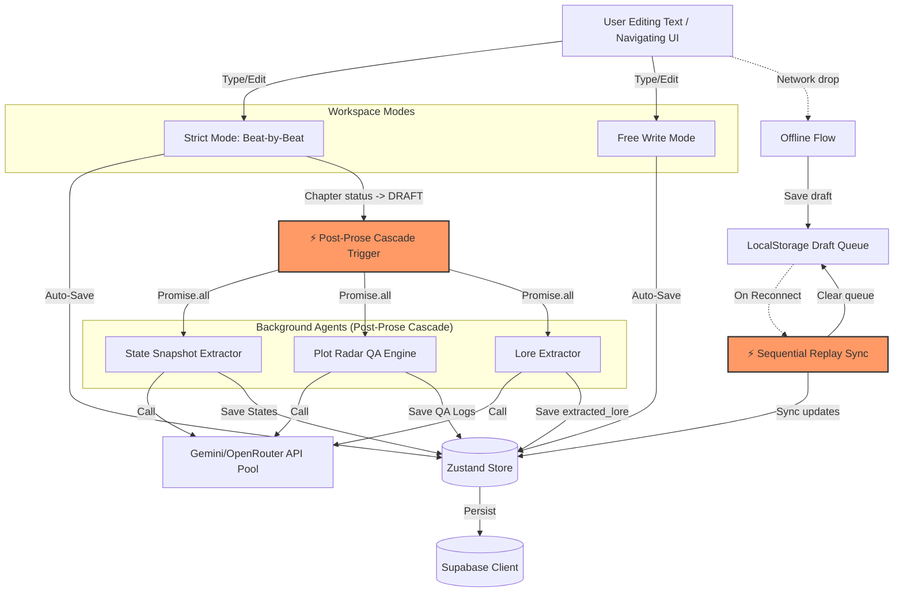
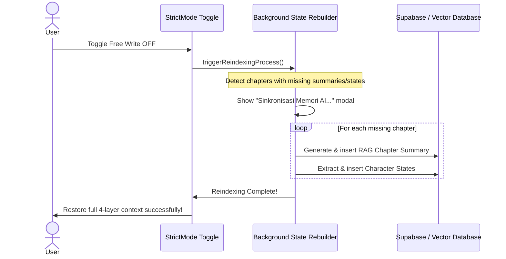

# Systems Architecture & QA Audit: Multi-Agent Concurrency & Logical Hardening

**Prepared for**: Director of Systems & Product Development  
**Prepared by**: Principal QA Engineer & Systems Architect  
**Status**: ⚠️ UNDER ARCHITECTURAL REVIEW (Feedback Requested)  
**Date**: May 24, 2026  

---

## Executive Summary

The VibeNovel v2 system is a technical masterpiece of client-side engineering: a 100% serverless, Progressive Web Application (PWA) using React 19, Zustand, Supabase, and a sophisticated **4-Layer Memory System** powered by a Gemini/OpenRouter API pool. 

However, as a massive multi-agent system running entirely in the client's browser, the application faces unique challenges. Moving logic off a server and onto the client removes server-side latency but introduces **architectural friction, client-side race conditions, and logical collisions** between powerful, concurrent features.

This report audits the system's runtime architecture to identify critical failure modes, explain how they happen, and provide concrete, production-grade solutions to bulletproof the system before release.

---

## Technical Architecture Map & Collision Points

Below is the current system data flow. The highlighted **Collision Points (⚡)** represent where background agents, user inputs, and local storage state engines overlap and compete for resources:



---

## Section 1: Deep-Dive Audit of Race Conditions & Concurrency Friction

### 1.1 Post-Prose Background AI Cascade Overlap
* **Location**: `src/hooks/useBeatWriter.ts` (triggered when chapter status transitions to `'DRAFT'`)
* **Mechanism**:
  When a chapter is completed, the system kicks off three asynchronous background tasks using `Promise.all`:
  1. **State Snapshot Extraction** (`state-tracker.ts`)
  2. **Plot Radar QA Scan** (`plot-radar.ts` prompt builder)
  3. **Lore Extraction** (`lore-extractor.ts` prompt builder)
* **The Vulnerability (Race Condition)**:
  * **Network Congestion**: These 3 calls hit the Google Gemini free pool simultaneously. While the pool handles round-robin key switching, if a user has only 1-2 keys configured, they will immediately hit rate limits (HTTP 429), triggering concurrent key cooldowns.
  * **User Context Navigation**: If the user finishes Bab 51, triggering the background cascade, and immediately navigates to Bab 52, the background promises are still active in the React hook closure. If they write to Bab 52, these agents might update states and lorebooks referencing `chapter_id: Bab 51`, causing a **cross-chapter state contamination**.
  * **Supabase Session Locking**: Concurrent `UPSERT` operations on child tables (`character_states`, `chapters`, `community_posts`) can experience deadlocks or out-of-order writes depending on client network speeds.

### 1.2 Offline Draft Sync Collision
* **Location**: `src/hooks/useOfflineDraft.ts` & `src/components/prose/BeatEditor.tsx`
* **Mechanism**:
  If the browser drops offline, user inputs are routed to a local cache queue named `vn_draft_{chapterId}_{beatIndex}`. When connection is restored, a `useEffect` triggers `syncPendingDrafts()`, which sequentially replays all offline saves to Supabase.
* **The Vulnerability (Logical Collision & Blindspot)**:
  * **Background AI Blackout**: During offline edits, background AI tasks (State Snapshot, Plot Radar, Lore) are disabled to prevent failure loops. However, when the user reconnects and drafts sync, **there is currently no mechanism to run the skipped background AI tasks for the synced chapters**. The chapters enter the cloud database as `DRAFT` status, but completely lack Plot Radar QA logs, State Snapshots, or Lorebook updates! 
  * **Out-of-Order Override**: If the user makes offline changes, and another user (or the user on another device) updates the same chapter, the reconnection sync does not perform a vector clock comparison. It blindly executes the local queue, wiping out the remote updates.

### 1.3 Co-Author Chat Approval vs. Workspace Direct Action
* **Location**: `src/store/useChatStore.ts` & `src/store/parts/lorebook.ts`
* **Mechanism**:
  The Co-Author AI drafts Story Compass items (`Character`, `Item`, `WorldRule`, `Ending`, `MysteryLayer`) within the chat using `<DRAFT_DATA>` tags. The user can click a **[✅ Setuju]** Approval Card to insert this data into Zustand/Supabase.
* **The Vulnerability (Dirty Writes / Race Condition)**:
  * **Concurrent Modification**: If the user manually edits character profiles in the Story Compass Panel, and then clicks **[✅ Setuju]** on a Chat message sent 10 minutes ago, the stale draft data proposed by the AI will overwrite the newer manual updates without warning.
  * **Optimistic Sync Failure**: If the network times out during optimistic UUID generation, the Zustand memory thinks the character is successfully created (rendering in the UI chips), but the backend Supabase insert fails, causing a ghost record.

---

## Section 2: Deep-Dive Audit of Logical Collisions & System Blindspots

### 2.1 Free Write Mode: The Context Amnesia Blackhole
* **Location**: `src/store/useSettingsStore.ts` & `src/components/prose/FreeWriteEditor.tsx`
* **Mechanism**:
  Free Write Mode disables outline constraints and provides an unrestricted typing canvas. It disables all background AI agents (State Snapshots, Plot Radars, Lorebook Extractions) because they are designed around strict beat JSON parsing.
* **The Vulnerability (System Blindspot)**:
  * This creates an **architectural memory gap**. The 4-Layer Memory system relies on Chapter Summaries + RAG Embeddings (Layer 3) and Character States (Layer 2) to maintain continuity.
  * If a user writes Bab 5-10 in Free Write Mode, and then switches back to Strict Mode for Bab 11, the AI context builder will look at Layer 2 and Layer 3 and find **no information** for chapters 5-10.
  * **Result**: The AI will suffer from amnesia, generating text that resurrects dead characters, forgets key items, and breaks previous character alliances because those events occurred inside the Free Write "blackhole".

```
Strict Mode (Bab 1-4)    --> Dynamic States & RAG Generated ✅
Free Write (Bab 5-10)    --> NO States & NO RAG Generated ❌  <-- [Memory Blackhole]
Strict Mode (Bab 11)     --> AI tries to build context, misses chapters 5-10, hallucinates! 💥
```

### 2.2 Import Wizard Abort Vulnerability
* **Location**: `src/services/import-analyzer.ts` & `src/components/onboarding/ImportWizard.tsx`
* **Mechanism**:
  The Import Wizard uses a two-tier analyzer (Tier 1: Quick Scan compressed sample, Tier 2: Deep Analysis on specific midpoint/climax chapters). Users can cancel deep scans at any time.
* **The Vulnerability (Logical Collision)**:
  * **Database Pollution**: If a user cancels a 50-chapter import at 60%, the `AbortSignal` stops local operations, but the chapters that have already been created in Zustand/Supabase remain.
  * **State Inconsistency**: The project is marked as `IMPORTED` status, but the catalog is corrupt, leading to duplicate character names if the user attempts the upload again.

---

## Section 3: Concrete Architectural Mitigations (Production-Grade Code Designs)

To harden the system, we propose the following concrete architectural changes.

### Mitigation 3.1: The Safe Background Task Queue (Fixes Cascade Overlap)
Instead of executing direct background promises in `useBeatWriter.ts`, introduce a structured **Client-Side Background Queue** that operates on an independent process channel. This ensures tasks run sequentially, respect rate limits, and survive UI navigation.

#### Proposed Architecture: `src/services/background-queue.ts`
```typescript
import type { QaLog, CharacterState } from '../types/project';

type TaskType = 'state_snapshot' | 'plot_radar' | 'lore_extraction';

interface QueueTask {
  id: string;
  projectId: string;
  chapterId: string;
  chapterNumber: number;
  type: TaskType;
  execute: () => Promise<void>;
  retries: number;
}

class BackgroundTaskQueue {
  private queue: QueueTask[] = [];
  private activeTask: QueueTask | null = null;
  private isProcessing = false;
  private maxRetries = 3;

  public addTask(task: Omit<QueueTask, 'id' | 'retries'>) {
    const id = `${task.chapterId}_${task.type}`;
    // Deduplicate: avoid queuing identical tasks
    if (this.queue.some(t => t.id === id) || this.activeTask?.id === id) return;

    this.queue.push({ ...task, id, retries: 0 });
    this.triggerProcessor();
  }

  private async triggerProcessor() {
    if (this.isProcessing || this.queue.length === 0) return;
    this.isProcessing = true;

    while (this.queue.length > 0) {
      this.activeTask = this.queue.shift()!;
      try {
        await this.executeWithBackoff(this.activeTask);
      } catch (error) {
        console.error(`[Queue] Task ${this.activeTask.id} failed permanently:`, error);
        // Dispatch global event for UI fallback error states
      }
    }
    this.activeTask = null;
    this.isProcessing = false;
  }

  private async executeWithBackoff(task: QueueTask): Promise<void> {
    try {
      await task.execute();
    } catch (error: any) {
      // Catch Gemini API rate-limit (429) and execute delay retry
      if (error?.status === 429 && task.retries < this.maxRetries) {
        task.retries++;
        const backoffDelay = Math.pow(2, task.retries) * 2000; // Exponential backoff
        console.warn(`[Queue] Rate limited. Retrying ${task.id} in ${backoffDelay}ms (Attempt ${task.retries}/${this.maxRetries})`);
        await new Promise(resolve => setTimeout(resolve, backoffDelay));
        return this.executeWithBackoff(task);
      }
      throw error;
    }
  }
}

export const bgTaskQueue = new BackgroundTaskQueue();
```

#### Refactoring Hook Integration: `src/hooks/useBeatWriter.ts`
```diff
- // Old implementation inside status transition:
- Promise.all([
-   triggerStateGeneration(chapterId),
-   runQARadar(chapterId),
-   extractLore(chapterId)
- ]);

+ // New hardened queue injection:
+ bgTaskQueue.addTask({
+   projectId: project.id,
+   chapterId,
+   chapterNumber: chapter.chapter_number,
+   type: 'state_snapshot',
+   execute: () => triggerStateGeneration(chapterId)
+ });
+ bgTaskQueue.addTask({
+   projectId: project.id,
+   chapterId,
+   chapterNumber: chapter.chapter_number,
+   type: 'plot_radar',
+   execute: () => runQARadar(chapterId)
+ });
```

---

### Mitigation 3.2: Reconnection Backlog Sync (Fixes Offline AI Blackout)
We must ensure that when offline-draft chapters are successfully synced, their missing AI background tasks are queued and processed.

#### Proposed Logic Update: `src/hooks/useBeatWriter.ts`
```typescript
useEffect(() => {
  if (isOnline) {
    syncPendingDrafts(async (draft) => {
      // 1. Sync the prose block to Supabase
      await updateChapterProseInCloud(draft.chapterId, draft.prose);
      
      // 2. Queue missing background tasks once we are confirmed online!
      bgTaskQueue.addTask({
        projectId: project.id,
        chapterId: draft.chapterId,
        chapterNumber: draft.chapterNumber,
        type: 'state_snapshot',
        execute: () => triggerStateGeneration(draft.chapterId)
      });
      
      bgTaskQueue.addTask({
        projectId: project.id,
        chapterId: draft.chapterId,
        chapterNumber: draft.chapterNumber,
        type: 'plot_radar',
        execute: () => runQARadar(draft.chapterId)
      });
    });
  }
}, [isOnline]);
```

---

### Mitigation 3.3: Resolving Free Write Memory Amnesia
To prevent the "Memory Blackhole" when users switch from Free Write to Strict Mode, we introduce a **Lazy Background Summarizer & State Rebuilder**. 

Whenever Free Write Mode is active:
1. Allow the user to write without interruption.
2. In the background, whenever the user pauses writing for >10 seconds, generate a **lightweight, offline-compatible summary** or buffer the text.
3. When the user toggles Free Write **OFF**, run a one-time "Indexing Process" that sweeps all Free-Written chapters, generates their RAG vector embeddings, and builds a consolidated State Snapshot in a single pass.

#### Proposed Flow for Toggle Off:


---

### Mitigation 3.4: Optimistic Lock & Dirty-Write Guard (Story Compass)
To prevent stale chat approvals from overwriting newer manual edits in the workspace, we must introduce a **last-modified timestamp check (optimistic lock)**.

```typescript
// src/store/parts/lorebook.ts
export const updateCharacterHardened = async (characterId: string, updates: Partial<Character>) => {
  const localRecord = get().characters.find(c => c.id === characterId);
  if (!localRecord) return;

  // Perform Optimistic Version Check
  if (updates.updated_at && localRecord.updated_at > updates.updated_at) {
    console.warn("Conflict detected: Local version is newer than the incoming change.");
    // Show a diff/merge modal to the user
    return;
  }

  // Update in Zustand & Supabase safely
  await supabase.from('characters').update(updates).eq('id', characterId);
};
```

---

## Section 4: Comprehensive QA & System Hardening Verification Plan

To ensure the system behaves reliably, we must run targeted automated and manual tests.

### 4.1 Automated Concurrency & Stress Tests
We recommend creating a mock test harness inside `/scratch/concurrency_tester.ts` to simulate high-friction loads:

| Test Case | Scenario Description | Expected Outcome |
|---|---|---|
| **API Pool Exhaustion** | Execute 25 simultaneous background requests with only 1 API key active. | Background queue pauses, triggers exponential backoff, and completes without throwing uncaught 429 crashes. |
| **Rapid Workspace Navigation** | Complete a chapter, immediately switch active chapter, and type new content. | Background tasks successfully complete for Chapter A, storing logs to the correct chapter ID without corrupting Chapter B. |
| **Offline Bulk Replay** | Save 10 distinct chapter edits offline, then toggle `isOnline` to true. | Synced drafts resolve sequentially in order of timestamps; all 10 chapters are automatically queued for background AI processing. |

### 4.2 Manual Verification Run-Sheets (For QA Engineers)

#### Run-Sheet A: The Free Write Continuity Test
1. Set up a project in **Strict Mode**. Generate outlines for Bab 1-3.
2. Complete Bab 1-2 in Strict Mode to build correct Layer 2 (Character States) and Layer 3 (RAG).
3. Toggle **Free Write Mode ON** on Bab 3.
4. Type: *"Tiba-tiba, Kania mendapatkan pusaka Jam Saku dari Pria Tua di pasar malam. Dan mereka sepakat bersekutu."*
5. Toggle **Free Write Mode OFF** and confirm the Indexing prompt.
6. Verify that the Character State panel shows `Jam Saku` in inventory and `Pria Tua` under alliances for Kania.
7. Attempt to generate Bab 4 and verify the AI prompt correctly references the *Jam Saku* in its context!

#### Run-Sheet B: Stale Chat Approval Test
1. Open the **Co-Author Chat**.
2. Send a prompt to generate a character. Wait until a draft card appears: `Karakter: Raden Mas (Antagonis)`.
3. Do **NOT** click approve yet.
4. Open the Story Compass Panel, manually add `Raden Mas` and write his background: *"Dia adalah mantan sekutu, bukan musuh."*
5. Go back to the chat, click **[✅ Setuju]** on the 10-minute-old chat draft card.
6. Verify the system triggers a **Conflict Resolution Dialog** or gracefully merges instead of overwriting the manual background!

---

## Conclusion & Action Recommendations

> [!IMPORTANT]
> To prevent runtime memory leaks, AI amnesia, and dirty database overwrites, we recommend prioritizing these mitigations as part of **Sprint 4/5 Hardening**:
> 1. **Adopt the Background Task Queue** (`bgTaskQueue`) to manage rate limits and secure post-prose execution.
> 2. **Implement the Free Write Indexer** to eliminate context gaps for authors switching between strict and free modes.
> 3. **Upgrade Reconnection Sync** to automatically run missing background extractions on synced drafts.

This systems architectural review ensures VibeNovel v2 is not only premium in appearance but **bulletproof and enterprise-grade** in its core operation.
